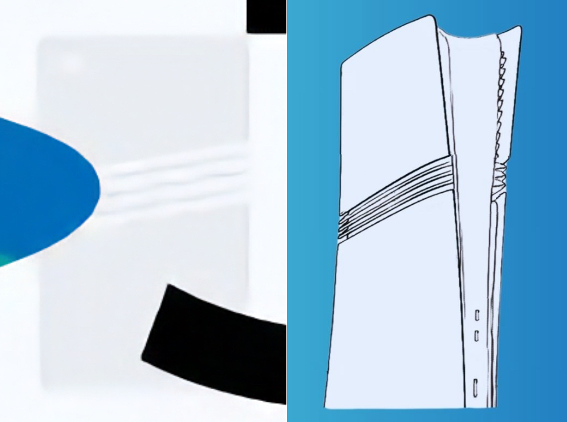

+++
title = "Sony aurait fuiter un visuel de la PS5 Pro"
date = 2024-09-06T06:40:32+01:00
draft = false
author = "Mickael"
tags = ["Actu"]
type = "telex"
+++

Sony a-t-il vendu la mèche de la PS5 Pro ? À l'occasion de l'annonce des 30 ans de PlayStation (le jour anniversaire est fixée au 3 décembre), le constructeur a [dévoilé](https://blog.playstation.com/2024/09/05/celebrating-30-years-of-playstation-my-first-gt-digital-soundtracks-shapes-of-play-collection-and-theres-more-to-come/) quelques unes des festivités et surtout, créé un visuel avec les différentes consoles et les accessoires sortis durant ces trois décennies.

Un visuel en particulier attire l'œil bien avisé : entre le logo PlayStation et le « 3 », il y a un produit qui ne ressemble à rien ou plutôt si, qui ressemble à une PS5 Slim mais avec trois lignes horizontales au centre. Comme le croquis de la PS5 Pro [partagé il y a quelques jours par Bilbil-kun](https://nostick.fr/articles/2024/aout/2908-ps5-pro-design-fuite/)…

Sony avait-il l'intention de dévoiler la PS5 Pro en début de semaine, avant de publier le message des 30 ans de PlayStation ? On croit savoir que le constructeur a l'intention de dévoiler sa nouvelle console en septembre. Mais peut-être que [la débandade *Concord*, confirmée il y a trois jours](https://nostick.fr/articles/2024/septembre/0309-sony-concord-debranche-serveurs-rembourse-joueurs/), a bousculé le calendrier initial. Quoi qu'il en soit, la vérité ne devrait plus tarder.