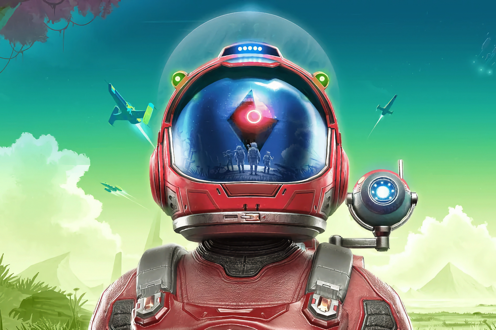

+++
title = "On vide le backlog de la semaine : Concord, CAVE, PlayStation, Black Myth Wukong"
date = 2024-09-07T23:30:32+01:00
draft = false
author = "Mickael"
tags = ["XXL"]
image = "https://nostick.fr/articles/vignettes/septembre/nomansky.jpg"
+++

L’actualité du jeu vidéo ne s’arrête pas à la poignée d’articles publiés sur *Nostick* ! Histoire de rattraper le retard accumulé, voici un retour rapide sur quelques unes des infos les plus importantes (ou insignifiantes) de la semaine.

## L'image de la semaine : les icônes PlayStation en vrai

On a peine à y croire, mais le 3 décembre prochain on fêtera les 30 ans de la PlayStation ! Pour l'occasion, Sony [lance](https://blog.playstation.com/2024/09/05/celebrating-30-years-of-playstation-my-first-gt-digital-soundtracks-shapes-of-play-collection-and-theres-more-to-come/) tout un tas de trucs pour fêter cet anniversaire, des playlists sur Spotify, des bandes son, un week-end gratos pour tester le multi de *FC24*, 2K25 et *Modern Warfare 3*, une démo de *Gran Turismo 7* et… des bidules en plastique.

Non, il ne s'agit pas de la PS5 Pro, mais d'une collection d'objets, « Shape of Play », reprenant le design des icônes PlayStation : croix, rond, carré, triangle, ~~aubergine~~. Sony propose en plus des blocs magnétiques pour aimanter ces objets entre eux et créer de nouvelles formes, il y a aussi un jeu de plateau et objets mous anti-stress. 

Un petit bazar bizarre et intrigant, mais il faudra attendre jusqu'au mois de décembre pour pouvoir commander le paquet (ce sera dispo en France aussi). Aucun prix n'a été précisé.

## Le chiffre de la semaine : 18 

Comme 18 millions de copies pour *Black Myth Wukong* en deux semaines ! Le titre de Game Science a [connu](https://x.com/ZhugeEX/status/1831660410451243077) un des démarrages les plus rapides de l'histoire du jeu vidéo, derrière *GTA V* et *Modern Warfare 2*. Le studio a encaissé 700 millions de dollars, soit 10 fois plus que le budget de développement, d'après des chiffres de Daniel Ahmad, analyste chez Niko Partners.

Avec un tel carton monumental sur les bras, les développeurs ne vont certainement pas en rester là. Un DLC est dans les tuyaux, a [révélé](https://www.bloomberg.com/news/articles/2024-09-05/investor-who-risked-it-all-on-wukong-scores-another-sales-win) à *Bloomberg* Daniel Wu, cofondateur de Hero Games, premier actionnaire de Game Science. Il n'entre pas dans les détails de l'extension, mais il y a une comparaison avec *Shadow Of The Erdtree*, le DLC d'*Elden Ring* qui a redonné un second souffle aux ventes du jeu.

Sony, qui s'est planté en beauté avec semaine, doit regarder tout ça avec les yeux qui brillent plein de larmes.

## La grosse info de la semaine : Concord, deux petites semaines et puis s'en va

Il y aura probablement des études de cas sur *Concord* dans les écoles de formation aux métiers du jeu vidéo et dans les écoles de commerce. Sorti le 23 août dans un silence assourdissant, [le hero shooter multi de PlayStation n'est plus jouable depuis le 6 septembre](https://nostick.fr/articles/2024/septembre/0309-sony-concord-debranche-serveurs-rembourse-joueurs/). Sony a coupé les serveurs et rembourse les joueurs des 40 € dépensés pour acheter le jeu.

Concord a tenu deux petites semaines avant de s'éclipser par la petite porte, après 8 années de développement et l'acquisition du studio Firewalk par Sony, dont les comptes vont prendre cher après cette aventure sans lendemain. *Concord* aurait représenté des dépenses à hauteur de plusieurs centaines de millions de dollars…

L'espoir entretenu par Firewalk d'[envisager](https://blog.playstation.com/2024/09/03/an-important-update-on-concord/) toutes les options possibles pour faire revenir le jeu semble bien vain. Il va être difficile de sortir une *Final Fantasy XIV* ou un *No Man's Sky* de ce désastre. Ce qui est un des plus gros flops (le plus gros ?) de l'histoire du jeu vidéo restera dans les mémoires pour les siècles des siècles.

Certains pourront trouver des raisons de se réjouir de ce désastre. Les incels et les extrême-droitiers qui mènent une guerre de tranchée culturelle contre tout ce qui est un tant soit peu différent du modèle dominant n'ont pas manqué de se féliciter de leur travail de sape. 

Ce n'est pourtant pas cette petite minorité qui parle très fort contre des [représentations diverses](https://www.instagram.com/p/C_TZx2eOLxc/) dans le jeu vidéo qui a planté *Concord*. Mais d'abord et avant tout l'apathie de Sony, qui n'a jamais donné l'impression d'y croire malgré l'argent englouti dans le développement. Il n'y a qu'à voir la quasi-absence de marketing lors du lancement du jeu (exception faite d'une manette désormais collector).

Est-ce que l'échec de *Concord* signe l'arrêt de mort des jeux services pour le groupe ? Certainement pas. Malgré cet accident industriel d'une ampleur inédite, le constructeur a enregistré un très beau succès avec *Helldivers 2* en début d'année. Vendu au même prix que *Concord*, le PvE d'Arrowhead a [dépassé](https://insider-gaming.com/how-many-copies-did-helldivers-2-sell-answered) le seuil des 10 millions de copies, deux mois après son lancement. Preuve que Sony peut faire du jeu service sur PS5 (et PC), pour peu que la proposition soit plus originale que les free-to-play du moment.

 

Mais il est très clair aussi que *Concord* va être vécu comme un avertissement (très coûteux, qui plus est). D'abord pour PlayStation, évidemment. En 2022, Jim Ryan, l'ancien boss qui ne jurait plus que par les jeux services, en voulait 12 (!) d'ici 2025. Le nombre a été rapidement réduit de moitié, avec des victimes collatérales comme le multi de *The Last of Us*.

La feuille de route de la plateforme compte deux gros jeux services à sortir prochainement : *Fairgame$*, développé par le studio Haven, et qui n'est pas parvenu à soulever la passion des foules lors de sa présentation en mai 2023 ; et *Marathon*, prochain gros jeu de [Bungie qui doit composer avec ses propres difficultés](https://nostick.fr/articles/2024/aout/0308-backlog-semaine-astro-bot/#les-emmerdes-de-la-semaine-chez-bungie). 

Comment lancer ces deux titres dans l'ombre de *Concord* ? Un sacré casse-tête pour Hermen Hulst, le nouveau co-CEO de PlayStation en charge des studios, qui avait été la cheville ouvrière du rachat de Firewalk. Il a sa part de responsabilité dans ce désastre.

Le flop retentissant de *Concord* frappe aussi toute l'industrie. L'éditeur qui voudra lancer un énième hero shooter va y réfléchir à deux fois avant de signer un chèque en blanc, surtout s'il ne peut pas s'appuyer sur une grosse licence, à l'image de *Marvel Rivals*. 

## La bonne nouvelle de la semaine : CAVE mitonne des nouveautés

Oubliez l'argent, l'amour, le pouvoir. Ce que les gens veulent, ce qu'ils désirent au plus profond d'eux, ce sont des bullet hell évidemment, mais pas de n'importe qui : de CAVE bien sûr ! Le studio japonais a popularisé le genre du danmaku avec *DonPachi* et ses suites, avec *Mushihimesama*, *Deathsmiles* ou encore *Espgaluda*. Et il [dépense](https://gamebiz.jp/news/391787) beaucoup en ce moment en recherche et développement : +70 % durant le dernier exercice fiscal, soit 290 millions de yens (1,8 million d'euros).

Bon sang ne saurait mentir : les cuisines de CAVE[^1] font chauffer des trucs. Ces dernières années, le studio a beaucoup travaillé pour les plateformes mobiles, le dernier gros jeu consoles ayant été *Akai Katana* édité par City Connection, un bullet hell plutôt bien reçu en 2022. Il est donc temps de refaire parler la foudre et les balles avec une nouveauté !

Durant l'exercice fiscal 2023-2024, les profits de l'activité jeux vidéo de CAVE ont enregistré un coup de fouet de 527 % (!) grâce au jeu mobile *Tohou Gensou Eclipse* qui cartonne, sans oublier la bonne santé du développeur Deluxe Games (*Monster Strike*), racheté il y a deux ans. Ça n'a malheureusement pas suffi pour sauver les bénéfices nets du groupe qui ont plongé de 44 % : les autres activités sont dans le rouge.

On croise les doigts pour que le ou les nouveaux jeux en préparation ne soient pas uniquement réservés aux smartphones.

## Le petit rigolo de la semaine : Phil Spencer

Le patron de Xbox, Phil Spencer, est très sympathique et personne ne doute un seul instant de son amour pour les jeux vidéo. Par contre, côté business, pas sûr qu'il soit le couteau le plus affûté du tiroir. Lors d'une conférence à PAX West, le dirigeant a révélé que *Destiny* et *Guitar Hero*, deux des plus grosses franchises du jeu vidéo, lui avaient été servis sur un plateau pour devenir des exclusivités Xbox. Il n'en a pas voulu.

 

« *J'ai pris certaines des pires décisions dans le choix des jeux* », a-t-il expliqué. *Destiny* « *n'a pas cliqué avec moi* » la première fois qu'il y a joué. Et pourtant, le jeu est développé par Bungie à qui Xbox doit une bonne partie de son succès initial avec *Halo*. Le studio, devenu indépendant du giron de Microsoft, s'est alors tourné vers Activision pour éditer son nouveau titre.

Phil Spencer a aussi laissé passer l'occasion d'éditer *Guitar Hero*, après que Alex Rigopulos, le CEO d'Harmonix, lui a présenté le concept. « *[Ils] m'ont présenté un jeu où ils allaient fabriquer des guitares en plastique, les brancher sur des consoles, puis vendre des morceaux où l'on jouerait à Simon sur cette guitare* ». C'est vrai que le pitch n'est pas spécialement vendeur. « *Et je me suis dit : vraiment ? Est-ce qu'on pense vraiment que ça va marcher ?* ». Il faut croire que oui !

Là aussi, c'est Activision qui a remporté la mise, avec le succès que l'on sait. Avec le recul il est facile de se moquer de l'absence de vision de Phil Spencer. Mais lui ne nourrit aucun regret : « J'essaie de me projeter et d'être positif sur ce que nous faisons ». Qui sait quels autres jeux il n'a pas voulu et qui sont devenus des hits ? Vertigineux.
 
## On n'a pas eu le temps cette semaine mais on pense à eux

 

Puisqu'il est désormais obligatoire que tous les jeux intègrent une simulation de pêche, *No Man's Sky* n'a pu que se plier à l'exigence. La dernière mise à jour gratuite « [Aquarius](https://www.nomanssky.com/2024/09/aquarius-update/) » permet enfin de choper du poiscaille et bien sûr, de les cuisiner. Il y a même un costume de plongeur pour explorer les fonds marins extra-terrestres.



Le remake de *Silent Hill 2* s'annonce finalement mieux que ce [les premières images et vidéos laissaient craindre](https://nostick.fr/articles/2024/aout/0708-silent-hill-2-developpeurs-donnez-chance/). Tant mieux pour la Bloober Team, le studio développeur du jeu, qui sort le 8 octobre. Ce dernier a dévoilé deux modes inédits : le premier ajoute un effet « télé pourrie des années 90 », le second vire tous les éléments d'interface. Il faudra se fier au langage corporel de James, le héros, ainsi que par les effets sonores et les visuels du jeu pour savoir où se diriger. L'idée est bonne, reste à voir ce que ça va donner en vrai.

## osef

Sale année pour les adaptations de jeux au cinoche. Si l'affligeant *Borderlands* ne vous avait pas suffi, voici venir *[Minecraft](https://www.youtube.com/watch?v=PE2YZhcC4NY)* avec Jack Black et Jason Momoa qui ont l'air de se demander ce qu'ils foutent là. Et nous aussi, d'ailleurs.

## Dans le reste de l'actu déchaînée

- Maintenant que le jeu est dispo sur Xbox, *Final Fantasy XIV* pourrait bien débarquer sur Switch ! Il faudra peut-être attendre la Switch 2, par contre. [Plus d'infos par ici.](https://nostick.fr/articles/2024/septembre/0209-final-fantasy-xiv-switch/)
- On ne sortira jamais du débat sur le prix des jeux vidéo : pas assez chers ? Trop ? Un cadre de Larian (*Baldur's Gate 3*) a remis une pièce dans la machine. [C'est à lire par là.](https://nostick.fr/articles/2024/septembre/0209-prix-jeux-pousse-encore/)
- Le studio Gust a donné de plus amples informations sur le fort sympathique *Atelier Yumia : L’Alchimiste des Souvenirs et la Terre Rêvée*, son futur JRPG aux formes généreuses. [À découvrir dans cette actu !](https://nostick.fr/articles/2024/septembre/0309-atelier-yumia-aventure-gust/)
- Trois dramas pour le prix d'un cette semaine pour Xbox ! Un producteur de *STALKER 2* a fait une boulette en déclarant que le jeu tournait pour le moment à 25 FPS sur la Series S ([c'était 35, il s'était trompé](https://nostick.fr/articles/2024/septembre/0309-stalker-2-xbox-series-s-30-fps/)). Et *Dune Awakening*, le MMO survival, va avoir besoin de [pas mal d'optimisation](https://nostick.fr/articles/2024/septembre/0309-dune-awakening-optimisation-xbox-series-s/) pour la petite console avant de sortir sur Xbox. Et puis il a fallu l'implication de Phil Spencer pour que *Enotria: The Last Song* sorte finalement sur Xbox… [On croit rêver.](https://nostick.fr/articles/2024/septembre/0509-phil-spencer-enotria-the-last-song-xbox/)
- Ouf ! Au milieu de toutes ces mauvaises nouvelles, en voilà une bonne : les compiles de jeux de baston de Capcom vont finalement sortir sur Xbox ! Microsoft a donné un coup de main à la technique. [Prenez une baffe dans cette actu.](https://nostick.fr/articles/2024/septembre/0409-xbox-compilations-capcom/)
- Valve s'est offert les talents du studio Hopoo Games, à qui l'on doit *Risk of Rain* et *Deadbolt*. Et pour faire quoi ? [Des tas de trucs biens !](https://nostick.fr/articles/2024/septembre/0309-developpeurs-de-risk-of-rain-tirent-le-rideau-et-partent-chez-valve/)
- Microsoft ne peut pas lancer d'app Xbox Cloud Gaming sur iOS, et pourquoi ça ? À cause de la commission de 30 % d'Apple, pardi ! [C'est à lire dans cette actu.](https://nostick.fr/articles/2024/septembre/0409-xbox-cloud-gaming-ios-microsoft-apple-bouffent-nez/)
- *Mario & Luigi: L'Épopée fraternelle* sera un des gros jeux Switch (un des derniers !) de la fin de l'année. Pas étonnant que Nintendo mette le paquet pour en faire la promo, [comme on le verra ici.](https://nostick.fr/articles/2024/septembre/0409-nintendo-fait-monter-la-sauce-mario-luigi-rpg/)
- Avec une telle licence en or, il est impossible qu'Ubisoft se plante et pourtant, *Star Wars Outlaws* n'a pas l'air très bien parti. [L'odeur de plantade, c'est par là.](https://nostick.fr/articles/2024/septembre/0509-star-wars-outlaws-carton-ubisoft/)
- Ouais, ça va être compliqué au bureau à partir de fin septembre : *Balatro* sort finalement sur iOS et sur Android. La productivité mondiale va tomber à zéro ! [Tous les détails dans cette actu.](https://nostick.fr/articles/2024/septembre/0509-balatro-mobile-enfin/)
- Après avoir enterré sa nouvelle (et défunte) franchise *Concord* sans fleur ni couronne, Sony vient se plaindre de ne pas posséder de licences suffisamment fortes. [Comment leur dire poliment ?](https://nostick.fr/articles/2024/septembre/0509-sony-se-plaint-de-ne-pas-avoir-assez-de-licences-originales/)
- Il y a très certainement un niveau secret des vaches dans *Diablo 4*. De quoi ça ? [On vous dit tout dans cette actu.](https://nostick.fr/articles/2024/septembre/0609-diablo-4-niveau-secret-vaches/)

[^1]: Le saviez-vous ? Ça veut dire « Computer Art Visual Entertainment ».