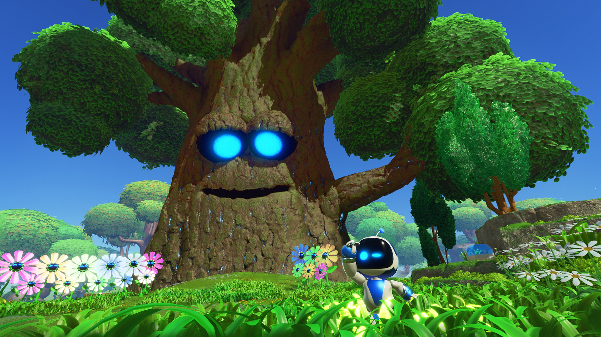
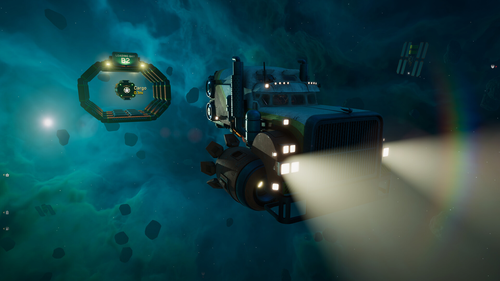

+++
title = "Astro Bot, Star Trucker : le récap des sorties de la semaine (08/09)"
date = 2024-09-08T07:00:02+01:00
draft = false
author = "Félix"
tags = ["C’est dispo"]
image = "https://nostick.fr/articles/2024/septembre/0809-les-sorties-de-la-semaine/astro.jpeg"
+++

L’été se termine, les sorties se multiplient. Vous n’avez rien eu le temps de suivre ces derniers jours et souhaitez alourdir un peu plus votre backlog ? Voici les nouveautés du moment à ne pas louper.

## Droit dans ses Bot

Carton plein pour ***Astro Bot***, la nouvelle exclusivité de la PS5 dans laquelle on incarne le sympathique petit robot mascotte de Sony. Ce jeu de plateforme se veut être un hommage à la galaxie PlayStation, faisant autant référence à *Kratos* qu’à *Lara Croft* en passant par les vieilles consoles Sony avec un souci du détail bluffant. Le jeu s’étale sur 80 niveaux imposant de sauter à droite à gauche aidés par différents gadgets. Les testeurs décrivent un jeu généreux et maîtrisé dans ses mécaniques, satisfaisant à parcourir tout en étant blindé de bonnes idées. Il tire parti de la DualSense et a été acclamé par la critique au point que son score de 95/100 sur OpenCritic me donnerait presque envie d’acheter une PS5. C’est coloré, fun, varié et ça devrait vous occuper une petite quinzaine d’heures. Le jeu n’a qu’un seul défaut : il n’est pas (encore) disponible sur PC. 70 € sur [PS5](https://www.playstation.com/fr-fr/games/astro-bot/).

## Un remake qui peine à Persée ?

Autre grosse sortie cette semaine avec ***‌Age of Mythology Retold***, remake du célèbre jeu de stratégie dans lequel différentes civilisations s’échinent dans un univers inspiré de la mythologie grecque et des légendes de l’Égypte ou des pays nordiques. On peut donc y invoquer des cyclopes, sphinx et autres krakens pour aller raser les bases ennemies, voire demande un coup de main à Zeus en personne pour faire pencher la balance lors d’une escarmouche critique. La formule marche visiblement toujours aussi bien, les graphismes revus ainsi que l’interface modernisée faisant leur petit effet. La campagne solo du jeu original n’a pas été oubliée, tout comme le mode multijoueur qui fonctionne en cross-plateform. Est-ce que ça mérite 30 balles ? À vous de voir : les testeurs évoquent un remake bien fait, mais qui se contente du minimum, donc ne vous attendez pas à redécouvrir le jeu. Dispo sur Xbox et sur [Steam](https://store.steampowered.com/app/1934680/Age_of_Mythology_Retold/), également proposé dans le Game Pass.

 

## Beau comme un camion

Et si vous troquiez le Scania R que vous utilisez depuis 2012 pour sillonner la map d’*Euro Truck 2* par un poids lourd galactique ? C’est ce que propose ***Star Trucker***, un simulateur de camion dans l’espace dans lequel il faudra éviter les débris spatiaux et effectuer différents sauts dans l'hyperespace pour assurer vos livraisons. L’idée est rigolote car il faudra occasionnellement sortir (en gravité 0) pour réparer son camion, tandis que la conduite est logiquement un peu plus compliquée que sur un Mâcon-Dijon. J’ai testé une bonne heure et moyennement accroché : l’univers est cool, mais c’est bien moins chill qu’*Euro Truck* et on passe pas mal de temps les mains dans le cambouis. Les testeurs ont plutôt apprécié, le jeu ayant l’avantage d’avoir une partie scénario et une radio country/rock sympa. À essayer si vous avez le Game Pass, n’hésitez pas à patouiller avec le mode de difficulté personnalisée si vous cherchez surtout un jeu relax. 24,50 € sur [Steam](https://store.steampowered.com/app/2380050/Star_Trucker/) et Xbox.

## Le monde n’est pas vraiment Stone

Ça fait un petit moment qu’on n’avait pas vu de jeu d’horreur arriver, et Supermassive Games (*‌Until Dawn*, *The Quarry*) vient corriger le tir avec son ***‌The Casting of Frank Stone***, créé en collaboration avec les développeurs de *Dead By Daylight*. Il s’agit d’un slasher interactif d’environ 8h se déroulant dans une mystérieuse ville de l'Oregon. L’intrigue tourne autour d'un tueur nommé Frank Stone et suit les aventures d’un petit groupe de personnage dispersées entre plusieurs lignes temporelles. Le titre promet d’élargir l’univers de *DBD*, ce qui est assez surprenant quand on sait que celui-ci a été tellement malmené par des DLC random ([Nicolas Cage](https://store.steampowered.com/app/2469400/Dead_by_Daylight__Nicolas_Cage_Chapter_Pack/) ?? [Donjons et Dragons](https://store.steampowered.com/app/2958440/Dead_by_Daylight__Dungeons__Dragons/) ?? ) qu’on se demande bien pour qui c’est un argument de vente. Ça n’a pas l’air fou, le jeu ayant un gameplay limité et une intrigue qui part apparemment dans tous les sens. Les critiques Steam sont « *moyennes* » et les quelques tests que j’ai lus tapaient dans le 5 ou 6/10. Vu que c’est quand même facturé 40 € [sur Steam](https://store.steampowered.com/app/2223840/The_Casting_of_Frank_Stone/), les fans du genre auront sans doute tout intérêt à attendre Halloween pour le récupérer à -50 % au fond du bac à promo. Aussi dispo sur PlayStation 5 et Xbox Series, notons qu’il y a une démo pour les curieux.

 

## Mais aussi

Capcom a continué de faire ses fonds de tiroir en nous réchauffant les vieux ***Ace Attorney Investigations***, deux spin-offs de la série dans laquelle on incarne le procureur. Ça a l’air correct même si cela ne parlera sans doute pas à ceux qui ne connaissent pas la série. C’est vendu 40 € sur [Steam](https://store.steampowered.com/app/2401970/Ace_Attorney_Investigations_Collection/) (où il y a une démo), aussi dispo sur toutes les consoles. ***Hitman 3 VR : Reloaded*** est arrivé sur [les casques Quest](https://www.meta.com/fr-fr/experiences/hitman-3-vr-reloaded/8012387035448196/), mais les tests décrivent une adaptation pourrie qui ne vous fera pas ressortir votre casque donc on ne va pas s’attarder. On notera aussi la sortie de ***[NBA 2K25](https://store.steampowered.com/app/2878980/NBA_2K25/)*** (osef) et de ***[Harry Potter : Champions de Quidditch](https://store.steampowered.com/app/2878600/Harry_Potter__Champions_de_Quidditch/?l=french)***. Ça a pas l’air incroyable, mais la Warner doit bien meubler en attendant [la suite](https://nostick.fr/articles/2024/septembre/0509-harry-potter-quidditch-champions-warner-bros/) de *Hogwart’s Legacy*.