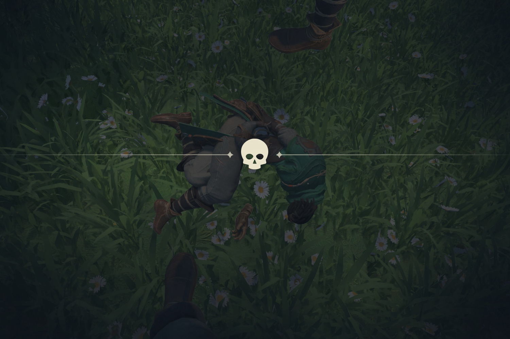
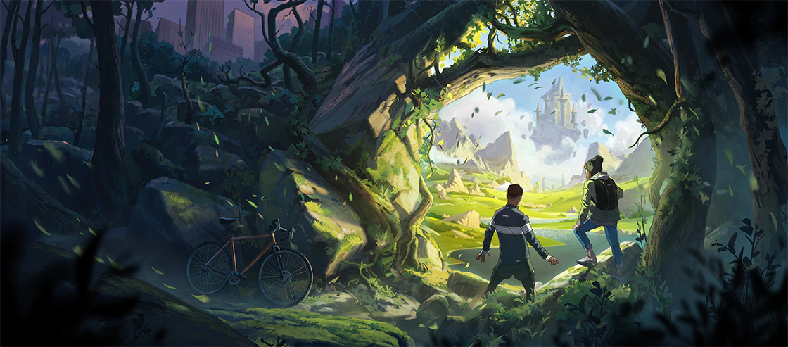
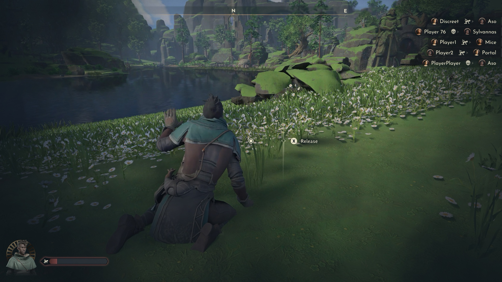
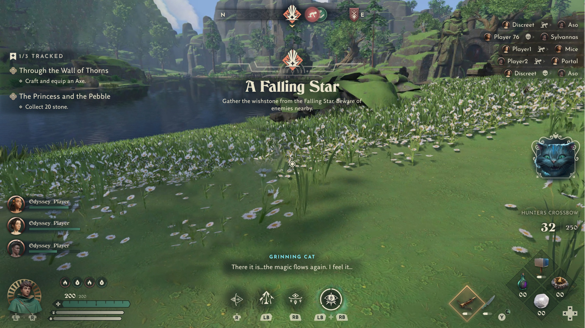
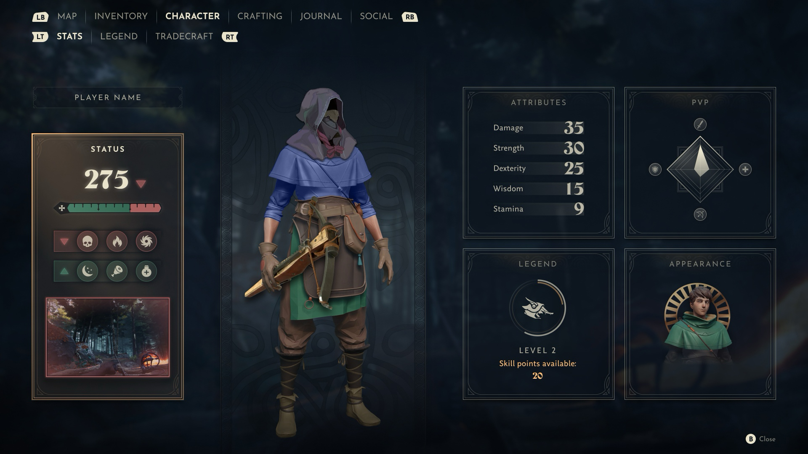
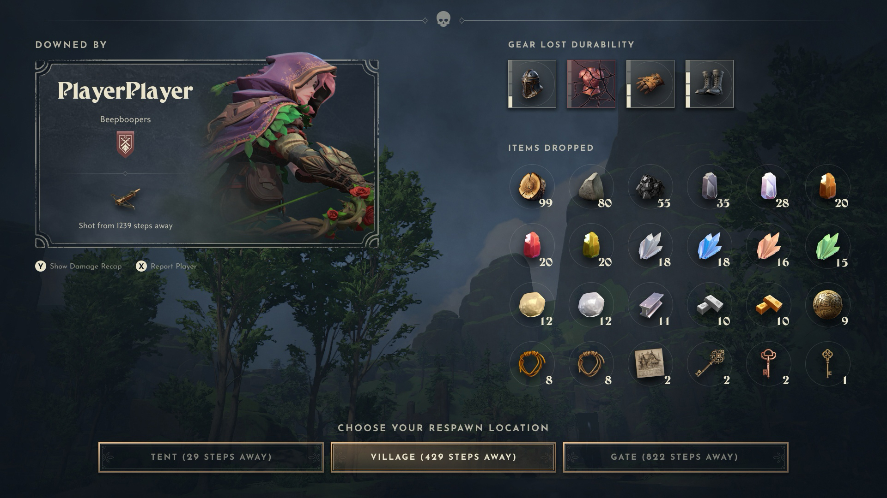
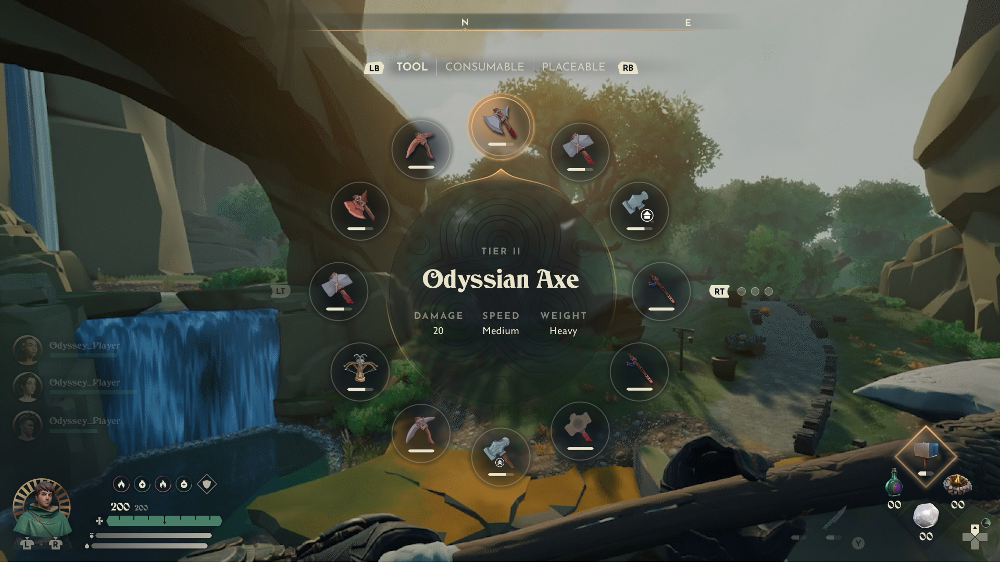
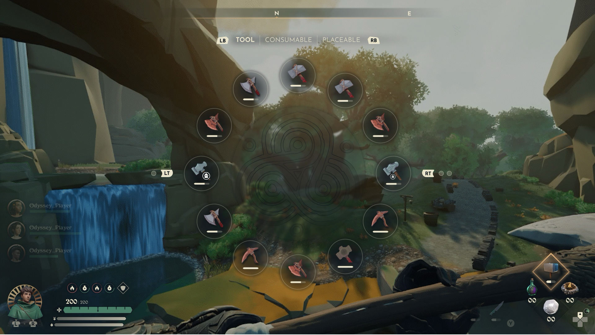

+++
title = "Des images d'Odyssey, le survival de Blizzard qui ne sortira jamais"
date = 2024-09-09T09:00:00+01:00
draft = false
author = "Mickael"
tags = ["Actu"]
image = "https://nostick.fr/articles/vignettes/septembre/blizzard-odyssey-1.jpg"
+++

Il y a deux ans, Blizzard annonçait le développement d'un jeu complètement inédit, une « nouvelle IP » comme on dit dans les dîners en ville, baptisé *Odyssey*. Malheureusement, le bordel issu de l'acquisition du studio par Microsoft (en même temps qu'Activision), et les charrettes de licenciements qui ont suivi, ont eu raison de ce projet. En janvier dernier, Matt Booty le président des studios Microsoft annonçait l'annulation du jeu.

*Odyssey*, qui devait être le nouvel univers de Blizzard depuis 2016 et *Overwatch*, se [présentait](https://news.blizzard.com/en-us/blizzard/23768911/create-a-new-universe-with-us) comme un survival « *plein de héros à rencontrer, d'histoires à raconter et d'aventures à vivre* ». Et que personne ne vivra, donc. À l'époque de l'annonce, en janvier 2022, le studio publiait un visuel pour donner une petite idée du schmilblick :

Le titre n'a cependant pas tout à fait disparu. Des captures d'écran ont été publiées sur [VK](https://vk.com/wall-23323356_38723), le Facebook russe, et elles donnent une meilleure idée de l'avancement supposé du développement et des fonctions du jeu. Sans trop de surprise, c'est du classique pour les fans du genre avec un système de gestion des armes, un autre pour gérer les ressources, un moniteur de statuts pour la faim, la chaleur et le repos…

Les captures laissent aussi vagabonder l'imagination vers un univers plein de références à *Alice aux Pays des Merveilles* avec son chat du Cheshire et aux contes de fées à l'anglaise (*Fable* va prendre le relais). À moins qu'une vidéo du jeu ou mieux encore, qu'une build montre le bout du nez un jour, c'est à peu près tout ce qu'on peut dire d'*Odyssey* !

Blizzard est de toute manière déjà bien occupé : Chris McCabe, directeur de gestion produit au sein du studio, a [ajouté](https://x.com/bogorad222/status/1829446709568585748) à son profil LinkedIn qu'il [travaillait](https://www.linkedin.com/in/christopermccabe/) sur un « *titre AAA RPG-FPS non annoncé* » ! Auparavant attaché à *Overwatch*, le cadre pourrait désormais plancher sur un spin-of du *hero shooter*, c'est du moins ce que beaucoup croient deviner entre les lignes.