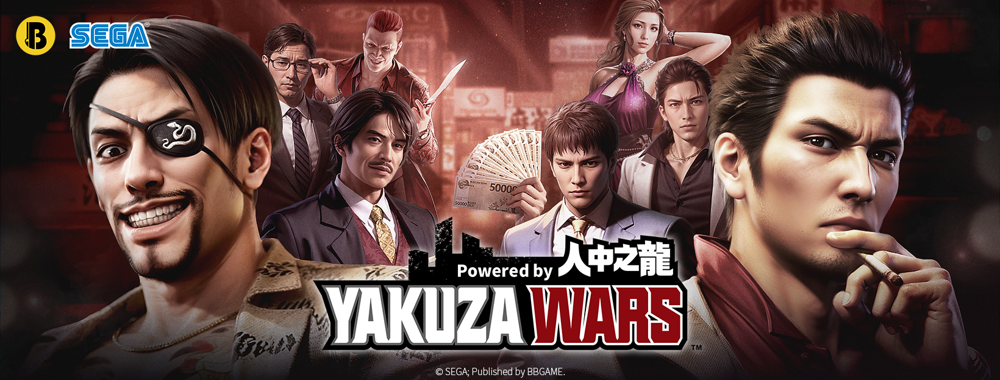

+++
title = "Rançon de la gloire, Yakuza va être adapté en jeu mobile"
date = 2024-09-09T21:40:32+01:00
draft = false
author = "Félix"
tags = ["Actu"]
type = "telex"
+++ 

Cet été, quelques curieux ont remarqué que Sega avait déposé la marque *Yakuza Wars* : un nom jamais vu jusqu’à présent que certains fans imaginaient déjà devenir le prochain opus de la franchise. Perdu ! Ce nouveau titre sera visiblement un jeu mobile développé par un studio chinois. Mouais.

Une [page Facebook](https://www.facebook.com/BBG.YakuzaWars.Asia) a craché le morceau en avance, révélant un jeu de stratégie mobile mettant en scène des personnages comme Kiryu, Ichiban ou Majima. Les quelques illustrations font assez cheap et il est fort probable que ça reste exclusif au marché asiatique (un peu comme le free-to-play *Persona* qui est indisponible en Europe). On en saura peut être plus au Tokyo Game Show, mais ça semble bien parti pour être un énième gacha chinois sans intérêt. D’autres visuels sont en ligne [ici](https://www.reddit.com/r/yakuzagames/comments/1fcizqw/images_from_yakuza_wars_ads_and_the_transcript_of/) pour les curieux.