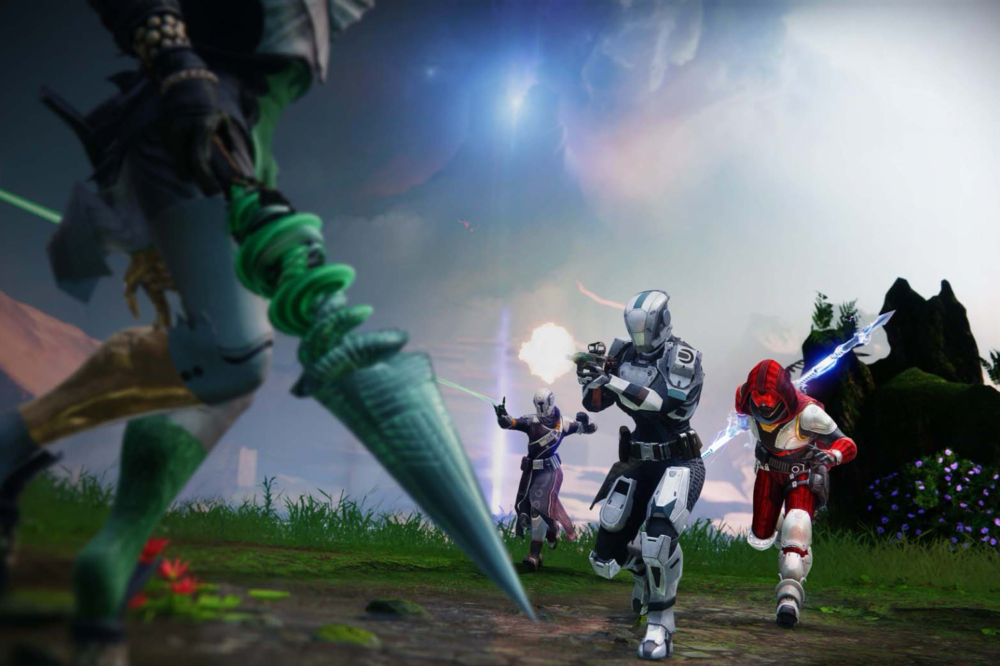
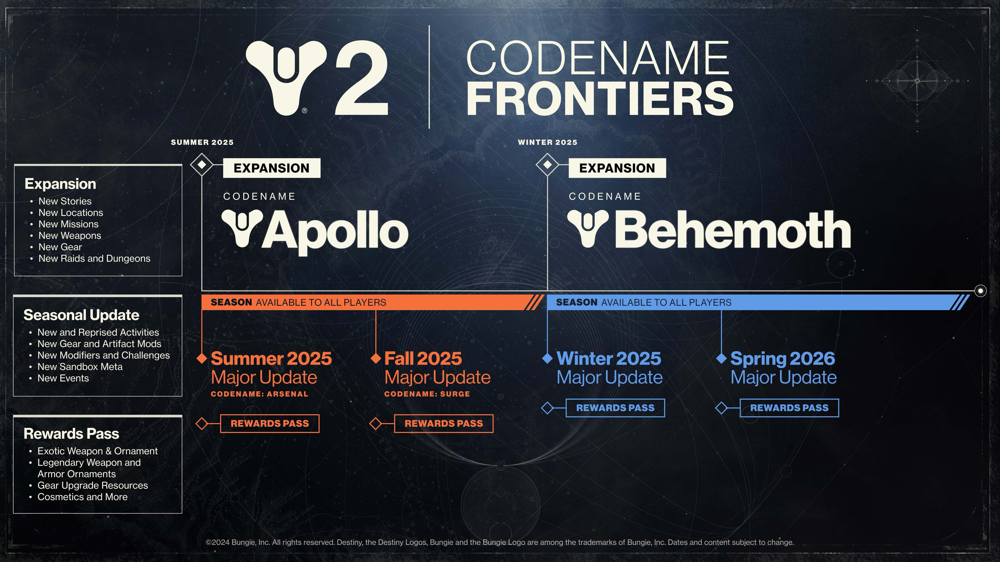

+++
title = "Il y a de l'avenir dans Destiny 2"
date = 2024-09-10T08:01:32+01:00
draft = false
author = "Mickael"
tags = ["Actu"]
image = "https://nostick.fr/articles/vignettes/septembre/destiny-2.jpg"
+++

 

Maintenant que l'ultime DLC de *Destiny 2*, le très réussi « The Final Shape », est sorti, les fans du shooter de Bungie attendaient avec une certaine angoisse ce qui allait se passer pour leur jeu préféré. Qu'ils se rassurent, le studio ne va pas les laisser tomber (et la boîte a besoin de leurs sous, de toute manière).

Bungie a [publié](https://www.bungie.net/7/en/News/article/new_frontiers) sa feuille de route — baptisée « Frontiers » — pour la suite des événements et la saga, qui a déjà dix ans au compteur (!), va poursuivre sa route pendant de nombreuses années encore. Le changement le plus important, c'est l'abandon de la grosse extension annuelle, au profit de deux extensions de plus petite taille chaque année, accompagnées de quatre mises à jour majeures de contenus gratuits.

Chacune de ces extensions sera l'occasion « *d'explorer d'excitants nouveaux formats* », comme l'explique Bungie. Ce nouveau modèle débutera durant l'été 2025 avec l'extension « Apollo », qui sera suivie de « Behemoth » l'hiver suivant. *Destiny 2* ouvrira de nouvelles portes, vers des endroits où le jeu n'est jamais allé, promet-elle.

« *Auparavant, dans des histoires comme "The Final Shape", vous viviez l'histoire de A à B, puis C, puis D, de manière linéaire. Dans "Apollo", notre histoire se déroule à travers des dizaines de fils que vous allez explorer et découvrir* », décrit Alison Lührs, directrice du scénario. « *Lorsque vous arriverez dans notre toute nouvelle zone, l'histoire commencera à A, et vous pourrez ensuite choisir si vous voulez explorer C en premier, essayer d'accéder à B, ou peut-être enquêter sur D* », poursuit-elle.

Ces futurs épisodes feront office d'« *épilogues* », qui clôtureront les fils narratifs précédents et en ouvriront d'autres. Tout cela est plutôt de bon augure et surtout, cela rassurera les joueurs de savoir que Bungie s'occupe de l'avenir de *Destiny 2* malgré [les lourdes difficultés actuelles](https://nostick.fr/articles/2024/aout/0308-backlog-semaine-astro-bot/#les-emmerdes-de-la-semaine-chez-bungie).