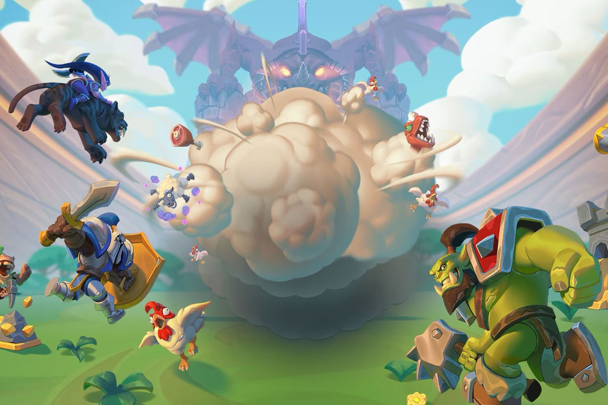

+++
title = "On vide le backlog de la semaine : PS5 Pro, Destiny 2, The Crew 2, Call of Duty Warzone Mobile…"
date = 2024-09-14T10:00:00+01:00
draft = false
author = "Mickael"
tags = ["XXL"]
image = "https://nostick.fr/articles/vignettes/septembre/snake.jpg"
+++

L’actualité du jeu vidéo ne s’arrête pas à la poignée d’articles publiés sur *Nostick* ! Histoire de rattraper le retard accumulé, voici un retour rapide sur quelques unes des infos les plus importantes (ou insignifiantes) de la semaine.

## L’image de la semaine : 

L'Ace of Spades, un flingue emblématique de *Destiny 2*, est tellement populaire que Bungie a [travaillé](https://x.com/Tofu_Rabbit/status/1833851336607101076) avec Nerf pour en produire une réplique en vrai. Le blaster lanceur de fléchettes (c'est un jouet pour les enfants, rassurez-vous) a certainement fière allure, probablement trop !

Il se trouve que le design de cet Ace of Spades ressemble beaucoup à celui réalisé en 2015 par l'artiste Tofu_Rabbit, qui a rapidement fait [connaitre](https://x.com/Tofu_Rabbit/status/1833851336607101076) son désarroi sur les réseaux sociaux. Alertée, Bungie a enquêté et miracle de Noël en septembre, l'affaire s'est [résolue](https://x.com/Tofu_Rabbit/status/1834641265951932491) probablement par un chèque bien mérité pour l'artiste. Tout est donc bien qui finit bien, et le flingue va être commercialisé, en édition limitée, au prix de [50 $](https://bungiestore.com/bungie-rewards-nerf-ace-of-spades-blaster). 

Bungie va peut-être faire un peu gaffe maintenant, car c'est la troisième fois que le studio est pris à pomper des designs déjà existants : en 2021, une œuvre *fan-made* avait été incluse par erreur dans un trailer de Destiny 2. L'an dernier, c'était dans une cinématique du jeu qu'une autre œuvre s'était retrouvée sans autorisation.

## La mauvaise nouvelle de la semaine : Microsoft aurait du mal avec ses jeux mobiles

Microsoft a [viré 650 personnes au sein des studios Xbox](https://nostick.fr/articles/2024/septembre/1209-microsoft-vire-650-personnes/), une charrette qui s'ajoute aux 1 900 pauvres bougres licenciés en début d'année, et à la fermeture de plusieurs studios (dont Tango Gameworks, créateur de *Hi-Fi Rush*). 

Si cette nouvelle coupe claire ne provoquera la fermeture d'aucun studio ni l'annulation d'aucun jeu, il semble toutefois que les équipes d'Activision Blizzard en charge de *Call of Duty Warzone Mobile* et de *Warcraft Rumble* en ont pris un coup derrière le carafon, selon *[Game File](https://www.gamefile.news/p/microsoft-gaming-layoffs-xbox-650)*.

Lancé en mars dernier sur iOS et Android, le battle royale *Call of Duty Warzone Mobile* (entièrement développé en interne chez Activision) capitalise sur le succès de la franchise et de son cousin plus généraliste *Call of Duty Mobile*, développé par Tencent. Malgré ce pedigree, *Warzone Mobile* ne serait pas le hit interplanétaire espéré par Activision et par Microsoft, ce qui explique pourquoi le groupe aurait décidé de réduire la voilure.

Le tower defense *Warcraft Rumble*, autre jeu mobile dispo depuis l'an dernier, ne serait pas non plus le carton espéré par Blizzard malgré un gros lancement. Pour Microsoft, le succès mitigé de ces deux jeux n'est pas de très bon augure. C'était pourtant une des raisons qui a poussé l'éditeur à faire un chèque de 70 milliards de dollars pour acheter Activision Blizzard King — n'oublions pas la troisième entité du groupe, spécialiste incontesté du jeu mobile.

Alors certes, *Call of Duty Mobile* continue d'engranger des millions de dollars, mais il faut en donner une partie à Tencent. Heureusement qu'il a *Candy Crush*…

## La grosse info de la semaine : le retour de l'hubris de PlayStation

Le 8 mai 2006, c'est un Kaz Hirai triomphant qui entre sur la scène de l'E3. Et pour cause : il va enfin pouvoir présenter en long, en large et en travers la 9e merveille du monde, la PS3. Sony est alors au sommet du monde avec la PS2, une console incroyablement populaire — elle trône toujours en tête du classement des consoles les plus vendues.

Après un long soliloque conçu pour séduire aussi bien les joueurs que les actionnaires, le président de Sony Computer Entertainment America (SCEA) dévoile le prix de la PS3. 499 $, soit 200 $ de plus qu'une PS2… ou encore le prix d'une Xbox 360 et d'une Wii ! 

Évidemment, ce tarif a plombé la PS3 face à des concurrents meilleur marché, et qui posaient moins de problèmes de développement. Trois ans plus tard, c'est un Sony plus humble qui revient dans la course avec la PS3 Slim à 299 $. Mais pour cette génération, le mal était fait.

Autre temps, autres mœurs : si PlayStation a de nouveau remporté la guerre des consoles, l'hubris des années 2000 s'étale de manière presque gênée. C'est en effet quasiment à contre-cœur que [Sony a présenté la PS5 Pro cette semaine](https://nostick.fr/articles/2024/septembre/1009-enfin-une-ps5-pour-les-pro/). Aucun flonflon, pas de trompette, zéro confetti, cette « présentation technique » anticlimatique au possible aurait pu se contenter d'être un email. Mark Cerny, architecte en chef de la PS5, a déroulé pendant 9 minutes les trois principaux arguments de vente qui justifient l'existence de cette nouvelle console.

 

Avec son meilleur GPU, ses fonctions de ray-tracing avancées et son upscale IA, la PS5 Pro veut mettre fin au dilemme qui angoisse le joueur au moment de lancer son jeu : plutôt performances ou plutôt qualité ? La grosse patate graphique de la PS5 Pro va offrir du 4K à 60 FPS (et même 120 FPS !) à tous les jeux « PS5 Pro Enhanced » — oui, les développeurs devront optimiser leurs jeux, ce ne sera pas automatique.

Soyons juste : techniquement parlant, le PlayStation Spectral Super Resolution (PSSR), l'équivalent Sony du FSR d'AMD ou du DLSS de Nvidia, est une technologie qui s'annonce prometteuse. Elle améliore la résolution d'une image en comblant les trous avec l'aide de l'IA, en évitant de taper dans les capacités de calcul du GPU. La puissance en réserve permet en retour d'afficher davantage d'images par seconde.

Voir Sony tirer profit de l'upscale IA valide la direction prise par l'industrie du PC ces dernières années. Et il se murmure que Nintendo fera grand usage du DLSS pour la Switch 2. Malheureusement pour PlayStation, il fallait plisser les yeux pour voir les différences entre les modes Performances/Qualité de la PS5 en face des améliorations apportées par la PS5 Pro.

Non seulement la compression de YouTube n'arrange rien, mais surtout les jeux présentés (*Ratchet & Clank: Rift Apart*, *Spider-Man 2*, *The Last of Us*…) sont déjà très beaux tels quels. Difficile de crier au génie quand les voitures au fond de la rue de New York ou les feuilles des arbres — qu'on ne remarque pas vraiment en jeu — sont un peu plus nettes. *[The Verge](https://www.theverge.com/2024/9/12/24243216/playstation-5-pro-ps5-big-4k-screenshots)* a mis la main sur les visuels haute définition et propose de les télécharger sans compression : ils sont autrement plus propres, mais même là, j'ai du mal à voir vraiment la différence.

Les comparaisons dans les FPS sont certainement plus intéressantes car personne n'aime se traîner à 30 images/seconde. Mais là encore, difficile de juger de la fluidité en jeu sans avoir la manette en main. On ne va pas cracher dans la soupe : du 4K à 60 FPS, c'est ce qu'on voudrait tous dans tous nos jeux, et la PS5 Pro a le mérite d'exister… Même si la puissance graphique ne fait pas tout, comme le démontre Nintendo tous les jours.

Et puis surtout, tout ça a un prix et on a pu entendre de par le monde un « gasp » collectif à la dernière seconde de la présentation, à l'apparition de l'ultime diapositive (le même « gasp » qui a étreint la salle de l'E3, en 2006) : les prix de la bête. Sept cent quatre vingt dix neuf euros et quatre vingt dix neuf centimes. Ouf ! Sans lecteur optique, à acheter à part (120 €), ni support vertical (30 €)… 

Sony se rattrape aux branches en fournissant 2 To de stockage, mais l'atterrissage est tout de même brutal. Et inquiétant. Les tarifs pratiqués par Sony pour la PS5 Pro annoncent des lendemains qui déchantent pour les consoleux. Ces niveaux de prix confirment la position dominante du constructeur sur le marché des consoles de salon. 

Xbox, [comme chacun sait](https://nostick.fr/articles/2024/mai/1505-bonjour-tristesse-chez-xbox/), a abandonné l'idée même de concurrencer PlayStation en Europe et au Japon. Microsoft reste cependant encore attaché à son marché domestique aux États-Unis, ce qui explique pourquoi la console y est un tout petit peu plus abordable qu'ailleurs.

Les 700 $ demandés aux US sont certes HT, mais même en ajoutant les taxes de vente, l'étiquette n'atteint pas les sommets japonais (850 $), européen (890 $) ou encore anglais (920 $) où les prix sont TTC. En ajoutant les taxes, la PS5 Pro revient à 760 $ à New York…

C'est moins le contenu de la boîte — ses composants — qui ont façonné le prix de la PS5 Pro, que les forces du marché et l'état de la concurrence. La vente à perte a toujours été la réalité des constructeurs de consoles, qui se rattrapent sur les commissions qu'ils touchent sur les jeux. Mais quand on est le seul et unique acteur du marché, pourquoi s'embêter ?

Dans quelques années, si d'aventure Xbox lâche complètement l'affaire dans le secteur des consoles de salon — ça semble bien parti —, Sony restera seul en lice. L'entreprise pourra dès lors pratiquer les prix qui lui chantent, sans aucune pression. Le scénario de 2009, lorsque la PS3 perd du bide et 200 $, ne risque pas de se reproduire.

Tout n'est pourtant pas perdu. Les joueurs ont ce pouvoir immense de refuser d'être pressurés comme des citrons. Une PS5 Pro à 800 €, sans jeux véritablement nouveaux pour enflammer l'imagination et les portefeuilles, n'a guère de chance d'être un best-seller (à moins que *GTA VI* ne soit optimisé, ce qui n'est absolument pas certain : les gars de Rockstar préféreront sûrement mettre le paquet sur la version PC bien plus lucrative).

Et puis à ce tarif, les PC commencent à devenir une option séduisante même s'il faudra mettre un ou deux billets en plus pour avoir quelque chose de vraiment potable. Mais on y gagne en termes de flexibilité (on n'est pas limité à une plateforme) et de prix des jeux. Et même des jeux PlayStation, les exclusivités Sony finissant souvent sur PC.

Ceux qui râlent pourront toujours avoir deux boulots pour se payer la bête, comme au bon vieux temps de la PS3. Un an avant le lancement de la console, Ken Kutaragi président de SCE et prédécesseur de Kaz Hirai à ce poste avait préparé le terrain du prix de la PS3 en [déclarant](https://www.engadget.com/2005-07-06-sony-wants-you-to-earn-that-playstation-3.html) que les consommateurs voudront faire des heures sup' pour pouvoir se la payer…

Les râleurs peuvent aussi s'intéresser de nouveau à la PS5 Slim dont le prix, à partir de 450 €, n'est finalement pas si élevé. Et tant pis s'il faut choisir un mode d'affichage avant de lancer un jeu…

## La bonne nouvelle de la semaine : un mode hors ligne pour The Crew 2 et The Crew Motorfest

C'est peu dire que [la disparition complète et brutale de *The Crew*](https://nostick.fr/articles/2024/avril/1204-ubisoft-efface-the-crew-partout/) a provoqué une réaction épidermique des joueurs, et écorné un peu plus l'image de marque d'Ubisoft. L'éditeur est même allé jusqu'à supprimer le jeu de la bibliothèque Ubisoft Connect des joueurs (!). 

Cette histoire a été le catalyseur de [la pétition « Stop Killing Games »](https://nostick.fr/articles/2024/aout/0208-stop-killing-games-petition-europe-tuer-jeux/) qui demande aux autorités européennes la mise en place de mécanismes pour pouvoir continuer à profiter des jeux dûment acquis, pour toujours. Toute cette agitation est manifestement remontée jusqu'aux oreilles d'Ubisoft.

L'entreprise s'est en effet [engagée](https://x.com/UbisoftFR/status/1833543518641336578) à développer un mode hors ligne qui permettra de jouer à *The Crew 2* et *The Crew Motorfest* « *sur le long terme* ». Ces deux titres ayant été conçus pour être joués avec une connexion à internet, ce mode hors ligne risque de demander un peu de temps (Ubisoft parle simplement d'un déploiement « *dans le futur* »).

Mais c'est déjà une belle victoire pour les joueurs qui pourront continuer à profiter de ces deux jeux jusqu'à la fin des temps, et même au-delà si le monde éternel nous est promis. En revanche, c'est définitivement mort de chez mort pour *The Crew*.

## Le petit rigolo de la semaine : Chris Deering et ses bons conseils aux licenciés des jeux vidéo

Chris Deering, l'ancien patron de Sony Computer Europe de 1995 à 2005, a un bon conseil pour tous les développeurs qui se sont fait virer depuis deux ans et la purge qui dégraisse l'industrie : devenir chauffeur Uber ou aller à la plage pendant un an, le temps que les affaires reprennent.

« *C'est toujours [dans le domaine du développement de jeux] que ça se passe* », a t-il [expliqué](https://www.patreon.com/myperfectconsole) à Simon Parkin, l'animateur du podcast *My Perfect Console*, repris par *[Eurogamer](https://www.eurogamer.net/games-industry-layoffs-not-the-result-of-corporate-greed-and-those-affected-should-drive-an-uber-says-ex-sony-president?utm_source=substack&utm_medium=email)*. Deering fait un parallèle avec la pandémie, lorsqu'il avait fallu trouver de nouveaux moyens de travailler et de recruter en masse. « *Sauf que maintenant il va falloir (…) trouver un moyen de s'en sortir, conduire un Uber ou autre, partir pour un endroit où la vie est moins chère et aller à la plage pendant un an* ». 

")

Ça va faire beaucoup de monde en short ou derrière une bagnole Uber : plus de 20 000 personnes ont été mises à la porte depuis 2023 dans l'industrie du jeu vidéo. Histoire d'arranger son matricule, l'ex-dirigeant ajoute : « *Je ne pense pas qu'il soit juste de dire que les licenciements qui résultent [de la crise actuelle] sont dus à de la cupidité* ».

Chris Deering se veut malgré tout optimiste pour l'avenir des licenciés, avec une bonne dose de méthode Coué : « *Ces situations se rétablissent parfois beaucoup plus rapidement qu'on ne le pense, même quand tout semble très précaire* ». Transmis aux principaux intéressés, ça va sûrement leur remonter le moral.

## On n’a pas eu le temps cette semaine mais on pense à lui

 

Cobra, le corsaire de l'espace et son rayon Delta planqué dans son bras gauche, sera de retour l'année prochaine dans un jeu de plateformes/action 2D. *Space Adventure Cobra – The Awakening* adapte les 12 premiers épisodes de l'anime et il faudra combattre les redoutables Pirates de l'espace. Ça a l'air pas trop mal, par contre avec Microids aux commandes, il faut s'attendre à tout (et au pire).

## osef

Vous allez dire qu'on s'acharne, mais c'est trop rigolo : le box office du film *Bordelands* a péniblement [atteint](https://www.pcgamer.com/movies-tv/borderlands-theatrical-run-grinds-to-a-halt-with-just-dollar31-million-worldwide-which-is-barely-enough-to-cover-the-marketing-costs/) les 31 millions de dollars pendant sa (courte) carrière au cinéma. C'est déjà 31 millions de trop si vous voulez mon avis, mais pour montrer l'ampleur du désastre il faut savoir que le budget de production du machin tourne autour des 115 millions de dollars… et que les frais de distribution et de marketing ont coûté 30 millions. Le film les a donc, de peine et de misère, à peine épongés.

## Dans le reste de l'actu déchaînée

- Sega, jamais en panne d'idée quand il s'agit de faire fructifier la nostalgie des joueurs, prépare plusieurs remakes d'anciennes gloires. [Et voici quelques vidéos volées !](https://nostick.fr/articles/2024/septembre/0809-sega-remakes-en-fuite/)
- Blizzard a planché quelques années sur *Odyssey*, un survival qui n'a pas survécu aux affres de son acquisition par Microsoft. Fort heureusement, quelques images nous sont parvenues du fond des âges (de la Russie, en fait). [C'est à voir par ici.](https://nostick.fr/articles/2024/septembre/0909-images-odyssey-survival-blizzard/)
- *Street Fighter 6* a atteint les 4 millions de copies vendues, et ça c'est plutôt cool. Même si l'objectif que s'est fixé Capcom est encore très loin. [Plus d'infos dans cette actu.](https://nostick.fr/articles/2024/septembre/0909-street-fighter-6-4-millions-copies/)
- Le service de cloud gaming français Gamestream est dans la panade. L'entreprise a été placée en redressement judiciaire et attend de connaitre son sort dans quelques jours. [On fait le point ici.](https://nostick.fr/articles/2024/septembre/1009-gamestream-nuages-noirs-cloud-gaming/)
- Qui a besoin de Shigeru Miyamoto quand on a l'IA ? Le nouveau modèle MarioVGG génère automatiquement et sans l'aide de personnes des niveaux de Super Mario. C'est presque convaincant, [comme on le verra par là.](https://nostick.fr/articles/2024/septembre/1009-mariovgg-genere-niveaux-mario/)
- Jouer à Sonic, certes, c'est bien, mais jouer à Sonic sur un smartphone ? Heu, pas sûr que ce soit beaucoup mieux, mais il y a tout de même quelques bonnes surprises dans les jeux mobiles de Sega. En tout cas, [on les a tous testés !](https://nostick.fr/articles/2024/septembre/1009-tests-sonic-mobile-pas-si-mal/)
- *Destiny 2* embarque dans une nouvelle aventure post-« The Final Shape », et Bungie a manifestement pensé son affaire. [À découvrir par ici.](https://nostick.fr/articles/2024/septembre/1009-avenir-destiny-2-bungie/)
- Microsoft a fini de bousiller le Game Pass en lançant officiellement la nouvelle formule Standard pour les consoleux. [Attention, c'est velu.](https://nostick.fr/articles/2024/septembre/1109-game-pass-standard-dispo-xbox/)
- Les jeux mobiles de Netflix continuent leur bonhomme de chemin et ils trouvent une place de plus en plus importante sur les smartphones. [C'est à lire ici.](https://nostick.fr/articles/2024/septembre/1109-netflix-210-millions-telechargements/)
- La PS5 Pro est trop chère ? Faites plaisir à votre banquier avec une PS5 « fat » reconditionnée par Sony ! En plus, il y a un lecteur disque, [le tout pour 450 €.](https://nostick.fr/articles/2024/septembre/1109-refurb-ps5-playstation/)
- On ne peut pas dire que le premier volume de la *Metal Gear Solid Master Collection* a été une franche réussite. Pour le volume 2, Konami veut prendre son temps et [ce n'est pas une mauvaise idée.](https://nostick.fr/articles/2024/septembre/1209-metal-gear-solid-volume-2-prendre-son-temps/)
- 2014 a appelé et il veut récupérer son *Flappy Bird* ! Le fameux jeu mobile reviendra sur nos petits écrans l'année prochaine, mais… avec un modèle économique bien pourri à base de cryptomerdouilles ! [Quelle misère.](https://nostick.fr/articles/2024/septembre/1209-retour-de-flappy-bird/)
- Unity a finalement décidé de rétablir un semblant de confiance avec les développeurs en abandonnant sa taxe sur les installations. [Mais n'est ce pas trop tard ?](https://nostick.fr/articles/2024/septembre/1209-unity-abandon-frais-runtime/)
- Ouch ! Coup dur pour Annapurna Interactive : l'ensemble de l'équipe a démissionné suite à des embrouilles avec la direction du groupe. [On fait le point ici.](https://nostick.fr/articles/2024/septembre/1309-annapurna-interactive-demission-collective/)
- Les développeurs de *Byte Breakers* proposent aux joueurs de tester leur prototype de battle royale à base de *Smash*. Et si le jeu ne leur convient pas, ils se lanceront sur autre chose. [C'est à lire dans cette actu.](https://nostick.fr/articles/2024/septembre/1309-byte-breakers-smash-battle-royale/)
- *Tony Hawk’s Pro Skater* a 25 ans, et oui on a peine à y croire mais c'est la vérité. Et pour l'occasion, le seul et unique Tony Hawk promet une surprise. [Mais quoi ?](https://nostick.fr/articles/2024/septembre/1309-tony-hawks-pro-skater-25-ans-surprise/)