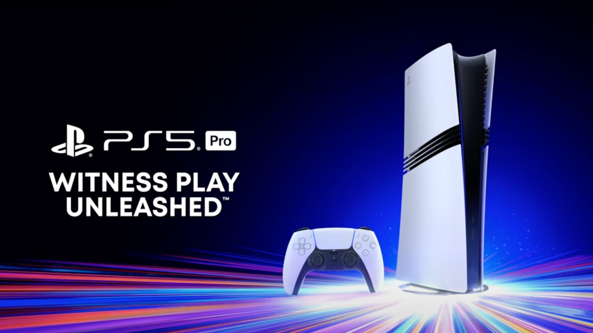

+++
title = "Meilleur GPU, ray tracing avancé, upscaling par IA : enfin une PS5 pour les Pro™"
date = 2024-09-10T16:25:00+01:00
draft = false
author = "Félix"
tags = ["Actu"]
type = "une"
image = "https://nostick.fr/articles/2024/aout/2308-valve-officialise-deadlock/deadlock.jpg"
+++

 

On le sentait venir, c’est maintenant chose faite : Sony avait une PS5 pro dans les cartons. Mark Cerny nous a présenté de sa voix suave cette nouvelle console, qui promet de ne plus nous laisser choisir entre les modes « Fidélité » et « Performance ».

La PS5 Pro va donc disposer d’un meilleur GPU et d’une RAM plus rapide, offrant un rendu que l’on nous promet jusqu’à 45 % plus efficace. Le ray tracing a été amélioré pour des performances pouvant être triplées. Sony a intégré sa technologie PlayStation Spectral Super Resolution (PSSR), de l’upscaling similaire au DLSS ou au FSR qui va carburer grâce à une puce dédiée.



Les éléments au loin sont plus détaillés, les cheveux des personnages plus beaux et les ombres plus réalistes. Plusieurs titres vont être pris en charge, nouveaux comme anciens : on a vu passer *The Last of Us*, *Spider-Man 2*, *Horizon Forbidden West*, *Gran Turismo 7* ou le dernier *Ratchet & Clank*.  Ça donne envie, mais le prix pique : 800 €, contre 549 € pour la PS5 standard et 450 pour l’édition sans lecteur CD. La PS5 Pro sera disponible le 7 novembre. 

