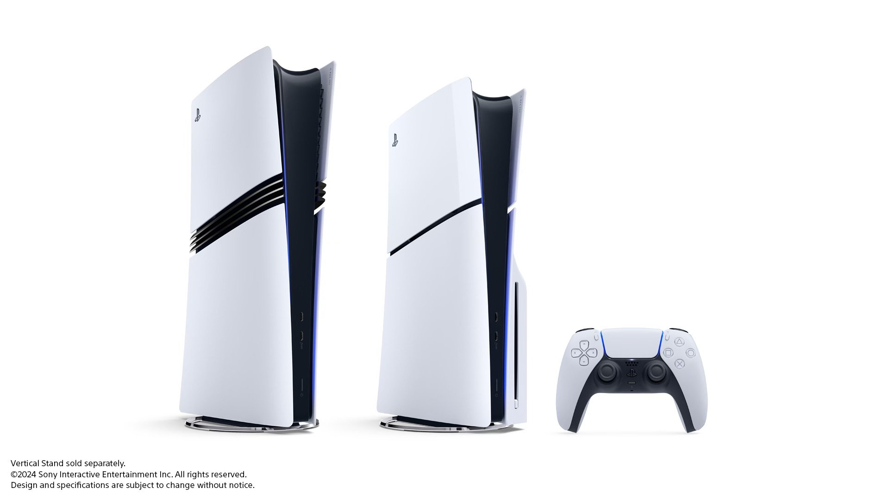
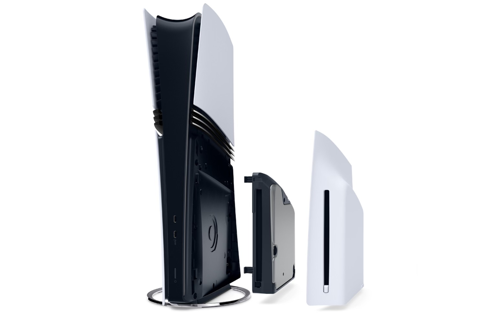

+++
title = "Meilleur GPU, ray tracing avancé, upscaling par IA et prix salé : enfin une PS5 pour les Pro™"
date = 2024-09-10T16:25:00+01:00
draft = false
author = "Félix"
tags = ["Actu"]
type = "une"
image = "https://nostick.fr/articles/2024/septembre/1009-enfin-une-ps5-pour-les-pro/ps55.png"
+++

 

On le sentait venir, c’est maintenant chose faite : Sony avait bien une PS5 Pro dans les cartons. Mark Cerny nous a présenté de sa voix suave cette nouvelle console, qui promet de ne plus nous laisser choisir entre les modes « Fidélité » et « Performance ».



La PS5 Pro va donc disposer d’un meilleur GPU et d’une RAM 28 % plus rapide, offrant un rendu jusqu’à 45 % plus efficace. Le ray tracing a été amélioré pour des performances pouvant être triplées. Sony a intégré sa technologie PlayStation Spectral Super Resolution (PSSR), de l’upscaling similaire au DLSS ou au FSR qui va carburer grâce à une puce dédiée.

 

Les éléments au loin sont plus détaillés, les cheveux des personnages plus beaux et les ombres plus réalistes. Une fonction « Game Boost » va faire son apparition pour améliorer les performances des jeux PS4 et PS5 pris en charge (on nous annonce plus de 8 500 jeux PS4 rétrocompatibles). Comptez également sur le Wi-Fi 7, le VRR et la prise en charge de la 8K.

Plusieurs titres vont être pris en charge, nouveaux comme anciens : on a vu passer *The Last of Us*, *Spider-Man 2*, *Horizon Forbidden West*, *Gran Turismo 7* ou le dernier *Ratchet & Clank*. Une mise à jour gratuite sera déployée au côté d’un petit badge « PS5 Pro Enhanced ». Les quatres joueurs ayant acheté le PlayStation VR2 sera ravis d’apprendre que le bidule est compatible, tout comme le PlayStation Portal et les manettes DualSense.

 

Ça donne envie, mais le prix pique : 800 €, contre 549 € pour la PS5 standard et 450 pour l’édition « Digital » (beurk). On pourra se réconforter en pensant aux 2 To de stockage, mais la machine arrive livrée sans lecteur CD : il faudra l’acheter séparément parce qu’après tout, pourquoi se priver. La PS5 Pro sera disponible le 7 novembre, avec une ouverture des précommandes les 26 septembre.



