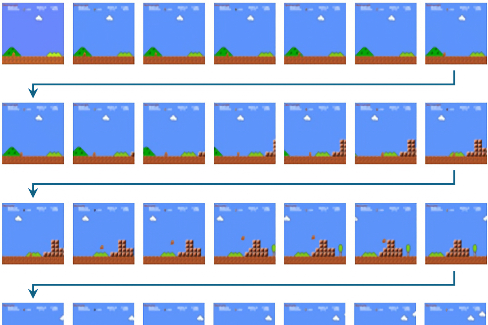
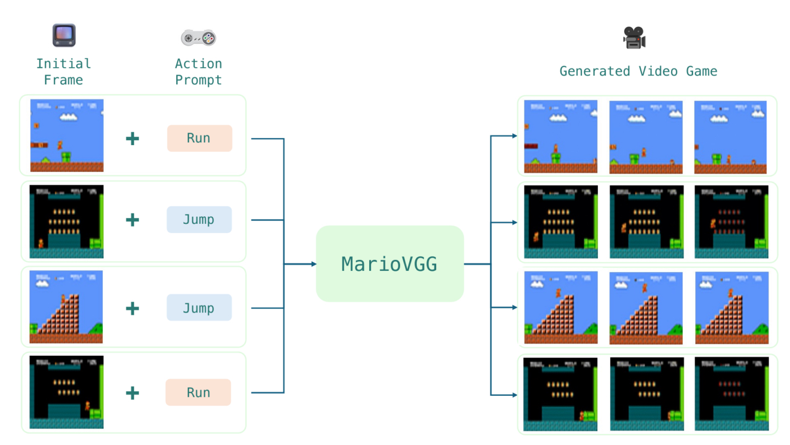

+++
title = "L'IA de MarioVGG génère des niveaux de Super Mario"
date = 2024-09-10T09:47:32+01:00
draft = false
author = "Mickael"
tags = ["Actu"]
image = "https://nostick.fr/articles/vignettes/septembre/mariovgg-2.jpg"
+++

Qui a besoin de développeurs quand l'IA peut faire tout le boulot ? Cette perspective peu réjouissante est testée par des apprentis sorciers qui nous ont déjà gratifié d'[une version de Doom entièrement générée par un modèle IA](https://nostick.fr/articles/2024/aout/3108-backlog/#la-vidéo-de-la-semaine--doom-tourne-aussi-dans-une-ia) développé par Google. Virtuals Protocol, une société qui donne dans les cryptomerdouilles, a planché sur quelque chose de similaire, mais… avec Mario, comme le raconte *[ArsTechnica](https://arstechnica.com/ai/2024/09/new-ai-model-learns-how-to-simulate-super-mario-bros-from-video-footage/)*.



Le modèle, [MarioVGG](https://huggingface.co/virtuals-protocol/mario-videogamegen), peut créer de lui-même des niveaux de *Super Mario*. C'est loin d'être parfait, puisque le « jeu » est trop lent pour être joué en temps réel. Néanmoins, le modèle ne demande qu'à s'améliorer. Les chercheurs espèrent en tout cas que ce premier développement est un premier pas vers un « générateur » de jeux vidéo fiable et contrôlable.

MarioVGG ou un successeur pourrait même « *remplacer le développement de jeux et de moteurs de jeux* », ce qui fait un peu froid dans le dos quand on y pense. En attendant, la base de données du modèle est accessible sur [GitHub](https://github.com/rafaelcp/smbdataset) ; il a été entraîné à partir d'un ensemble de données publiques de gameplay de *Super Mario Bros.* représentant 280 « niveaux » organisés pour les besoins de l'apprentissage automatique.

La recherche s'est concentrée sur des mouvements limités : le personnage court vers la droite, ou le personnage court vers la droite et saute. De quoi simplifier le processus d'apprentissage, mais revers de la médaille, cela limite aussi ses capacités de réaction. En plus d'une qualité graphique qui laisse à désirer et d'une certaine lenteur, le modèle « hallucine » également, comme toute bonne IA : Mario passe ainsi à travers des obstacles ou change soudainement de taille. Bon après tout, on a vu pire dans *Super Mario Wonder* !

Tout comme GameNGen avec *Doom*, MarioVGG est une « preuve de concept » qui démontre que malgré leurs limites, des algorithmes peuvent créer des modèles de création de jeux vidéo pouvant déboucher un jour sur quelque chose de potable. Je ne sais pas s'il faut vraiment s'en réjouir.