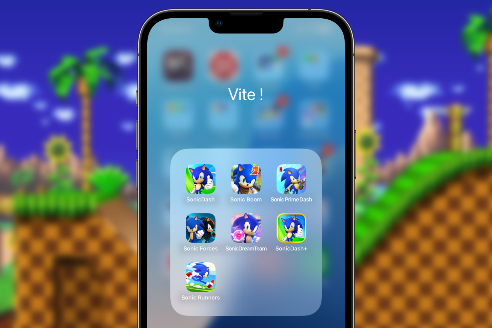
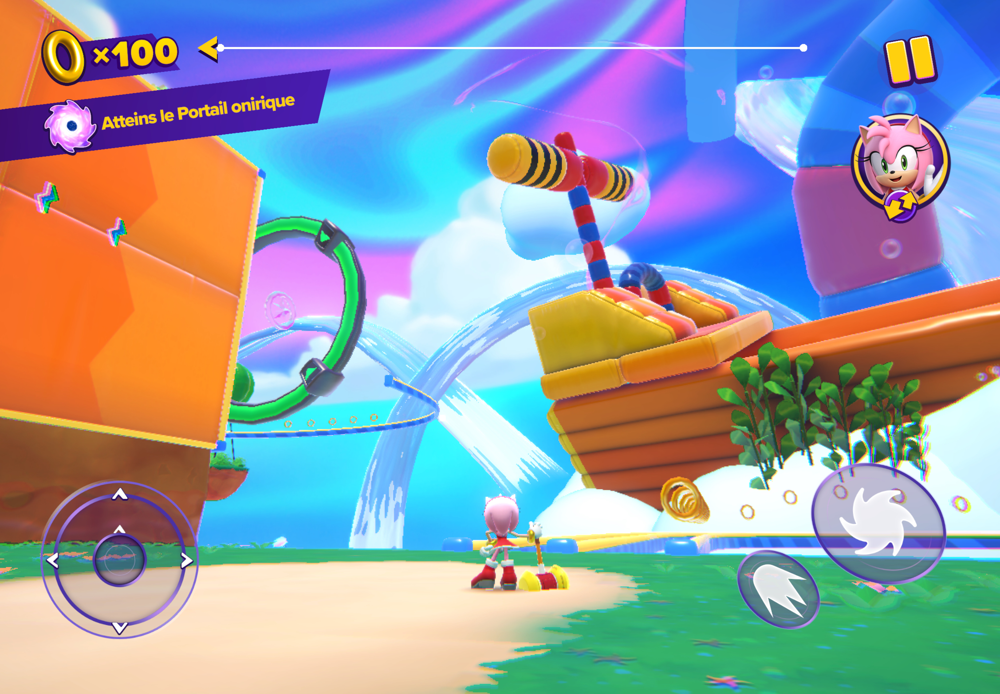
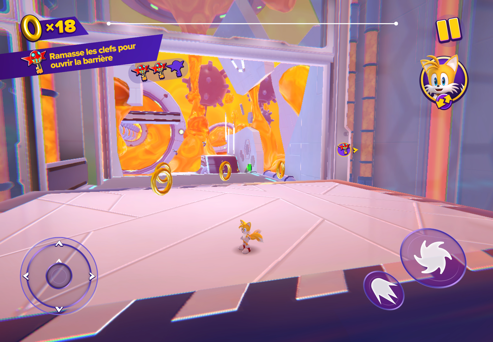
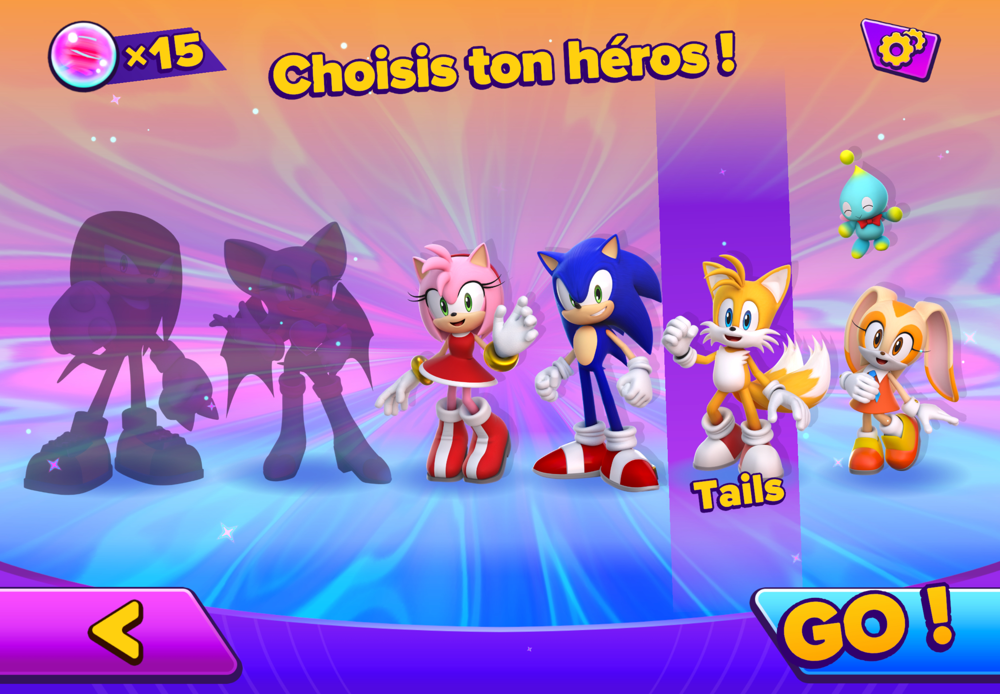
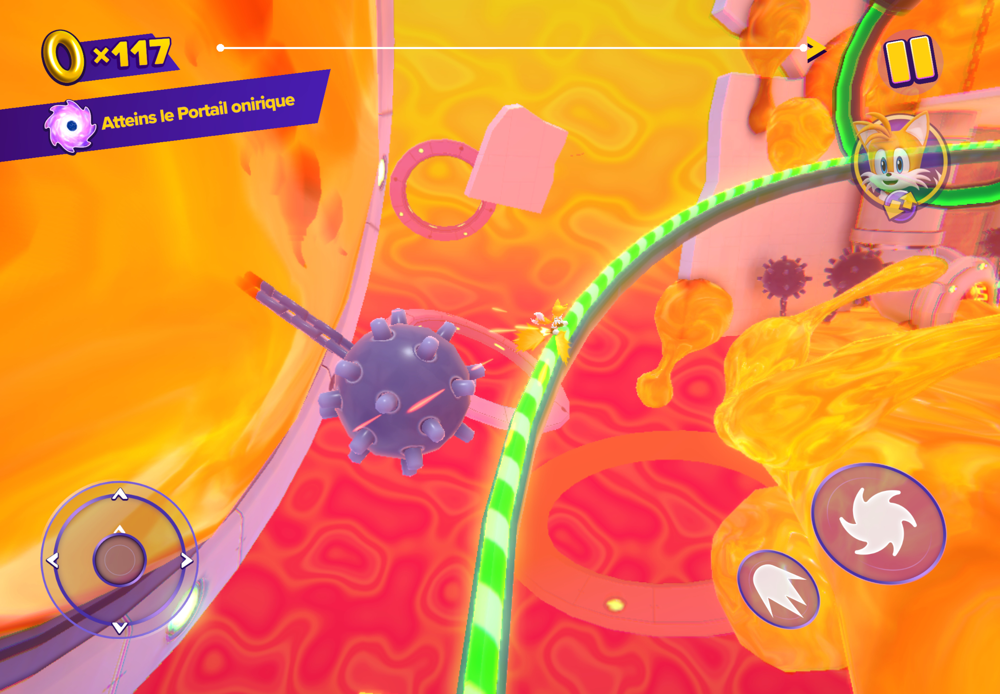
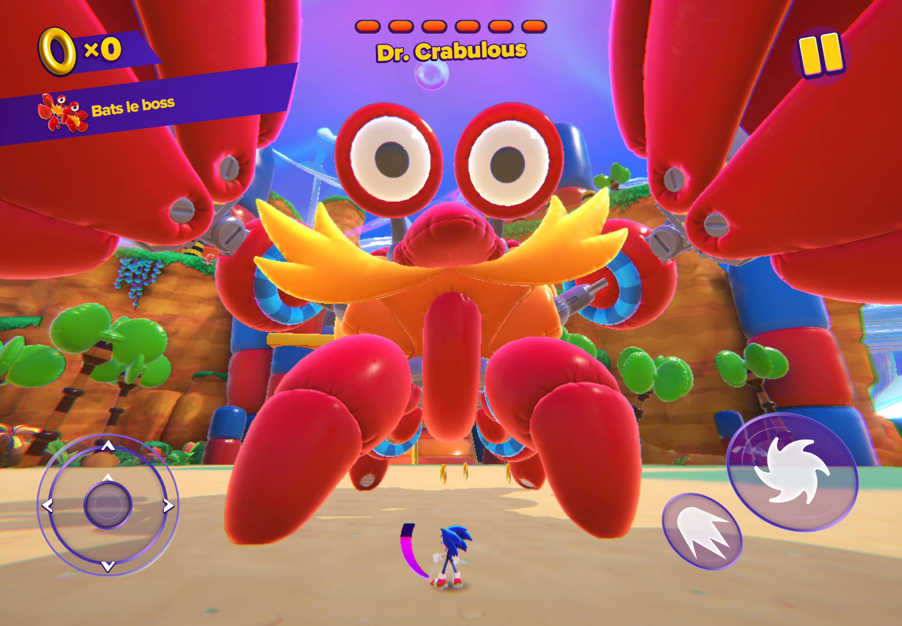

+++
title = "On a testé les jeux mobiles Sonic… et ça n'était pas si mal"
date = 2024-09-10T10:47:32+01:00
draft = false
author = "Mickael"
tags = ["Test"]
type = "une"
image = "https://nostick.fr/articles/vignettes/septembre/sonic.jpg"
+++

**Je ne vais pas mentir : en me lançant dans cette épopée folle, je ne m'attendais pas vraiment à tomber sur de bons jeux. Alors évidemment, tout n'est pas parfait loin de là, mais il faut reconnaitre qu'il est possible de s'amuser avec Sonic sur son smartphone, à condition de faire les bons choix.**

Avec *Sonic X Shadow Generations* prévu pour le 22 octobre sur consoles et PC, et *Sonic 3* qui va débouler en trombe dans les salles de cinéma le 25 décembre en France, la fin de l'année va être marquée au fer rouge par le hérisson bleu ! Mais pas besoin d'attendre pour jouer avec Sonic, il suffit de dégainer son smartphone.

Les jeux mobiles Sonic sont un peu honteux, Sega ayant souvent profité et abusé de la popularité de sa mascotte pour nous refourguer des titres indignes. Notre sélection des jeux Sonic actuellement disponibles sur smartphones — attention, on ne parle pas des jeux rétro adaptés aux smartphones — reflète ces choix hasardeux. Mais surprise, la qualité peut aussi être au rendez-vous comme c'est le cas de notre premier jeu.

## Sonic Dream Team

Allons bon, Robotnik a encore volé un truc qui permet aux rêves de devenir réalité. Vous vous en doutez, il va falloir une fois de plus arranger les bidons de l'univers tout entier et sauver le monde des rêves — et la réalité toute entière. On ne se retournera pas sur l'histoire-prétexte de ce *Sonic Dream Team*, en revanche le petit animé au lancement du jeu met tout de suite dans le bain.

Sonic et ses amis devront parcourir quatre mondes à la recherche d'orbes oniriques pour déverrouiller les niveaux. On est en terrain connu.

Un bouton pour sauter, un autre pour accélérer, et un pad tactile pour se diriger : question jouabilité, difficile de faire plus classique. La caméra se contrôle avec l'autre main, celle qui gère aussi les boutons ce qui peut être un peu compliqué dans les moments délicats ! Néanmoins, la caméra étant assez éloignée du héros, on a une assez bonne idée de l'environnement direct. Je conseille quand même de jouer à la manette, peu importe la taille de votre écran.

*Sonic Dream Team* est très dynamique, c'est un plaisir d'enchaîner les sauts et les turbos, de sauter ou de grimper aux murs. Les niveaux sont bien agencés pour la plupart d'entre eux, avec des petits trucs à découvrir ici et là, des rampes qui emmènent d'un point à un autre, et évidemment des ennemis à dégommer. 

Chaque monde terminé permet de déverrouiller de nouveaux ~~shitty friends~~ amis. On commence l'aventure avec Sonic et Amy, puis Tails et Cream seront jouables (avec leur capacité de voler), et enfin Knuckles et la séduisante Rouge, deux persos qui peuvent grimper aux murs.

Ce Sonic ne réinvente pas la roue c'est certain, mais les contrôles et les univers sont suffisamment bien fichus pour donner envie d'y revenir.

La branche « jeux 3D » de *Sonic* n'a pas la meilleure réputation, mais il se trouve que *Sonic Dream Team* réussit là où bien d'autres jeux se sont plantés avant lui. Les contrôles sont simples et adapté aux écrans tactiles (surtout sur iPhone) ; et il est possible de réorganiser et d'agrandir les boutons. 

Chacun des mondes contient 3 niveaux plus un boss, pour un total de 12 niveaux ce qui peut paraitre un peu léger, mais d'une part on est sur du jeu mobile, et puis les niveaux sont suffisamment grands et pleins de secrets pour être amusants à refaire plusieurs fois. Il faudra de toute manière en passer par là pour récupérer les orbes et passer au monde suivant ; et parfois, seule la capacité particulière d'un héros permettra de décrocher les orbes manquants.

Les niveaux sont à explorer en fonction de missions (5 par niveau) : atteindre le portail onirique, ramasser un orbe et des fragments de rêve, il y a aussi un contre la montre et un mode où il faut passer des points de contrôle avant un chrono. Des missions bien calibrées pour être jouées sur un iPhone, entre deux arrêts de bus ou dans le dos du patron. À cela s'ajoute le collectathon habituel d'étoiles et de donuts bleus à choper. Sans oublier les rings évidemment !

Tout n'est pas réussi dans *Sonic Dream Team*, c'est le cas des  boss qui ne sont pas aussi amusants qu'ils le laissent paraître. Le gros crabe gonflable du premier monde est très rapide à dégonfler, ce qui lui retire beaucoup de son charme. Heureusement, le jeu ne se limite pas à ses boss.

Malgré la diversité des missions, la durée de vie est tout de même assez limitée : en 6 ou 7 heures, on en fait le tour. On pourra regretter les quatre mondes seulement, mais les niveaux sont suffisamment vastes pour être parcourus à plusieurs reprises sans engendrer de lassitude trop vite. Et puis les missions sont variées et entraînantes.

Les graphismes sont sympas et les décors mignons, mais sans plus. On est loin d'épuiser les capacités graphiques d'un iPhone ou d'un iPad récent. Il faut aussi relever un sacrilège : les musiques ne resteront pas en tête, alors que la bande son est toujours quelque chose de soigné dans les jeux Sonic. Attention, il n'y a rien de déshonorant non plus, mais c'est vrai que bof.

L'un dans l'autre, *Sonic Dream Team* est une bonne surprise. Le jeu est entraînant, pêchu, certaines séquences sont bien sympas et font honneur à Sonic et à ses potes. La jouabilité simple mais efficace, et l'idée des missions sont parfaitement adaptées à un jeu mobile. Des missions qui permettent par ailleurs de tirer profit des niveaux et de pousser à l'exploration.

Difficile de faire la fine bouche devant ce jeu… dont le principal défaut finalement, est de n'être proposé qu'aux abonnés Apple Arcade ! Cela signifie que les joueurs Android peuvent se la mettre sous le bras. On imagine que Sega fera sauter l'exclusivité à un moment ou à un autre (*Sonic Dream Team* est sorti à la fin de l'année dernière), mais en attendant, l'éditeur impose aux fans de jouer sur leur iPhone, iPad ou Mac.

- *Sonic Dream Team* à télécharger sur [iOS](https://apps.apple.com/us/app/sonic-dream-team/id1609094795).

## Sonic Dash, Sonic Dash+, Sonic Prime Dash

*Sonic Dash*, *Sonic Dash+* et son cousin *Sonic Prime Dash* sont des jeux de running à la manière de *Temple Run* (ça reviendra souvent dans les jeux qui vont suivre). Il faut dire que ce type de gameplay colle assez bien avec Sonic, il y a donc une certaine logique à voir Sega s'y intéresser.

Si on regroupe ces trois jeux, c'est qu'ils sont très proches les uns des autres. En fait, ils proposent tous les mêmes niveaux, le seul changement réside dans le déverrouillage des personnages : dans *Sonic Dash*, c'est un système de cartes (sur iOS du moins), dans les deux autres il faut construire des abris pour les animaux (et aussi dans *Sonic Dash* sur Android, allez comprendre).

La grande différence réside surtout dans le modèle économique de ces jeux. *Sonic Dash* est un jeu free-to-play rempli de pub jusqu'à ras la gueule ; les deux autres ne sont accessibles que si on a souscrit soit à Apple Arcade (*Sonic Dash+*), soit à Netflix (*Sonic Prime Dash*).

Si vous avez déjà pratiqué un *endless runner* dans votre vie, vous connaissez déjà tout de *Sonic Dash*. Le héros file tout droit, il faut le diriger de gauche à droite pour éviter les obstacles, et on peut le faire sauter ou faire des roulades toujours dans le but d'éviter les trucs en chemin. Dégommer un ennemi avec une roulade reviens à sauver un animal, alors faites vous plaisir !

Entre deux courses, *Sonic Dash* propose de combattre des boss venant d'autres épisodes de la saga. Il faut ici toucher l'écran au bon moment, en étant précis et adroit. Ce ne sont pas les meilleurs moments du jeu, il faut bien l'avouer, et on est content de retrouver le plancher des vaches. Pour le reste, *Sonic Dash* ne change pas une jouabilité qui a démontré son efficacité à d'innombrables reprises dans d'autres jeux du même tonneau.

L'intérêt du jeu est pouvoir déverrouiller tous les persos de l'univers Sonic… Et il y en a un bon paquet, des plus connus aux plus obscurs — bon sang de bois, Sega a vraiment forcé sur les shitty friends durant toutes ces années de Sonic…

Là où *Sonic Dash* coince, c'est au niveau de son modèle économique merdique : la version « gratuite » du jeu ne perd jamais un instant pour infliger au joueur de la pub tout le temps et à tout propos. L'interface est bourrée de *dark patterns* qui poussent le joueur à toucher un bouton lançant une page de pub. Le nombre de monnaies et de ressources à obtenir pour pouvoir déverrouiller un perso ou l'améliorer fait tourner la tête, à l'image des micro-transactions.

*Sonic Dash* est une caricature du freemium, un jeu qu'on aura bien du mal à recommander, que ce soit pour soi ou pour ses enfants. Et c'est bien dommage, parce que le gameplay en lui-même est plutôt agréable. Mais tout ce qu'il y a autour, c'est le capitalisme dégénéré dans ce qu'il a de pire. Comment Apple ou Google peuvent promouvoir ces pratiques, c'est quelque chose qui me dépasse.

Heureusement qu'il y a les versions sans pub, rattachées à des abonnements Netflix ou Apple Arcade. Exit les réclames abrutissantes pour des jeux complètement crétins, au revoir les micro-transactions ! Il faut toujours composer avec des tonnes de ressources différentes, la boutique est toujours présente (mais les items sont à acheter avec la monnaie qu'on gagne en jeu), ce qui trahit l'origine freemium du jeu d'origine. Elles sont cependant disponibles en abondance.

*Sonic Dash* n'est pas le clone le plus déshonorant qui soit de *Temple Run*. Il peut occuper le temps si vous avez un abonnement Netflix ou Apple Arcade, car tout l'aspect monétisation et publicité sera supprimé. Et c'est un soulagement, car la version free-to-play est une horreur, un véritable tue-l'amour pour les fans de Sonic.

- *Sonic Dash* sur [iOS](https://apps.apple.com/app/sonic-dash-fun-endless-runner/id582654048) et [Android](https://play.google.com/store/apps/details?id=com.sega.sonicdash). 
- *Sonic Dash+* sur [iOS](https://apps.apple.com/app/sonic-dash/id1608888053) (avec Apple Arcade). 
- *Sonic Prime Dash* sur [iOS](https://apps.apple.com/app/sonic-prime-dash/id6445996493) et [Android](https://play.google.com/store/apps/details?id=com.netflix.NGP.SonicDash) (avec Netflix).

## Sonic Dash 2: Sonic Boom, Sonic Forces

*Sonic Dash 2: Sonic Boom* et *Sonic Forces* sont des variations sur le même thème. On est sur du *endless runner* façon *Temple Run*, avec chacun leur petite originalité. *Sonic Boom* permet de changer de perso entre deux niveaux : on peut débuter une partie avec Sonic, continuer avec Tails et terminer avec Amy, c'est vous qui voyez. Chacun des héros a une capacité bien à lui, par exemple Knuckles produit une explosion après un saut.

.")

Bien sûr, un système d'amélioration des persos est présent en déverrouillant des paliers à acheter avec des rings, et des « lutins » peuvent apporter des bonus permanents ou pour la prochaine course. *Sonic Boom* est probablement le plus faible de tous les runners Sonic, les différents niveaux ne sont pas très beaux et puis bon, les mêmes mécanismes f2p sont à la fête là encore.

*Sonic Forces* est autrement plus ambitieux. D'abord, les routes sont composées de 4 couloirs contre 3 habituellement, ce qui n'est pas inintéressant niveau tactique de course. Les parcours servent le gameplay puisqu'on affronte 3 autres coureurs. Le matchmaking s'arrangera pour opposer des joueurs de même niveau, aussi bien des humains que des bots. Ces derniers sont nombreux durant les premières courses (il faut bien débuter), mais les joueurs humains finissent par apparaitre dans les niveaux plus élevés.

.")

Il s'agit évidemment d'arriver en première position pour gagner le maximum de ressources, et tous les coups sont permis. De nombreuses armes (boules de feu, éclairs, tornades…) sont à récupérer sur le parcours pour les balancer au moment opportun sur les rivaux. Ils ne s'en priveront pas, alors soyez généreux !

Les courses sont donc plutôt nerveuses, il y a un petit côté *Mario Kart* pas désagréable. Les premières niveaux sont très faciles et on progresse rapidement ; en revanche, dès qu'interviennent les joueurs humains, là ça rigole moins et il faudra faire ses preuves sur le terrain. Ce d'autant que le jeu peut retrancher des points si on arrive troisième ou bon dernier…

Par ailleurs, graphiquement ce *Sonic Forces* est un des plus beaux runners Sonic ici présent, avec des décors sympas et des parcours variés (pas mal de rampes et autres détours). Dommage qu'on y retrouve les mêmes interfaces trompeuses et de la pub jusqu'à l'indigestion. 

*Sonic Forces* gagnerait certainement à virer au moins les pages de pub interminables pour se concentrer sur sa boutique de micro-transactions. Mais si vraiment vous désespérez de jouer à un runner et que vous êtes prêt à encaisser de la réclame, celui-ci n'est pas le plus mauvais choix.

- *Sonic Dash 2: Sonic Boom* sur [iOS](https://apps.apple.com/us/app/sonic-dash-2-sonic-boom/id968744559) et [Android](https://play.google.com/store/apps/details?id=com.sega.sonicboomandroid)
- *Sonic Forces* sur [iOS](https://apps.apple.com/us/app/sonic-forces-pvp-racing-battle/id1262362476) et [Android](https://play.google.com/store/apps/details?id=com.sega.sprint) 

## Sonic Runners Adventure

Les jeux mobiles Sonic sont développés par le studio Hardlight, fondé par Sega en 2012, tous… ou presque. En 2017, c'est Gameloft qui lance ce *Sonic Runners Adventure*, et ça n'est pas la seule bizarrerie de ce jeu : il est en effet payant (3 €). Et malgré quelques défauts, il vaut le détour pour les fans, et aussi pour ceux qui aiment les bons petits jeux.

Il s'agit également d'un *runner*, mais en scrolling 2D vu de côté comme les *Sonic* classiques. On y retrouve aussi les  plateformes habituelles et les ennemis qu'on connait bien. En fait, c'est tout comme un *Sonic*… sauf que le joueur se contente de le faire sauter ! Il suffit de toucher l'écran pendant que cet idiot court comme un fou. Un gameplay ultra-simple qui rappelle forcément *Super Mario Run*. Et pourquoi pas ?

Le jeu comprend 4 mondes, inspirés bien sûr des jeux Sonic, composés de plusieurs niveaux ; chacun d'entre eux compte 3 défis qui permettent d'obtenir des étoiles (remporter tant de rings, battre tant d'adversaires, courir telle distance en un temps donné, etc.). Et ces étoiles sont indispensables pour poursuivre l'aventure.

*Sonic Runners* a ce petit parfum très agréable d'avant tout le bordel de micro-transactions et de pub qui a pourri l'univers des jeux mobiles. Dynamique et entraînant (avec une bande son rock de bon aloi), il offre aussi un challenge de plus en plus corsé. En fait, j'irais jusqu'à dire que Gameloft a réussi là où Nintendo a échoué avec *Super Mario Run* : d'un côté un jeu fun avec un goût de reviens-y, de l'autre un jeu rapidement crispant et frustrant (c'est aussi à ça qu'on voit l'expérience du jeu mobile de Gameloft). Bonus : *Sonic Runners* est régulièrement mis à jour.

- *Sonic Runners Adventure* sur [iOS](https://apps.apple.com/us/app/sonic-runners-adventure/id1306844643) et [Android](https://play.google.com/store/apps/details?id=com.gameloft.android.ANMP.GloftICHM)

Sonic est depuis longtemps un habitué des plateformes mobiles. Si les *endless runners* se taillent la part du lion, il ne faut pas oublier les autres titres qui, à l'image de *Sonic Dream Team* et *Sonic Runners Adventure*, valent le coup d'œil. Et bien sûr, il y a tous les autres jeux Sonic émulés disponibles sur smartphones et tablettes.