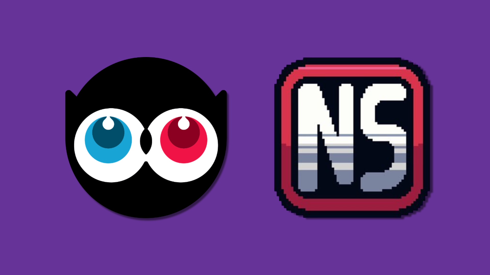
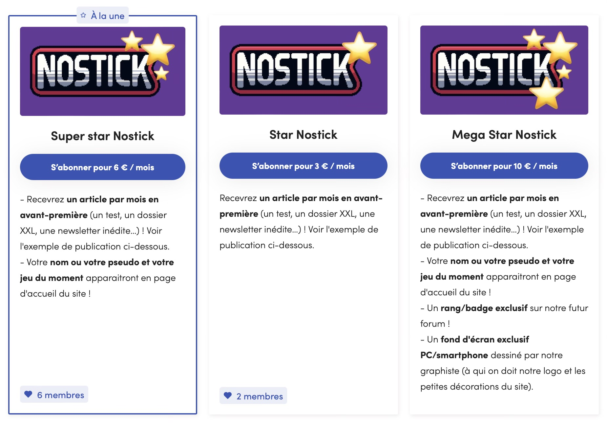

+++
title = "Un forum dédié : notre nouvel objectif pour Nostick !"
date = 2024-09-11T11:25:00+01:00
draft = false
author = "Félix"
tags = ["Actu"]
type = "une"
image = "https://nostick.fr/articles/2024/septembre/1009-enfin-une-ps5-pour-les-pro/ps55.jpg"
+++

 

Salut à tous !

Un petit billet « vie du site » pour revenir sur [le lancement de notre Ulule](https://nostick.fr/articles/2024/aout/2809-nostick-souffle-sa-premiere-bougie/), dont on est très satisfait : 9 d’entre vous se sont abonnés, ce qui nous a permis de largement atteindre notre premier objectif. On va donc bientôt pouvoir se passer de Substack pour migrer vers [Ghost](https://ghost.org/), une alternative qui nous fait de l’œil par son côté open source et entièrement personnalisable. Encore merci à tous pour le soutien !

Il faut qu’on se penche dessus et on aimerait faire ça de manière propre (comprendre : sans perdre la moitié des abonnés en route ou vous demander de nous redonner votre mail), donc la transition se fera d’ici la fin de l’année. En pratique, l’infolettre arrivera depuis un nouveau mail et sera plus jolie. De notre côté, ça nous permet d’être plus indépendant sans avoir à nous coltiner certains aspects disons, lourdingues, de Substack.

Comme c’est le jeu avec Ulule, il faut maintenant qu’on se fixe un nouvel objectif et cette fois, cela concerne toute la communauté Nostick ! On adorerait avoir notre propre forum de discussion pour nos lecteurs, ce qui permettrait à la fois de discuter des articles mais aussi d’échanger avec vous dans un espace dédié. On pensait partir sur [Discourse](https://www.discourse.org/) étant donné que c’est open source, et que les possibilités sont énormes en termes de personnalisation. C’est ce qu’on trouve sous le capot des forums de [Godot](https://forum.godotengine.org/) ou de [Eve Online](https://forums.eveonline.com/) par exemple.

On estime qu’il nous faudrait environ 80 € par mois pour financer non seulement l'abonnement à Ghost (25 $/mois) mais aussi l'hébergement sur un serveur dédié (13,80 €/mois chez [OVH](https://www.ovhcloud.com/fr/vps/compare/)). Vu qu'on n'est pas spécialement doué à la technique, l'idée serait de faire appel à un prestataire indépendant qui nous mettait tout ça en place et gérerait la maintenance. Et on a ajouté l'abonnement à [Plausible](https://plausible.io/), l'équivalent de Google Analytics en moins intrusif et open source (11 €/mois).

Si on atteint ce palier, Nostick sera autonome non seulement techniquement, mais aussi financièrement, ce qui serait quand même sympa ! 

 

On profite de l'occasion pour lancer un nouvel abonnement Mega Star Nostick à 10 € par mois. Il contient :

- la lecture en avant-première d'un article par mois (actuellement [un test](https://fr.ulule.com/nostick/news/on-a-teste-les-jeux-mobiles-sonic----et-ca-n-etait-pas-si-mal-413015/) des différents jeux mobiles Sonic) — et il y en aura probablement plus ;
- l’affichage de votre nom ou de votre pseudo ainsi que de votre jeu du moment sur la page d'accueil du site ;
- un rang/badge exclusif sur le futur forum ;
- un fond d'écran exclusif pour PC et smartphones dessiné par notre graphiste (à qui on doit notre logo et les petites décorations du site).

Les membres déjà abonnés aux deux paliers payants recevront également le badge pour les forums et le fond d'écran exclusif, pour les remercier de nous avoir fait confiance.

Encore merci de nous lire et à bientôt 🥳 !