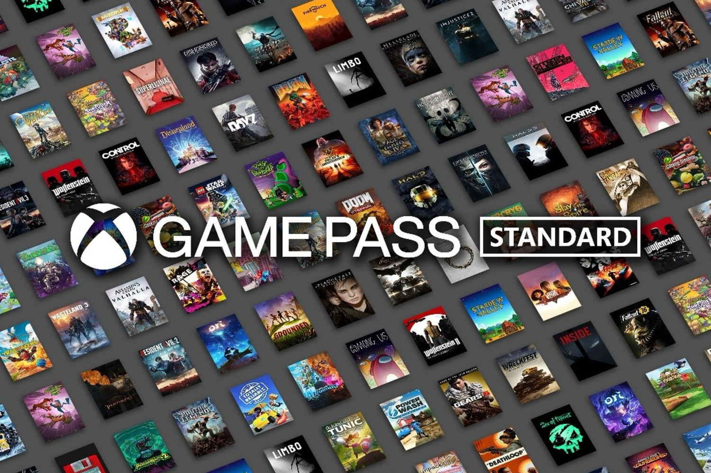
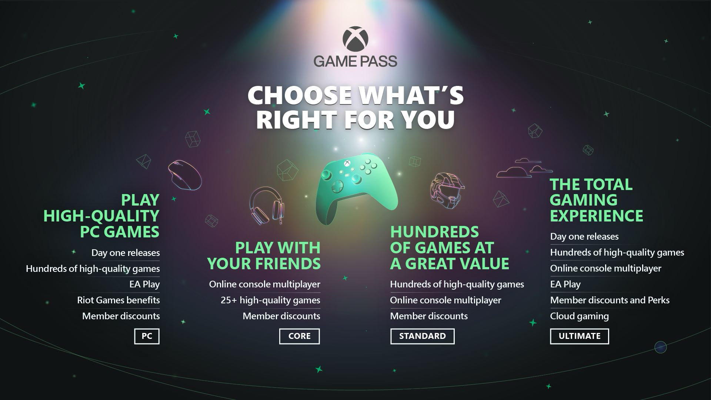

+++
title = "La nouvelle formule Game Pass Standard est dispo pour tous, mais la voulez-vous vraiment ?"
date = 2024-09-11T08:01:32+01:00
draft = false
author = "Mickael"
tags = ["Actu"]
image = "https://nostick.fr/articles/vignettes/septembre/game-pass-standard.jpg"
+++

Microsoft a mis sa menace à [exécution](https://news.xbox.com/en-us/2024/09/10/xbox-game-pass-standard-is-here/) : le Game Pass est désormais beaucoup plus compliqué à piger. Les changements apportés au service, [annoncés début juillet](https://nostick.fr/articles/2024/juillet/0907-game-pass-xbox-bordel-hausse-prix/), sont en effet en place après une petite période de bêta test. Le Game Pass garde ses quatre formules, mais Xbox a augmenté les prix et secoué le cocotier des prestations, alors voici ce que ça donne :

- **Game Pass Core** (6,99 €/mois) : accès à un catalogue de 25 jeux + le multi en ligne sur console ;
- **Game Pass Standard** (12,99 €/mois) : accès au catalogue du Game Pass *mais pas aux nouveautés dès le jour de leur sortie* + le multi en ligne sur console ;
- **Game Pass PC** (11,99 €/mois) : accès au catalogue du Game Pass *et aux nouveautés dès le jour de leur sortie* ainsi qu'à celui de EA Play ;
- **Game Pass Ultimate** (17,99 €/mois) : accès au catalogue du Game Pass *et aux nouveautés dès le jour de leur sortie* ainsi qu'à celui de EA Play + le multi en ligne sur console + Xbox Cloud Gaming.

La grosse nouveauté dans cette offre, c'est l'abonnement Standard qui remplace l'ancienne formule Game Pass Console. Elle était moins chère (10,99 €) et donnait accès aux nouveautés « day one », mais sans le multi en ligne. Les consoleux devaient souscrire à l'offre Ultimate, qui était vendu à l'époque 14,99 €, pour pouvoir jouer en multi.

Le nouveau Game Pass Standard ajoute 2 € et le multi, mais on perd les nouveautés dès le jour de leur sortie. Elles seront ajoutées au catalogue dans les 12 mois après leur sortie, en fonction des jeux. 