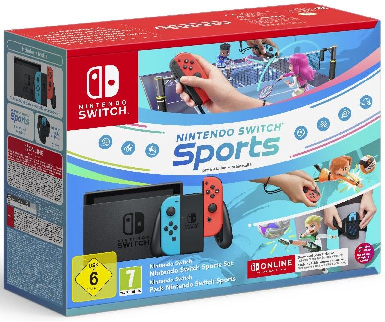

+++
title = "Des bundles de Switch comme s'il en pleuvait"
date = 2024-09-11T09:30:32+01:00
draft = false
author = "Mickael"
tags = ["Actu"]
type = "telex"
+++

Maintenant que [la PS5 Pro est sortie](https://nostick.fr/articles/2024/septembre/1009-enfin-une-ps5-pour-les-pro/), il est temps de se concentrer à nouveau sur notre passe-temps favori : la Switch 2 ! [Les rumeurs d'une annonce imminente](https://nostick.fr/articles/2024/septembre/0409-switch-2-nintendo-presentation/) sont mises à mal par les révélations de Bilbil-kun qui, sur *Dealabs*, continue de dérouler la feuille de route matérielle de Nintendo pour la fin de l'année… et visiblement, le constructeur a davantage l'intention de vider les stocks que de les remplir avec les palettes de sa nouvelle console !

En plus du bundle Switch OLED + *Super Mario Bros. Wonder* [dévoilé la semaine dernière](https://nostick.fr/articles/2024/septembre/0609-pas-de-switch-2-en-septembre/) — mais pas encore officialisé —, Nintendo [devrait](https://www.dealabs.com/magazine/nintendo-switch-nous-avons-sans-doute-le-tableau-complet-des-sorties-de-materiels-a-venir-en-europe-59348) également lancer quatre autres packs. Deux concernent la Switch Lite avec un jeu (inconnu pour le moment) au prix de 219 € ; un pack regroupera la Switch standard avec *Nintendo Switch Sports* et 12 mois au NSO pour 299 € ; un quatrième mettra ensemble une Switch OLED avec un jeu inconnu à 349 €.

L'annonce de ces nouveaux bundles est prévue pour le 12 ou le 13 septembre, la commercialisation débutera aux alentours du 19 septembre. Gardons en tête que cela concerne l'Europe, rien ne dit que ces packs seront proposés ailleurs dans le monde. L'importance toute relative de ces packs donne un peu d'espoir à tous ceux qui espèrent toujours une présentation de la Switch 2 en septembre. 