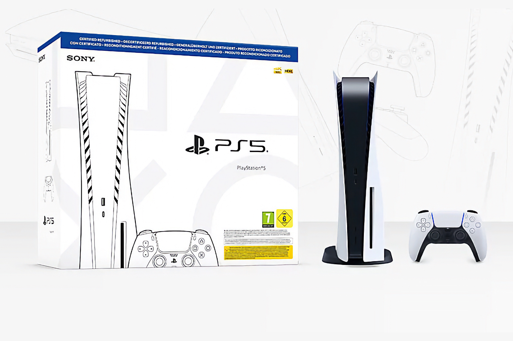

+++
title = "Sony vend des PS5 « fat » avec lecteur disque reconditionnées à 450 €"
date = 2024-09-11T15:47:32+01:00
draft = false
author = "Mickael"
tags = ["Actu"]
image = "https://nostick.fr/articles/vignettes/septembre/PS5-refurb.jpg"
+++

Le prix de la PS5 Pro vous reste en travers de la gorge ? C'est vrai que 800 €, ça fait un peu cher pour [faire disparaitre le choix cornélien du mode fidélité ou qualité](https://nostick.fr/articles/2024/septembre/1009-enfin-une-ps5-pour-les-pro/) au début du jeu. Il reste heureusement toujours possible de s'équiper d'une PS5 Slim standard. Pour ceux qui veulent faire une petite économie, PlayStation propose une nouvelle option : le refurb.

Sony propose ainsi une PS5 « fat » avec son lecteur optique au prix de 449,99 €. Certes, c'est l'ancien design de la console, plus imposant et moins bien doté en stockage (825 Go) que la PS5 Slim (1 To). Mais en même temps, on gratte 100 € sur le prix de la PS5 Slim avec lecteur Blu-ray, et les performances sont similaires. Contrairement aux États-Unis, le refurb français ne propose pas (pas encore ?) la PS5 Slim « édition numérique ».

Les PS5 reconditionnées par Sony sont « *nettoyées et testées minutieusement* », le cas échéant avec des composants neufs, et fournies avec une manette DualSense et 12 mois de garantie. Pas un mauvais deal si vous voulez mon avis, même s'il peut y avoir des petits défauts esthétiques. C'est à retrouver à cette [adresse](https://direct.playstation.com/fr-fr/certified-refurbished?addedSkuId=1000043590-FR).