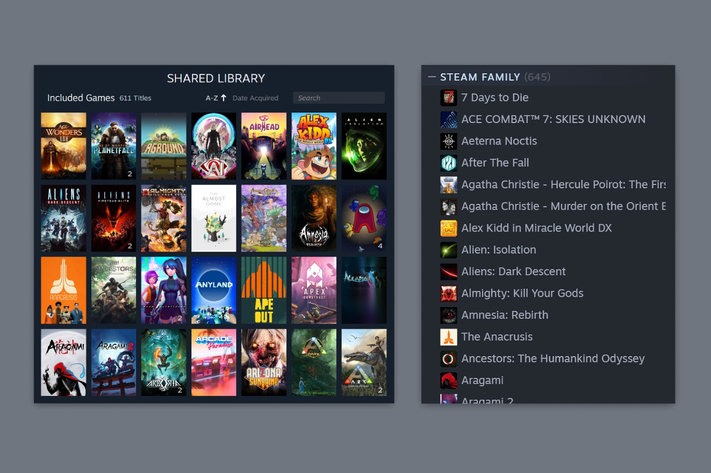

+++
title = "Vous pouvez laver votre linge sale en famille sur Steam"
date = 2024-09-12T08:30:32+01:00
draft = false
author = "Mickael"
tags = ["Actu"]
type = "telex"
+++

[En bêta depuis le mois de mars](https://nostick.fr/articles/2024/mars/1903_steam/), la fonction Famille Steam est désormais ouverte à tous les utilisateurs de la boutique en ligne. Il faudrait plutôt parler d'un ensemble de fonctions, puisque cette nouveauté remplace le partage familial et le mode famille de Steam qui n'ont jamais convaincu.

 

Une famille Steam peut compter jusqu'à 6 membres par foyer (dont l'utilisateur principal). Tout le monde aura dès lors accès à la même bibliothèque de jeux ; chaque membre conserve son propre profil, ses progressions, ses succès… 

En revanche, un même jeu ne pourra pas être joué par deux membres de la famille, à moins d'en posséder deux copies. Les développeurs peuvent désactiver le partage familial dans leurs jeux, ce qui n'est pas un bon calcul mais que voulez-vous.

Steam fournit une [liste](https://store.steampowered.com/search/?category2=62&ndl=1) des jeux compatibles, il y en a un petit paquet. Un système de contrôle parental est aussi présent, et les gamins pourront réclamer l'achat d'un jeu jusqu'à ce que les parents cèdent. Vous trouverez toutes les infos à cette [adresse](https://steamcommunity.com/games/593110/announcements/detail/4605582245626919824).