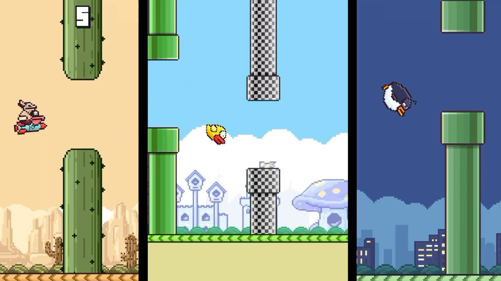
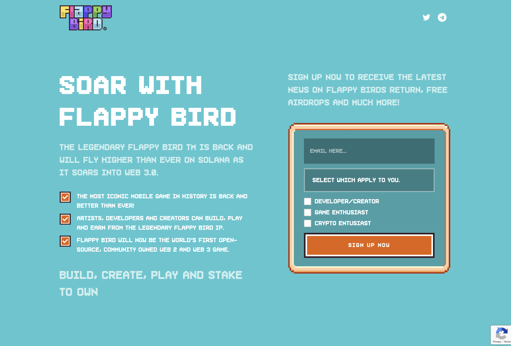

+++
title = "Le nouveau Flappy Bird est une cryptomerdouille [màj]"
date = 2024-09-13T14:45:32+01:00
draft = false
author = "Félix"
tags = ["Actu"]
image = "https://nostick.fr/articles/2024/septembre/1209-retour-de-flappy-bird/flappy.png"
+++

 

**Mise à jour 13/09 —** Les nouveaux proprios de *Flappy Bird* sont restés assez discrets sur le modèle économique du jeu, se contentant d'évoquer entre les lignes des microtransactions. Mais en fait, ce futur *Flappy Bird* ne sera qu'une énième tentative de refourguer des cryptomerdouilles aux joueurs innocents. 

Le chercheur en sécurité Varun Biniwale a [fouillé](https://varun.ch/flappy-bird) le site web du projet et surprise, on trouve une page cachée qui annonce que « *le légendaire Flappy Bird est de retour et volera plus haut que jamais sur Solana en s'envolant vers le Web 3.0… Flappy Bird sera désormais le premier jeu open-source, détenu par la communauté, à la fois pour le Web 2.0 et le Web 3.0* ». La « Flappy Bird Foundation » promet des distributions gratuites de cryptos à tous ceux qui s'inscriront à la newsletter.

 

Le chercheur est également tombé sur un prototype jouable du jeu avec un tableau des scores déjà rempli avec des pseudos évoquant des cryptomerdouilles. Bon sang ne saurait mentir.

On connait aussi un peu mieux les instigateurs du projet, notamment Michael Roberts, qui supervise la fameuse « fondation ». Le game designer est aussi le patron du studio 1208 Productions, « *pionnier du web3* » et qui entretient des liens avec le petit monde frelaté des NFT. CQFD.

**Article original, 12/09 —** Voilà un truc qu’on n’avait pas sur le bingo 2024 : le retour de *Flappy Bird* ! Ce grand classique du jeu mobile reviendra en 2025 sur iOS, Android et un peu avant sur navigateurs. *Flappy Bird* avait connu un succès phénoménal en 2013 (ça ne nous rajeunit pas) avant que son unique développeur Dong Nguyen ne décide de tout débrancher face à la pression du succès.

Qui se cache derrière ce retour en fanfare ? Pour être honnête, c’est un peu le bordel. ‌« The Flappy Bird Foundation Group » va relancer le projet et se présente comme « *une nouvelle équipe de fans passionnés qui s'engagent à partager le jeu avec le monde entier* ». Un site web a été [mis en ligne](https://flappybird.org) pour l’occasion, où l’on nous invite à rejoindre… un canal Telegram. 

C’est un peu louche, mais passons. La fondation explique avoir obtenu les droits sur le jeu en rachetant la licence à Gametech, LLC. Celle-ci n’est pas en lien avec Nguyen, qui n’a d’ailleurs pas communiqué sur ce retour (ni [tweeté](https://x.com/dongatory?lang=vi) depuis des années). La question de l’origine de *Flappy Bird* se posait déjà en 2013, le titre ayant de grosses similitudes avec *Piou Piou*, un [jeu mobile](https://blog.zanorg.com/?perm=423) du développeur français Kek. ‌The Flappy Bird Foundation Group affirme avoir racheté les droits sur les deux projets, ce qui devrait lui éviter les problèmes. 

 

En attendant de voir si un procès éclate, le *Flappy Bird* 2024 devrait apporter pas mal de nouveautés. On nous promet des défis multijoueurs, un mode Battle royale, des personnages inédits et des modes de jeu originaux. Le jeu devrait revenir sur navigateur « *et d’autres plateformes* » à l’automne avant d'arriver sur mobile l’année prochaine. Si vous voulez mon avis ça va faire le buzz pendant 2 jours avant que tout le monde ne souvienne que quand même, c’était pas si fou que ça, *Flappy Bird*.