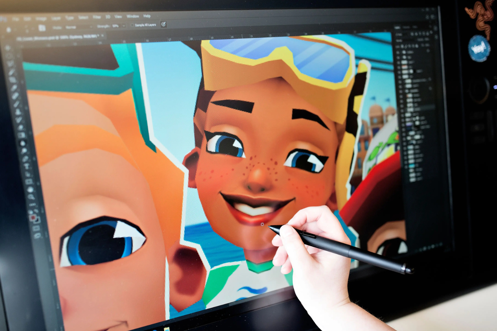

+++
title = "Unity abandonne son système de frais fixes Runtime au grand soulagement de tous"
date = 2024-09-12T18:02:32+01:00
draft = false
author = "Mickael"
tags = ["Actu"]
image = "https://nostick.fr/articles/vignettes/septembre/unity.jpg"
+++

Unity a fait n'importe quoi l'an dernier en annonçant la mise en place de nouveaux frais pour les jeux utilisant le moteur du même nom. Au-delà d'un certain seuil de revenus, les développeurs devaient régler un montant fixe pour chaque installation supplémentaire. Ce qui pouvait devenir rapidement devenir un gros problème pour un jeu gratuit qui devient viral.

Ce nouveau modèle économique a failli précipiter la chute du géant Unity : l'ensemble de l'industrie, des petits développeurs aux grands éditeurs, est monté au créneau pour s'y opposer. Plusieurs d'entre eux ont signé une [lettre ouverte](https://medium.com/supercent-blog/collective-letter-to-unity-dcf962f4f1ad) contre ces frais et pire encore, ils ont retiré de leurs jeux la plateforme de pub de Unity.

L'entreprise assurait à l'époque que ces frais Runtime ne concerneraient que 10 % des utilisateurs du moteur. Mais devant la bronca d'une ampleur inédite suscité par cette nouvelle stratégie, Unity n'a cessé de faire des concessions… Peine perdue, la confiance est brisée. Le nouveau patron de Unity, Matthew Bromberg, veut désormais faire table rase du passé en [annonçant](https://unity.com/fr/blog/unity-is-canceling-the-runtime-fee) l'abandon pur et simple de ces frais fixes.

La société revient donc à son modèle traditionnel à base d'abonnements en fonction du nombre de postes. Et cela s'appliquera aussi pour Unity 6, la nouvelle version du moteur. Les prix des abos Pro et Enterprise de Unity vont augmenter, de respectivement 8 % et 25 % ; en revanche, l'abonnement gratuit Unity Personal relève le plafond au-delà duquel il faut passer à la caisse, ce qui est une bonne nouvelle pour les petits développeurs.

Cet incroyable bordel a tout de même eu deux conséquences positives. La première, c'est que le CEO de Unity, John Riccitiello, a dû quitter son poste moins d'un mois après l'annonce des frais Runtime ! Le bonhomme est franchement chelou. C'est à lui qu'on doit l'accélération pratiques toxiques de monétisation agressive chez Electronic Arts, lorsqu'il en était le patron.

En 2022, alors à la tête de Unity, il a déblatéré sur ces « *foutus idiots* » de développeurs qui n'intègrent pas de microtransactions dans leurs jeux (il s'en est [excusé](https://x.com/johnriccitiello/status/1548326529217679365) ensuite). Plus curieux, il a [vendu](https://www.pocketgamer.biz/unitys-ceo-john-riccitiello-sold-shares-a-week-before-dropping-their-pricing-bombshell/) des centaines d'actions Unity avant qu'elles ne plongent suite à l'annonce des frais Runtime… Aurait-il senti que ça n'allait pas passer comme une lettre à la Poste ?

L'autre aspect positif de toute cette histoire, c'est que [Godot](https://godotengine.org), le moteur de jeu open source, gratuit et multiplateforme, connait un regain de popularité qui lui assure un développement pérenne.