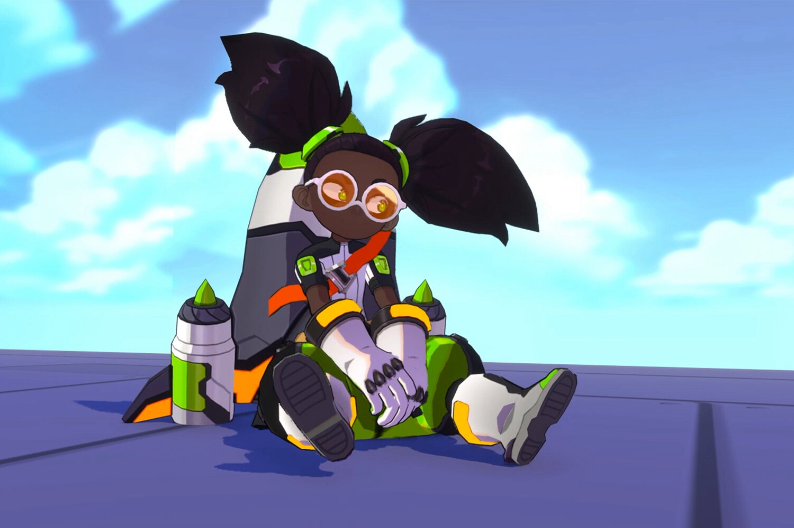
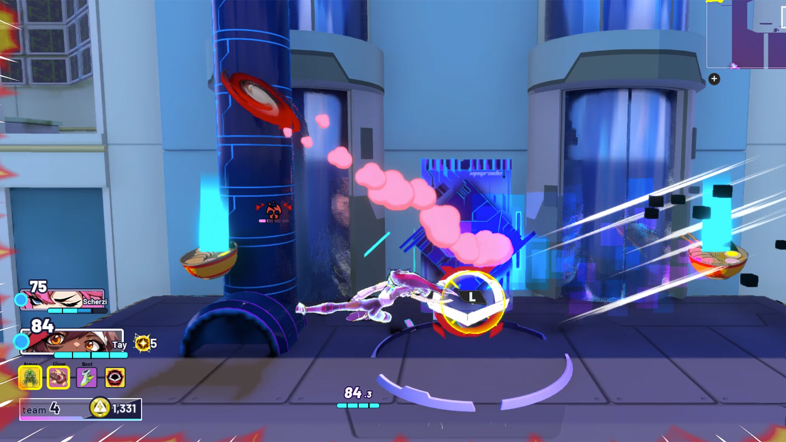

+++
title = "Byte Breakers : qui veut goûter ce cocktail de Smash et de battle royale ?"
date = 2024-09-13T10:10:32+01:00
draft = false
author = "Mickael"
tags = ["Actu"]
image = "https://nostick.fr/articles/vignettes/septembre/Byte-Breakers.jpg"
+++

*Smash*, mais en battle royale. C'est le nouveau projet du petit studio Odyssey Interactive, et… pourquoi pas ? *Byte Breakers*, le jeu en question, oppose 40 combattants dans des maps autrement plus grandes que celles du titre de Nintendo. Mais on reste sur le même mix entre plateformes 2D et jeu de tape, dans un style graphique qui n'a pas par contre pas grand chose à voir avec *Super Smash Bros.*

 

L'autre particularité étonnante de *Byte Breakers* est que le jeu est un chantier à ciel ouvert dans lequel les joueurs auront leur mot à dire. L'équipe va lancer sur Steam un « prototype » du jeu qu'il sera possible de pratiquer autant qu'on veut (la page est [ici](https://store.steampowered.com/app/2503080/Byte_Breakers/)). Liberté sera donnée aux testeurs de donner leurs retours, y compris publiquement, et même de streamer leurs parties.

« *Nous espérons que vous pourrez voir le potentiel* », expliquent les développeurs qui admettent bien volontiers que la source d'inspiration est *Smash*, avec une bonne dose de maps ouvertes et de mécanismes de battle royale. Ils espèrent « *offrir aux joueurs des expériences folles qu'ils ne trouveraient jamais dans un simple jeu de combat avec des plateformes* ».

Odyssey Interactive veut déterminer l'intérêt des joueurs et, le cas échéant, faire les modifs qui permettront au jeu de trouver sa voie. Et si ça ne fonctionne pas ? Le studio, déjà auteur du « footbrawl » *Omega Strikers*, remettra l'ouvrage sur le métier avec un autre concept.