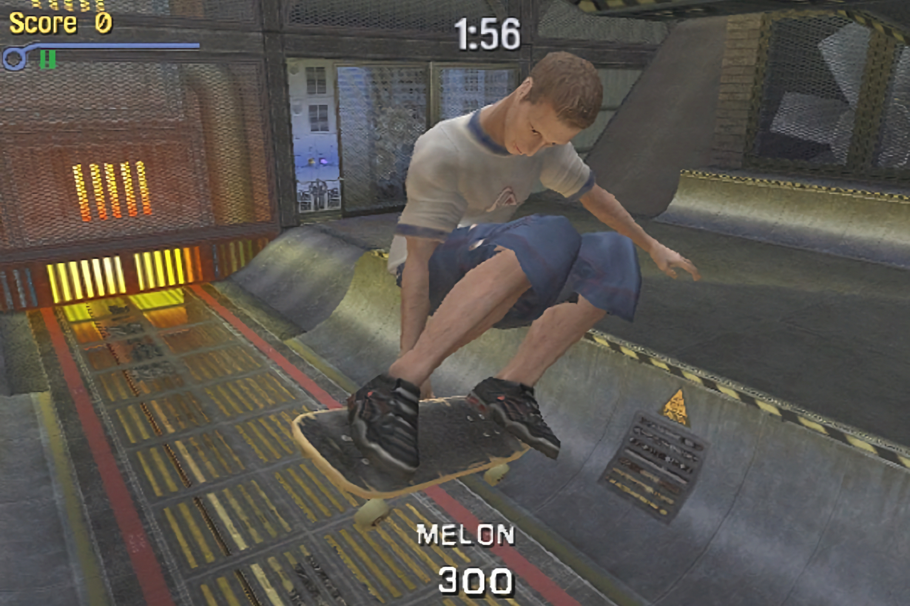

+++
title = "Les fans de Tony Hawk auront-ils droit à un beau cadeau pour les 25 ans de la franchise ?"
date = 2024-09-13T10:20:32+01:00
draft = false
author = "Mickael"
tags = ["Actu"]
image = "https://nostick.fr/articles/vignettes/septembre/tony-hawk-pro-skater.jpg"
+++

Attention là derrière vous, il arrive ! Mais quoi, mais quoi ? Mais le coup de vieux pardi ! Et oui, on fêtera les 25 ans du tout premier *Tony Hawk’s Pro Skater* le 29 septembre, et vu l'impact que le jeu (sorti d'abord sur Playstation puis partout ailleurs) et ses suites ont eu sur les adeptes du skate et sur  l'industrie toute entière, cet anniversaire mérite d'être célébré.

Mais comment ? Tony Hawk a manifestement une petite idée derrière la tête. The Birdman a laissé entendre qu'il y avait « quelque chose » de prévu pour cet anniversaire ! « *J'aimerais pouvoir vous en dire plus, mais je peux vous dire que j'ai de nouveau discuté avec Activision* », a [expliqué](https://www.youtube.com/watch?v=CIEpU0EF0XI) la légende à l'émission « Mythical Kitchen ». « *Nous travaillons sur quelque chose. Ce sera quelque chose que les fans devraient vraiment apprécier* », ajoute-t-il.

 

Reste à savoir quoi. Il y a deux ans, Tony Hawk avait déjà fait miroiter une deuxième compile après *Tony Hawk’s Pro Skater 1+2*, sorti en 2020 et fort bien accueilli. Mais Vicarious Visions, le studio ayant planché sur ces remakes, a été absorbé dans le trou noir d'Activision pour ne plus jamais en ressortir. 

Il était bien prévu de sortir un 3+4, mais malheureusement ce beau projet est tombé à l'eau. Activision avait essayé à l'époque de trouver un autre studio mais personne n'était au niveau de Vicarious Visions… jusqu'à présent. Microsoft, le nouveau big boss, pourrait avoie envie de surfer sur la nostalgie qui paie bien — et vu le nombre de studios sous l'ombrelle Xbox, il y en a probablement un ou deux qui serait capable de produire un remake potable. On aura la réponse bien assez tôt.