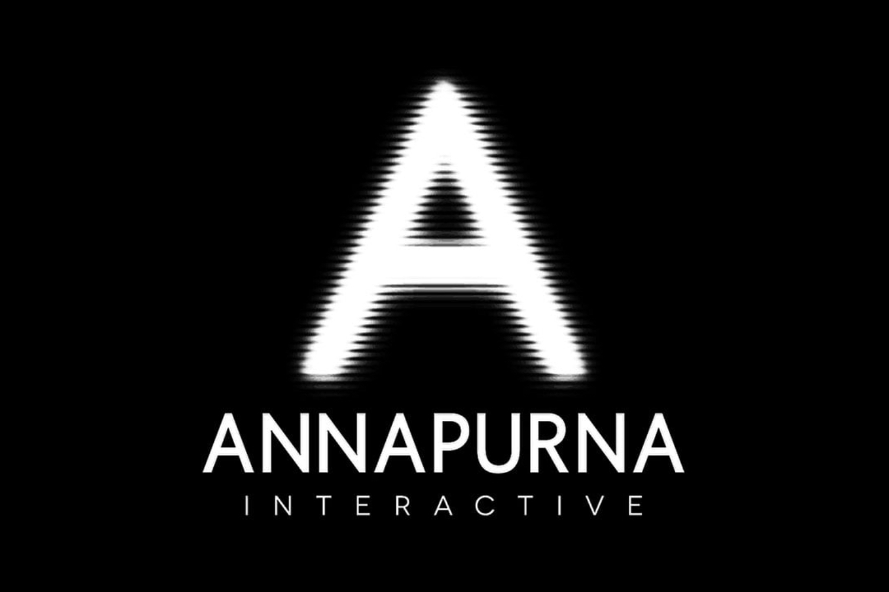

+++
title = "Démission collective chez Annapurna Interactive"
date = 2024-09-13T10:00:32+01:00
draft = false
author = "Mickael"
tags = ["Actu"]
image = "https://nostick.fr/articles/vignettes/septembre/annapurna-interactive.jpg"
+++

 

Du rififi chez Annapurna. Les effectifs de la division chargée de l'édition de jeux vidéo, Annapurna Interactive, ont tout simplement démissionné en bloc. 25 personnes en tout, dont le président Nathan Gary, ont claqué la porte ne laissant plus qu'une coquille vide.

*Bloomberg* [rapporte](https://www.bloomberg.com/news/articles/2024-09-12/annapurna-video-game-team-resigns-leaving-partners-scrambling) que la direction d'Annapurna Interactive tentait d'obtenir l'indépendance du studio. Ça n'a abouti à rien : Megan Ellison, la proprio d'Annapurna, a quitté la table des négociations. Cette démission collective a été « *la décision la plus difficile que nous avons jamais prise* », a indiqué Nathan Gary et ses collègues.

L'histoire a été confirmée par Megan Ellison, qui assure également de son engagement envers les partenaires développeurs et éditeurs pendant la transition. « *Nous nous engageons non seulement envers notre catalogue actuel de jeux, mais également à étendre notre présence dans l'espace interactif* », ajoute-t-elle. Les développeurs qui avaient confiance dans l'ancienne équipe sont embarqués bien malgré eux dans un grand huit assez compliqué : leurs contacts ne sont plus au poste, les contrats sont au point mort faute de personnel.

Hector Sanchez, co-fondateur d'Annapurna Interactive et qui est devenu tout récemment le nouveau président du groupe, a déclaré aux développeurs que l'entreprise honorera les contrats et remplacera le staff démissionnaire. 

Annapurna Interactive a édité pas mal d'excellents jeux indés ces dernières années, dont *Stray*, *Cocoon* ou encore *Outer Wilds*. Annapurna Pictures, la division qui développe des films, enregistre de son côté des succès tout aussi importants comme *Her*, *Zero Dark Thirty*, *American Hustle*. On lui doit aussi la production de l'excellent film animé *Nimona* sur Netflix. Pas plus tard que fin août, [Annapurna Pictures annonçait un accord avec le studio finlandais Remedy](https://nostick.fr/articles/2024/aout/3008-remedy-et-annapurna-sassocient-pour-des-adaptations/) pour produire des adaptations ciné et télé de *Control* et d'*Alan Wake*.