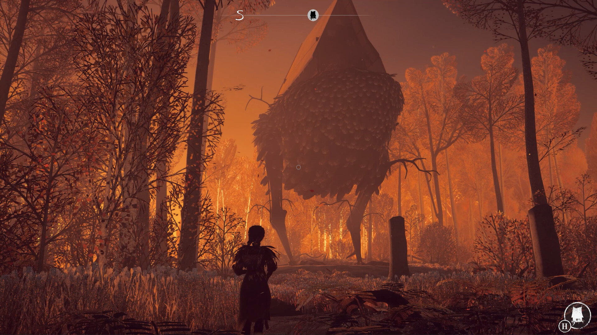

+++
title = "Warhammer 40,000: Space Marine 2, Caravan Sandwitch : le récap des sorties de la semaine (15/09)"
date = 2024-09-15T07:00:01+01:00
draft = false
author = "Félix"
tags = ["C’est dispo"]
image = "https://nostick.fr/articles/2024/septembre/1509-les-sorties-de-la-semaines/reka.jpg"
+++

Entre la fin de l’été, les températures qui baissent et les 4 pneus neufs pour la Dacia qui vous ont coûté un bras, vous n’avez peut-être pas eu le temps de vous intéresser aux nouveautés du moment. Qu’à cela ne tienne : voici les sorties de ces derniers jours qui ont retenu notre attention.

## Les gars de la marine

Vous connaissez **Warhammer 40,000** ? Moi pas du tout, et je me retrouve bien emmerdé pour écrire cette brève sur **Space Marine 2**, la suite d’un jeu sorti il y a 13 ans et signée Saber Interactive. Fort heureusement pour mois les tests sont positifs et le jeu a réalisé [le meilleur démarrage](https://www.gamekult.com/actualite/warhammer-40-000-space-marine-2-deja-plus-de-2-millions-de-ventes-en-moins-de-24h-3050859788.html) de l'histoire de la série, donc ça semble plutôt être une bonne affaire. On y incarne un soldat à la troisième personne dans un titre bien bourrin, à mi-chemin entre un shooter et un brawler. On est parti pour une campagne linéaire d’environ 10 h dans laquelle on va dégommer un tas d'aliens à coup d’épée-tronçonneuse et autres flingues de l’espace. Ça peut se faire en solo mais ça a surtout l’air pensé pour le mode co-op jusqu’à trois joueurs. Bref, un bon défouloir qui devrait ravir les fans de l’univers Warhammer tout comme les joueurs ayant un ou deux potes sous la main. 60 € sur [Steam](https://store.steampowered.com/app/2183900/Warhammer_40000_Space_Marine_2/), aussi dispo sur consoles.  

## Le Pont des espions

Après l’excellent *El Paso; Elsewhere* et le bien étrange [simulateur de kidnapping](https://nostickreloaded.substack.com/i/143778420/la-miliviludes-le-deteste) *‌Life Eater*, les petits gars de Strange Scaffold sont de retour avec ***I Am Your Beast***, un fast-FPS dans un univers au style BD. On y incarne un agent secret en fuite dans une forêt, poursuivi par une agence gouvernementale qui cherche à le tuer. Si le pitch s’inspire des films d’espionnages, il cache un gameplay frénétique dans lequel on saute d’un arbre pour assommer un garde avant de courir attraper un fusil à pompe et d’enchainer les headshots. La campagne se déroule sur 27 niveaux sans temps morts de quelques minutes : le but est de réussir à optimiser son tracé pour *speedruner* comme un goret. Le jeu incite à refaire les cartes en complétant certains objectifs bonus (ne pas utiliser d’armes, seulement des couteaux de lancers), ce qui fait que vous pouvez finir le jeu en 3 heures comme en 10. Les tests sont tous très positifs et le jeu ne coûte que 19,50 € [sur Steam](https://store.steampowered.com/app/1876590/I_Am_Your_Beast/) : vous ne perdez pas grand-chose à essayer si vous êtes en manque de FPS nerveux.



## Ma sorcière bien-aimée

Malgré les différends « remasters » et autres recyclages à peu de frais que l’on couvre chaque semaine (*chaque semaine*), il reste heureusement quelques jeux indés qui essayent d’innover. Et quoi de plus innovant qu’un jeu dans lequel on incarne une sorcière vivant dans une hutte perchée sur les pattes d’un gigantesque poulet ? C’est ce que propose *Reka*, un jeu d’exploration assez classique inspiré du mythe [de Baba Yaga](https://fr.wikipedia.org/wiki/Baba_Yaga). On nous invite à parcourir un monde procédural dans une Europe du 19e remplie de trucs à récolter et d’animaux à apprivoiser. La maison-poulet est personnalisable et *Reka* visiblement plus axé sur la partie craft/bac à sable. Le jeu vient d’être lancé en early-access [pour 20 €](https://store.steampowered.com/app/1737870/REKA/), ce qui semble un peu cher au vu du contenu proposé et de sa campagne qui se boucle en une poignée d’heure. À surveiller si le concept vous botte, ça sera sûrement sympa dans quelques mois.

## Mad Max sauce provençale

Le sympathique ***Caravan SandWitch*** est sorti cette semaine. Il s’agit d’un jeu d’exploration dans un monde post-apo coloré que l’on parcoure à l’aide d’un gros van jaune. On y incarne une jeune astronaute revenant sur sa planète après avoir reçu un signal de détresse de sa sœur disparue. Studio montpelliérain oblige, la carte dévastée est inspirée des paysages provençaux pour une ambiance des plus sympa. Le jeu se veut *feel-good*, sans combats et sans possibilité de mourir : tout passe par l’exploration de son univers et la résolution de puzzles, en van ou à pied. On peut améliorer son véhicule pour débloquer de nouvelles zones et explorer de petites villes remplies de PNJ le sourire aux lèvres. Les tests sont bons mais sans plus, certains testeurs étant emballés par le côté reposant là où d’autres ont plutôt trouvé ça répétitif. Si le style vous accroche, ça a l’air d’être un bon petit jeu pour vous aider à surmonter la grisaille de septembre. 25 € sur Switch, PlayStation et sur [Steam](https://store.steampowered.com/app/1582650/Caravan_SandWitch/). 

 

## En rab’

On a franchement pas eu le temps de s’ennuyer cette semaine avec la sortie d’un paquet de trucs cool. Les déviants qui rêvent de travailler plus pourront construire des usines à la première personne dans ***Satisfactory***, disponible dans sa V1 [pour 39 €](https://store.steampowered.com/app/526870/Satisfactory/). Apparemment c’est excellent, allez savoir. **Yars Rising** est un metroidvania signé des développeurs de ***Shantae*** ou des récents remakes des **Advance Wars** dont les tests donnent envie même s’il ne réinvente pas la roue. 29 € tout de même sur [PC](https://store.steampowered.com/app/2534370/Yars_Rising/) et consoles. Bethesda a sorti cette semaine **un nouveau *Elder Scrolls***… sur [iOS](https://apps.apple.com/us/app/the-elder-scrolls-castles/id1594657136) et [Android](https://play.google.com/store/apps/details?id=com.bethsoft.stronghold&hl=en). *Castles* se rapproche de *Fallout Shelter* dans un reskin qui a l’air sympathique, alors pourquoi pas. Mouais. Évidemment, on ne pouvait pas clôturer la semaine sans parler d’un remake : c’est ***Lollipop Chainsaw*** qui revient aujourd’hui dans une version *RePOP* apparemment assez fainéante selon *[GameReactor](https://www.gamereactor.eu/lollipop-chainsaw-repop-1431993/)* qui ne mérite peut être pas [45 €](https://store.steampowered.com/app/2658450/LOLLIPOP_CHAINSAW_RePOP/) dans l’immédiat. 