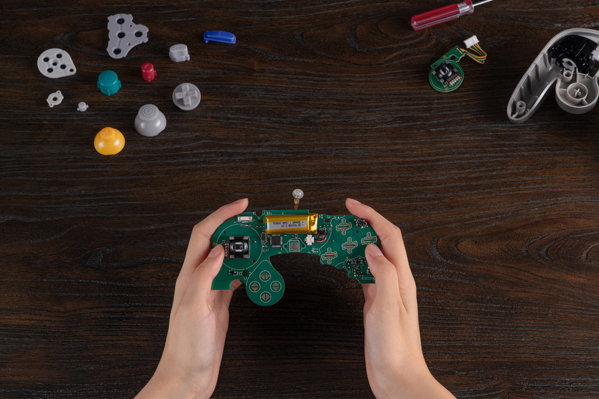
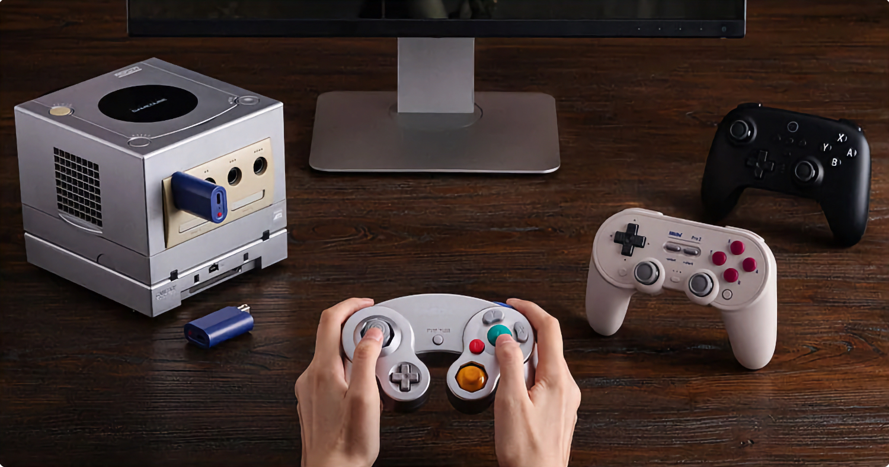

+++
title = "8BitDo : du Bluetooth en retrofit pour la manette GameCube"
date = 2024-09-16T08:57:32+01:00
draft = false
author = "Mickael"
tags = ["Actu"]
image = "https://nostick.fr/articles/vignettes/septembre/8BitDo-manette-gamecube.jpg"
+++

 

Ressortez votre vieille manette GameCube, elle va connaitre une nouvelle vie ! Enfin, si vous êtes un peu bidouilleur. 8BitDo propose en effet un retrofit du périphérique pour le transformer en manette Bluetooth compatible avec la Switch et avec Android. Une fois installé, le [kit](https://shop.8bitdo.com/products/mod-kit-for-original-ngc?variant=44610072379569) permet même de jouer à la GameCube sans fil, mais il faut ajouter un récepteur à brancher sur la console.

Le kit remplace le circuit imprimé original de la manette par un PCB custom comprenant des sticks à effet Hall (adieu la maladie mortelle du drift) ainsi qu'une batterie rechargeable d'une capacité de 300 mAh. L'autonomie est de 6 heures, promet le fabricant. 

 

8BitDo a conçu le kit pour être aussi facile que possible à installer, sans devoir sortir le poste à soudure. Il faut simplement retirer la carte-mère de la manette, et la remplacer par le nouveau modèle. Il faudra au préalable jouer du tournevis pour ouvrir le périphérique, mais il n'y a rien de sorcier. Le tout est proposé à 26 $, avec des livraisons débutant le 25 septembre. Le récepteur Bluetooth pour la GameCube est facturé 25 $.

Le fabricant est habitué à ce genre de bidouille. Il commercialise déjà des kits retrofit pour les manettes de la Mega Drive, de la NES et de la Super NES.