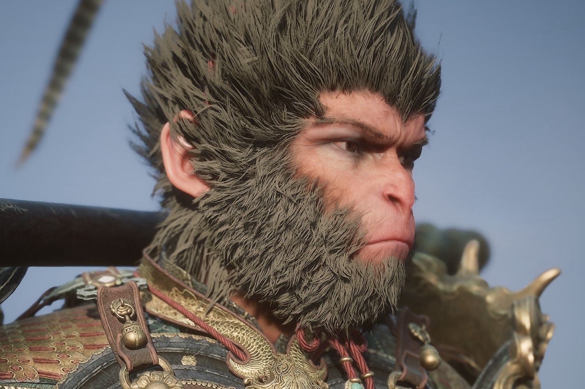

+++
title = "Une date pour le premier DLC de Black Myth: Wukong"
date = 2024-09-17T08:52:32+01:00
draft = false
author = "Mickael"
tags = ["Actu"]
type = "telex"
+++

N'écarquillez pas les yeux comme ça, c'est la nouvelle la moins étonnante de l'année : il y aura bien (au moins) un DLC pour *Black Myth: Wukong*, qui sortira finalement assez rapidement. Selon le Daniel Camilo, journaliste bien introduit dans le milieu de l'industrie chinoise du jeu vidéo, cette première extension serait [fournie](https://x.com/DanielOlimac/status/1835068254416781433) le 29 janvier 2025. Voilà qui a le mérite d'être précis !

La date n'est pas choisie au hasard, puisqu'elle coïncide avec le Nouvel An chinois. Évidemment, il peut se passer n'importe quoi d'ici là, mais cette rumeur ne parait pas complètement farfelue. Hero Games, principal actionnaire du studio Game Science, avait déjà indiqué qu'une extension était en développement pour le jeu phénomème. Depuis son lancement le 20 août sur PC et PS5, le jeu a franchi le seuil des 20 millions de copies vendues.