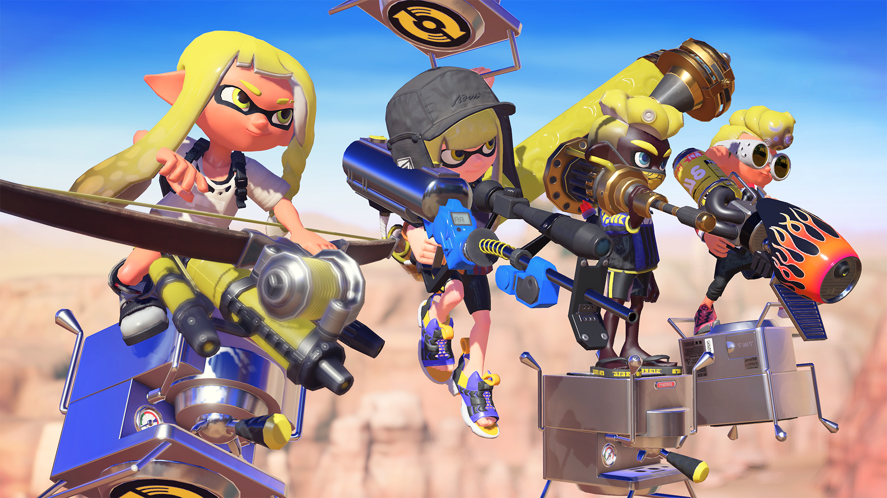

+++
title = "Fin de service pour Splatoon 3"
date = 2024-09-17T08:00:00+01:00
draft = false
author = "Félix"
tags = ["Actu"]
type = "telex"
+++

C’est le début de la fin pour *Splatoon 3*. Nintendo a [annoncé](https://x.com/SplatoonNA/status/1835506615971356881) la fin officielle du suivi, deux ans après le lancement du jeu qui recevait encore fréquemment de nouvelles armes, objets et cartes. Que les joueurs se rassurent : les serveurs resteront en ligne et les évènements « *Splatoween, Frosty Fest, Spring Fest et Summer Nights* » continueront d’avoir lieu à des dates régulières.

 

Nintendo n’abandonne pas complètement le jeu, qui pourra recevoir des mises à jour d’ajustement des armes de temps à autre. Les modes Big Run, Travail d'Eggstra et les challenges mensuels continueront pendant encore quelque temps. *Splatoon 2* a également eu un suivi de 2 ans, mais on ne peut s’empêcher de penser que Nintendo prépare le terrain pour l’arrivée de sa nouvelle console. Rendez-vous pour *Splatoon 4* ?