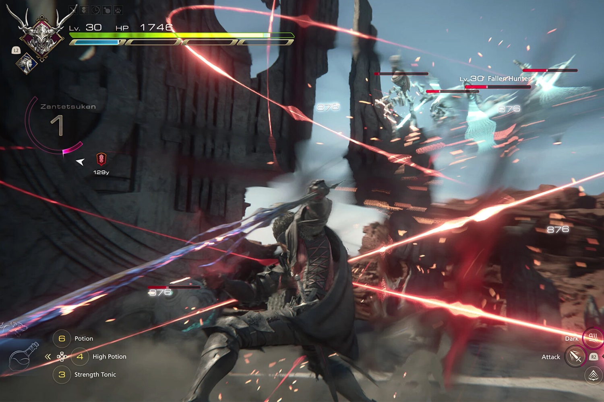

+++
title = "Final Fantasy XVI : des mods oui, mais restez dans les clous svp"
date = 2024-09-17T08:15:32+01:00
draft = false
author = "Mickael"
tags = ["Actu"]
image = "https://nostick.fr/articles/vignettes/septembre/FFXVI.jpg"
+++

Soyez chic bon dieu, et ne faites pas n'importe quoi avec mon jeu ! C'est, en substance, le cri du cœur de Naoki Yoshida, le producteur de *Final Fantasy XVI*, qui a gentiment demandé aux joueurs de ne pas installer ni de créer de mods qui soient offensants ou inappropriés pour son jeu qui sort aujourd'hui sur PC. Et on sait que les joueurs PC sont taquins et coquinous.

« *Nous ne voulons certainement pas dire quoi que ce soit d'offensant ou d'inapproprié, alors s'il vous plaît, ne créez pas et n'installez rien de de ce genre* », plaide-t-il auprès de *[PC Gamer](https://www.pcgamer.com/games/rpg/final-fantasy-16-director-naoki-yoshida-asks-that-modders-please-dont-run-amok-with-offensive-or-inappropriate-shenanigans-now-the-games-on-pc/?utm_source=substack&utm_medium=email)*. Bon évidemment, cette déclaration sera reléguée aux oubliettes dès qu'un mod bizarre ou sexy fera son apparition, ce qui ne manquera pas d'arriver très vite.

Pour le moment, il n'y a pas de mods pour *FFXVI* sur la plateforme Nexus, mais d'autres titres (comme *Kingdom Hearts 3* et *Devil May Cry 5*) ont droit à des mods sur le thème de *FFXVI*. Naoki Yoshida laisse en tout cas entendre que la porte  reste ouverte aux joueurs voulant créer des mods pour améliorer le gameplay de son jeu.