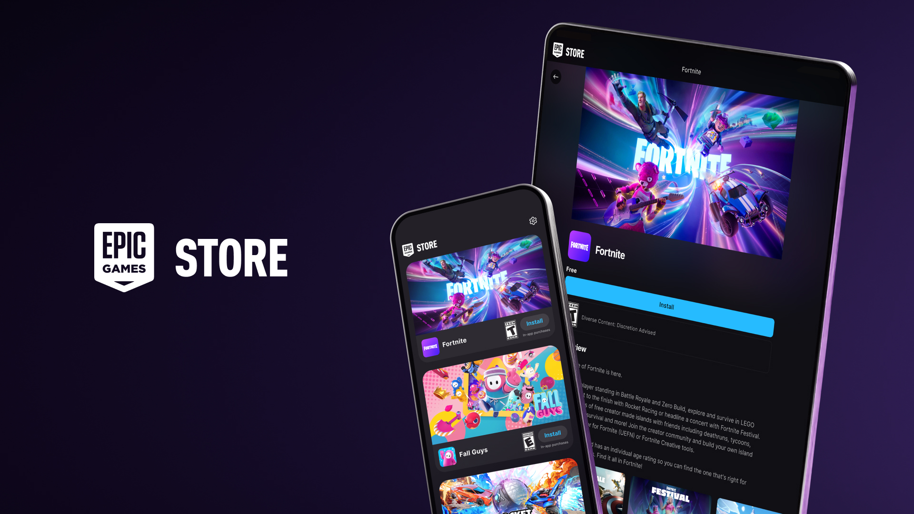

+++
title = "Delta, Fortnite, Fall Guys : l’iPad s’ouvre aux boutiques tierces"
date = 2024-09-17T18:20:32+01:00
draft = false
author = "Félix"
tags = ["Actu"]
image = "https://nostick.fr/articles/2024/septembre/1709-ipad-souvre-aux-boutiques-tierces/epic.jpeg"
+++

 

Bonne nouvelle si vous avez un iPad récent : Apple vient de mettre en ligne [iPadOS 18](https://www.apple.com/fr/ipados/ipados-18/), une mise à jour qui apporte la prise en charge des boutiques tierces. Autrement dit, votre tablette n’est plus limitée à l’App Store et peut donc installer des magasins alternatifs hébergeant certains jeux intéressants. C’est notamment le cas de l’Epic Games Store, qui donne accès à *Fortnite*, *Fall Guys* et *Rocket League : Sideswipe*.

Si vous êtes intéressé, il faudra dans un premier temps mettre votre iPad à jour vers la 18e version du système avant de vous rendre [sur le site d’Epic](https://store.epicgames.com/fr/mobile) via Safari (et uniquement Safari). Un bouton « Installer sur iPhone ou iPad » devrait être proposé : cliquez dessus, validez le pop-up et rendez-vous dans les *Réglages*. Un nouveau menu devrait apparaître en haut de la liste à gauche vous demandant d’autoriser Epic à installer son échoppe. Ne reste plus qu’à retourner dans Safari et à réappuyer sur le même bouton, ce qui aura pour effet de télécharger la boutique.

L’Epic Games Store est assez simple à prendre en main étant donné qu’elle ne propose que 3 jeux et autant de gros boutons « Installer ». J’ai passé une partie de mon week-end sur *Fall Guys*, qui tourne super sur iPad Pro M4 (forcément) et qui fonctionne avec les comptes Epic afin de retrouver ses items débloqués sur PC ainsi que sa liste d’ami. Notons que les jeux Epic sont aussi disponibles via [AltStore](https://altstore.io), la boutique alternative hébergeant Delta. L’émulateur a d’ailleurs gagné une meilleure prise en charge des tablettes [il y a peu](https://nostick.fr/articles/2024/juillet/1007-emulateur-delta-compatible-ipad/). N’hésitez pas à relire notre [guide d’installation](https://www.igen.fr/app-store/2024/09/fortnite-fall-guys-lepic-games-store-est-desormais-optimise-pour-ipados-145893), qui marche autant pour iPad que pour iPhone.