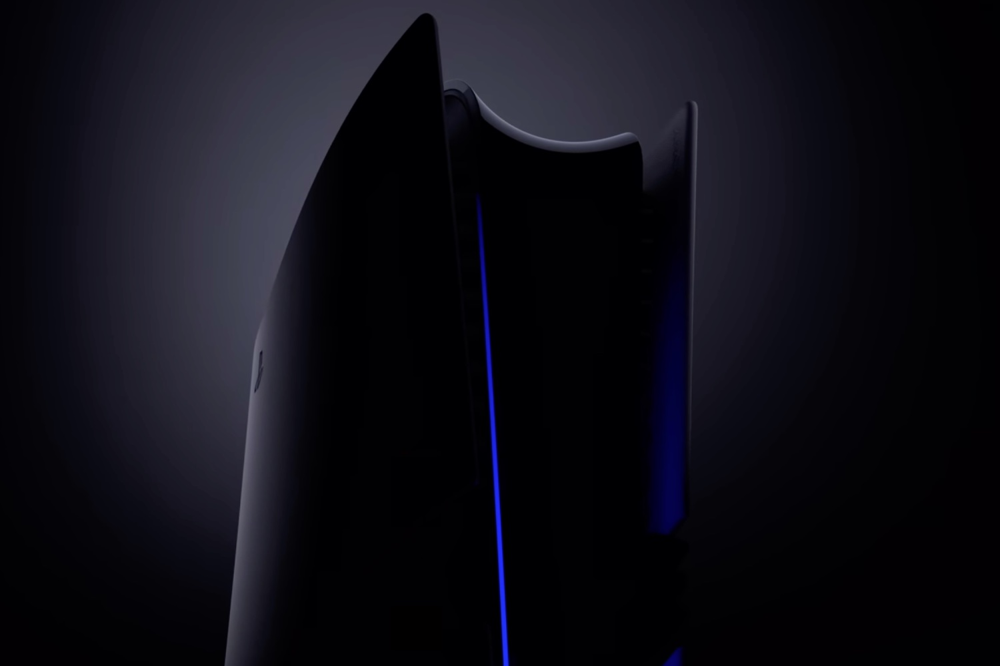

+++
title = "Sous le moteur de la PS6, une puce AMD (et pas Intel)"
date = 2024-09-17T08:50:32+01:00
draft = false
author = "Mickael"
tags = ["Actu"]
image = "https://nostick.fr/articles/vignettes/septembre/PS5-pro.jpg"
+++

La PS5 Pro — [qui ne sortira que le 7 novembre](https://nostick.fr/articles/2024/septembre/1009-enfin-une-ps5-pour-les-pro/) — est déjà un lointain souvenir. Ce qui nous intéresse désormais, c’est la PS6, bien sûr. La future console de salon sera équipeé en puces AMD, tout comme la PS4 et la PS5, croit savoir *[Reuters](https://www.reuters.com/technology/how-intel-lost-sony-playstation-business-2024-09-16/)*.

Cela semble assez logique que Sony fasse de nouveau appel à AMD pour les systèmes-sur-puce (SoC) de sa prochaine console, mais ça n’était pas si évident finalement. Le constructeur avait organisé un appel d’offre en 2022, qui a notamment opposé AMD à Intel et Broadcom. Dans la dernière ligne droite, ce sont les deux premiers qui sont restés en course.

Intel a loupé ce contrat à plusieurs dizaines de milliards de dollars. Non seulement parce qu’une histoire de marge a tout fait capoter, mais aussi par les craintes de Sony concernant la rétro-compatibilité des jeux des précédentes générations. Les processeurs d’Intel et d’AMD s’appuient certes sur la même architecture x86, mais AMD s’est arrangé pour que les jeux de la PS4 fonctionnent bien sur PS5. Et ça devra être pareil avec la PS6 : les joueurs sortiraient les fourches et les torches contre PlayStation si leurs jeux PS4/PS5 étaient incompatibles avec la future console.

Pour Intel, assurer cette compatibilité poserait des problèmes que l’entreprise ne pourrait régler qu’en investissant beaucoup de ressources et d'argent. Or, Intel n’est pas très riche en la matière depuis des années, le groupe perd beaucoup d’argent et a procédé à une énorme charrette de 15 000 licenciements il y a quelques semaines.

Donc voilà, sans trop de surprise finalement, c’est bien AMD qui fournira Sony pour la PS6. Les deux partenaires de longue date ont quelques années devant eux pour accorder leurs violons. D’après des documents publiés à l’occasion de la procédure d’acquisition d’Activision par Microsoft, Sony pourrait ne lancer la PlayStation qu’en 2028, au plus tôt. Bien sûr, les plans peuvent changer.