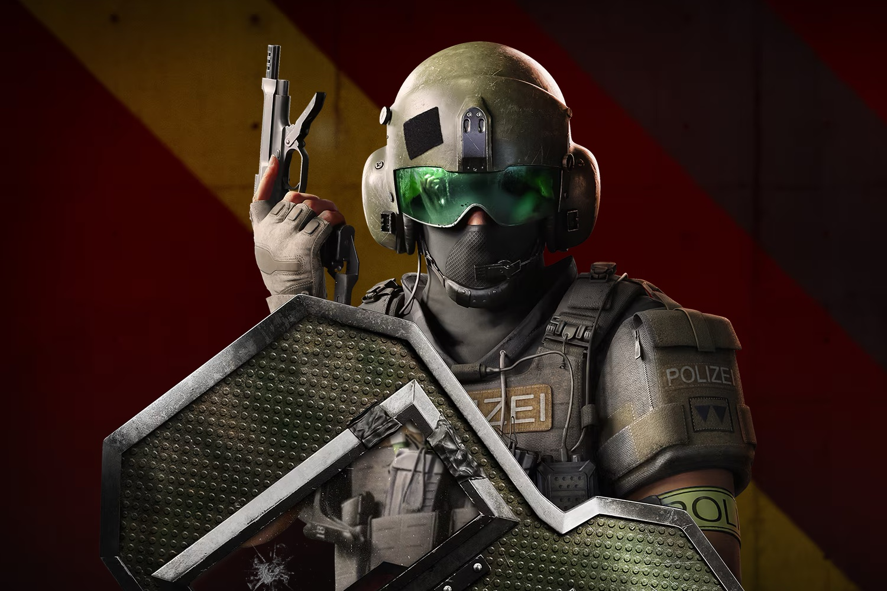

+++
title = "XDefiant n'est pas mort !"
date = 2024-09-18T11:04:32+01:00
draft = false
author = "Mickael"
tags = ["Actu"]
type = "telex"
+++

 

La nouvelle de la mort prochaine de XDefiant a été grandement exagérée. La rumeur a couru il y a quelques semaines que le shooter multi d'Ubisoft n'allait pas bien du tout, et pire encore : que l'éditeur se tenait prêt à tout débrancher faute de joueurs en nombre suffisant.

Il n'y a rien de plus faux, jure le producteur du jeu, Mark Rubin. « *Non, le jeu n'est absolument pas en train de mourir. Nous savons qu'il y a des choses que nous devons améliorer comme le Netcode/Hitreg et ajouter plus de contenus, mais le jeu se porte bien* », [assure-t-il](https://www.ubisoft.com/en-ca/game/xdefiant/news/5uIKnSBuGp6nEszPe9NlfG/year-1-update) dans le blog déroulant la feuille de route de la première année.

Ubisoft est « *derrière le jeu* », la preuve : l'entreprise a alloué des ressources supplémentaires pour « *faire mieux* ». Tant mieux, Ubisoft a besoin d'un succès en ce moment. Mais le fait que l'éditeur ait récemment donné 9 $ en argent du jeu pour faire revenir les joueurs n'est pas de très bon augure pour autant.