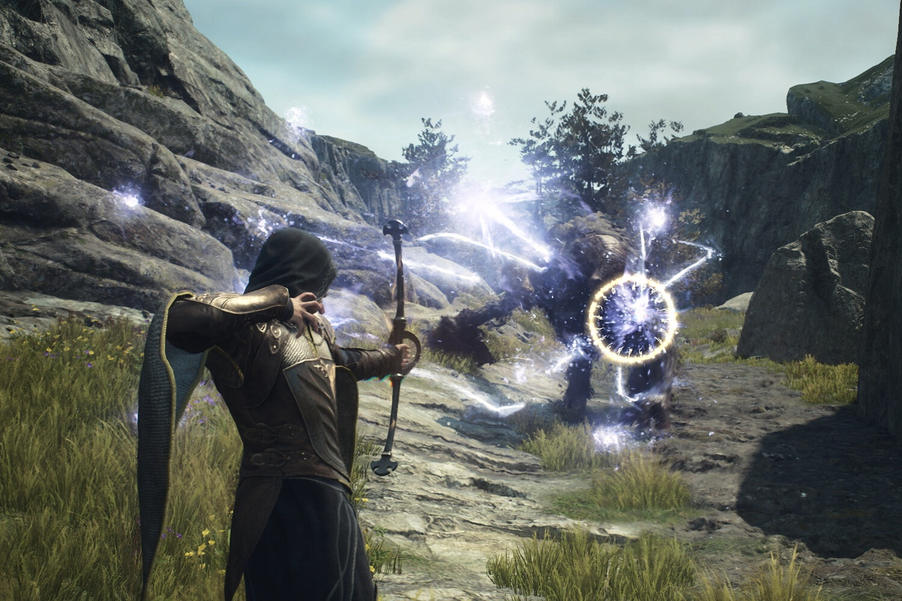

+++
title = "Dragon’s Dogma 2 est un peu moins difficile"
date = 2024-09-18T07:30:32+01:00
draft = false
author = "Mickael"
tags = ["Actu"]
image = "https://nostick.fr/articles/vignettes/septembre/dragon-dogma-2.jpg"
+++

*Dragon’s Dogma 2*, c'est super. Enfin, ça le serait sûrement (vous connaissez un mauvais jeu Capcom ?) s'il était moins dur, ont protesté de nombreux joueurs à la sortie du jeu, fin mars. L'éditeur a fini par entendre cette complainte et dans la dernière mise à jour du titre, il propose un mode « casual » pour les joueurs qui en ont [marre de se faire humilier](https://nostick.fr/articles/2024/avril/0904-nayez-pas-honte-de-jouer-en-mode-facile/) (ou pour les gros nullos comme moi qui ne savent pas tenir une manette).

Ce mode réduit les frais d'auberge pour passer la nuit tranquillou, les pierres de faille sont moins chères, le poids transporté a moins de chance de devenir « lourd » ou « très lourd », les pions peuvent guérir de la peste draconique sans subir de calamité dévastatrice. En gros, ce mode est moins pénalisant en cas de mort (ça fait bizarre d'écrire ça), les déplacements et la récupération sont moins dispendieux.

En revanche, il n'y a toujours qu'une seule sauvegarde possible, et si le joueur bascule en mode casual, il ne pourra pas le désactiver pour revenir au mode normal. Impossible donc de s'en servir pour réussir un passage compliqué du jeu… Par ailleurs, certains trophées et achievements ne peuvent pas être décrochés en mode casu. Ouais, la vie est injuste.

Le patch ajoute un portacristal — un objet qui fait office de point de téléportation — à Bakbattahl, un coin souvent visité par les joueurs. Oh, et les combats sont un peu moins difficiles, de l'aveu même de Capcom, et ce pour tous les joueurs quel quel soit le mode.