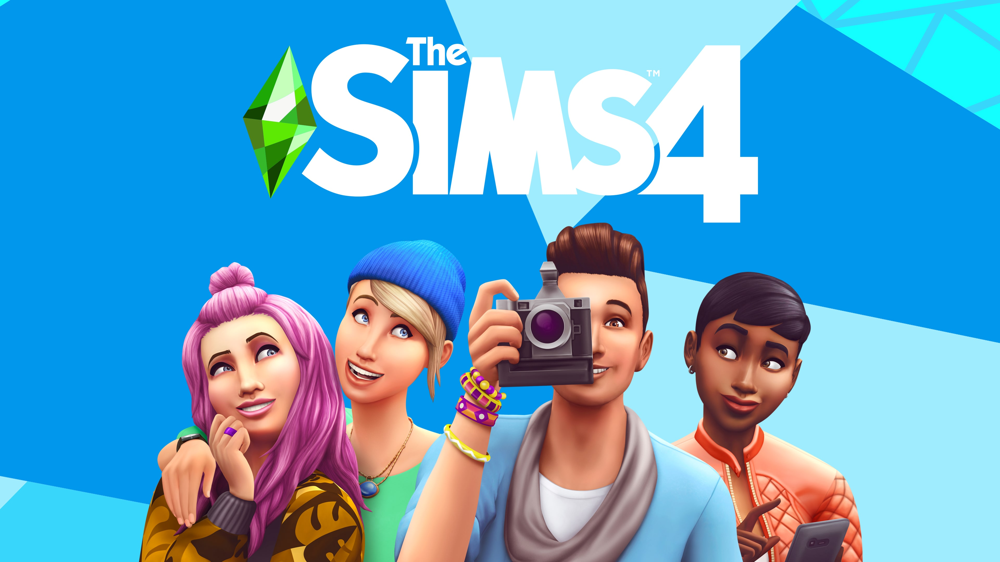
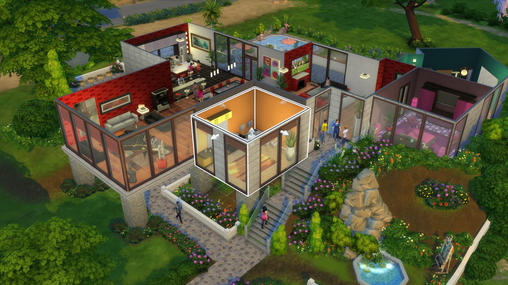

+++
title = "EA annonce qu’il n’y aura pas de Sims 5 et va ajouter du multi au jeu actuel"
date = 2024-09-18T08:15:32+01:00
draft = false
author = "Félix"
tags = ["Actu"]
image = "https://nostick.fr/articles/vignettes/septembre/FFXVI.jpg"
+++

 

Certaines choses ne veulent simplement pas mourir. Kate Gorman, vice-présidente de la franchise *Les Sims*, a confirmé à *[Variety](https://variety.com/2024/gaming/news/the-sims-5-update-multiplayer-creator-content-ea-interview-1236142010/)* qu’il n’y aurait pas de *Sims 5*. À la place, les *Sims 4* vont continuer de recevoir des mises à jour et des extensions payantes *ad vitam aeternam*. Pourquoi se fouler à tout reprendre de zéro quand on a un machin vieux de 10 ans qui génère un fric monstre, après tout ?

Selon Kate Gorman, l’idée derrière tout ça est de ne pas forcer les joueurs ayant investi des centaines d’heures à tout reprendre depuis le début. Une stratégie étonnante pour une franchise qui a fait son blé sur ses multiples DLC (les animaux, les saisons, les jobs) revendus de génération en génération sans trop se fouler. À la place, EA nous promet un paquet de mise à jour donnant aux joueurs un *Sims 5* dans les *Sims 4*.

Si tout est encore flou, cela va se [traduire](https://www.ea.com/fr-fr/games/the-sims/news/the-future-of-the-sims) par un mode multijoueur découlant du « Project Rene », en cuisine depuis un bout de temps et que tout le monde pensait être *Les Sims 5*. Celui-ci va permettre aux joueurs amis « *de se rencontrer, de se connecter et de partager tout en jouant ensemble dans un tout nouveau monde* ». Une bêta sur invitation aura lieu cet automne, auquel les plus assidus peuvent s’inscrire [via le Sims Lab](https://ea.arcsivr.com/Portal/ea-cte/default), un programme pour tester en avance certaines fonctions.

 

La vice-présidente de la franchise a également annoncé que la boutique en jeu allait prochainement vendre des kits d’objets créés par des joueurs. Ceux-ci seront rémunérés pour leur travail, EA se faisant probablement une marge au passage. Pourquoi pas, mais rappelons que *Les Sims 4* est un jeu avec une très bonne prise en charge des mods et une communauté très active : l’initiative vise sans doute les joueurs *casuals* ou les plus impliqués.

EA tease enfin quelques partenariats, un film *Les Sims* ayant été [confirmé](https://variety.com/2024/film/news/the-sims-movie-plot-details-amazon-ea-margot-robbie-1236142126/) dans la journée produit par la boîte de Margot Robbie et en chantier dans les studios MGM d’Amazon. « *Vous verrez qu'il y a plus de façons de vivre « Les Sims » sur différentes plateformes, différentes façons de jouer, du transmédia, et beaucoup de propositions formidables dans cet univers* », nous fait miroiter Kate Gorman. Notons que ces annonces sont faites à l’approche des 25 ans de la franchise l’année prochaine.
 
Bref, EA semble chercher à faire du neuf avec du vieux. *Les Sims 4* est sorti il y a plus de dix ans, et si on nous promet des mises à jour et un coup de frais, la nouvelle pourra en décevoir certains qui s’attendaient à un grand chamboulement. Si la licence dispose d’une base de joueurs solide, la concurrence s’intéresse au secteur. Le prometteur *[inZOI](https://store.steampowered.com/app/2456740/inZOI/)* va tourner sous l’Unreal Engine 5 et ne devrait plus trop tarder à avoir une date de sortie. Les deux ne jouent pas dans la même cours, mais c’est quand même plus excitant que « *Les Sims 4 à la ferme* ».