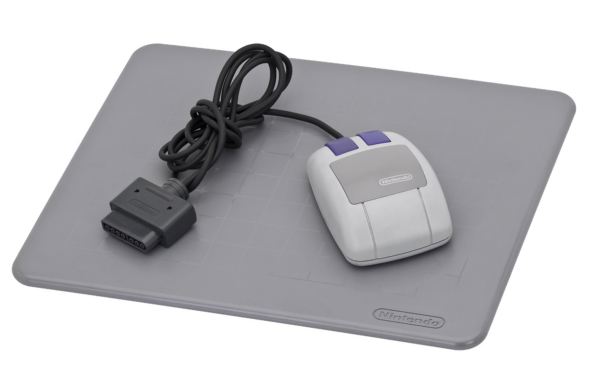

+++
title = "Le Nintendo Switch Online s'offre la compatibilité avec… la souris SNES"
date = 2024-09-18T15:47:32+01:00
draft = false
author = "Mickael"
tags = ["Actu"]
image = "https://nostick.fr/articles/vignettes/septembre/souris-super-nes.jpg"
+++

Oubliez la Switch 2 et [les images de prototype (probablement faisandées)](https://nostick.fr/articles/2024/septembre/1809-switch-2-visuels-cad/), voici une nouvelle rumeur autrement plus juteuse ! Nintendo semble préparer le support des souris pour les jeux du Switch Online, d'après la découverte singulière du *dataminer* LuigiBlood. L'émulateur SNES du service sur abonnement contient secrètement, et depuis le lancement du NSO, du code pour émuler la souris de la console.

 

À la faveur du [lâcher de nouveaux jeux](https://www.youtube.com/watch?v=X_rI1L1Umbg) au catalogue du NSO — dont *Battletoads Double Dragon* ! —, LuigiBlood a [déniché](https://www.tumblr.com/luigiblood/761949570951512064/something-is-going-on-with-retro-nso) des indices d'une refonte majeure de la compatibilité avec la souris SNES. Le logiciel est maintenant en mesure d'émuler le mulot sur ses deux ports contrôleur (seul le premier était pris en charge jusqu'à présent), il est aussi possible de configurer le comportement de la souris entre « original » et… autre chose.

Ces nouveautés ont été ajoutées entre février et août de cette année. Tout ça est bien gentil, mais bon courage pour remettre la main sur cette fameuse souris (sans compter le connecteur incompatible avec les ports USB de la Switch !)… à moins que Nintendo lance une version NSO comme pour les manettes rétro. On n'est plus à ça près.

À moins qu'il ne s'agisse que d'émuler le fonctionnement de la souris avec une manette classique ou en touchant l'écran ? Il faudra aussi faire avec une sélection de jeux compatible extrêmement restreinte : *Mario Paint* et *Mario & Wario*. *Sound Fantasy* était aussi de la fête, mais ce jeu n'est jamais sorti. Ce qu'on veut vraiment, c'est le support du [Super Scope](https://en.wikipedia.org/wiki/Super_Scope). Au boulot, Nintendo.