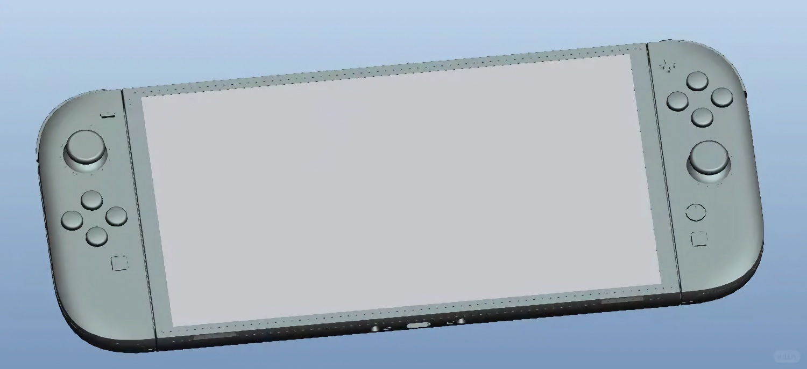
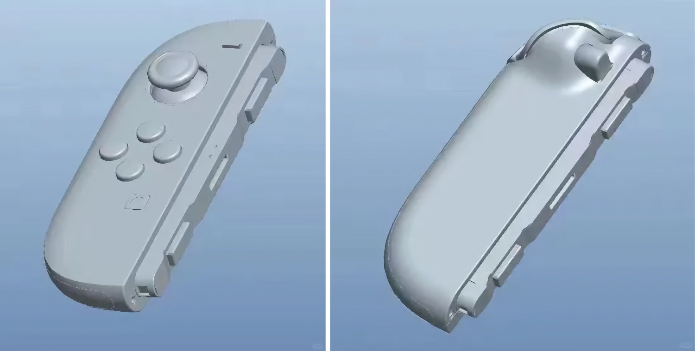

+++
title = "Se pourrait-il qu'il s'agisse de la Switch 2 ?"
date = 2024-09-18T12:47:32+01:00
draft = false
author = "Mickael"
tags = ["Actu"]
image = "https://nostick.fr/articles/vignettes/septembre/switch-2-usine.jpg"
+++

**Mise à jour —** La méfiance est plus que jamais de mise. Tom Warren de *The Verge* a [indiqué](https://x.com/tomwarren/status/1836391172685644221) que les images ci-dessous proviendraient en fait d'un utilisateur chinois adepte de l'impression 3D qui a blousé tout son monde.

___

Il va bien falloir à un moment donné que Nintendo se décide à balancer sa nouvelle Switch. Si le constructeur parvient à serrer le kiki des développeurs et des journalistes spécialisés qui sont dans la boucle — l'armée d'avocats-ninjas de Nintendo veille —, les fuites vont être impossibles à contrôler du côté des lignes de production.

Et manifestement, ça commence à chauffer dur dans les usines chinoises. Une d'entre elles aurait [reçu](https://www.reddit.com/r/GamingLeaksAndRumours/comments/1fjp352/photos_of_switch_2_factory_prototypes_have_leaked/) les fichiers CAO de la Switch 2 en vue de la production et évidemment, des images ont fuité. Bon, il faut évidemment rester très prudent, mais les images partagées sur les internets chinois semblent correspondre pas mal avec les précédentes rumeurs : [la Switch 2 ne devrait rien révolutionner](https://nostick.fr/articles/2024/mai/0905-switch-2-tout-ce-que-lon-sait/) !

En fait, la seule différence vraiment probante, c'est la présence d'un bouton supplémentaire derrière les Joy-Con. Le système de rails n'est pas le même non plus, on a parlé d'un mécanisme de verrou magnétique. Il y a aussi quelques nouveautés sur la console en elle-même, comme ce très intéressant port USB-C supplémentaire à côté du port jack.

À prendre avec un gros grain de sel donc, tout comme la nouvelle fournée de specs : on parle en effet de 12 Go de RAM LPDDR5X très rapide, de 256 Go de stockage UFS 3.1, ainsi que du support du HDMI 2.1. Ça parait trop beau pour être vrai, mais… qui sait ?