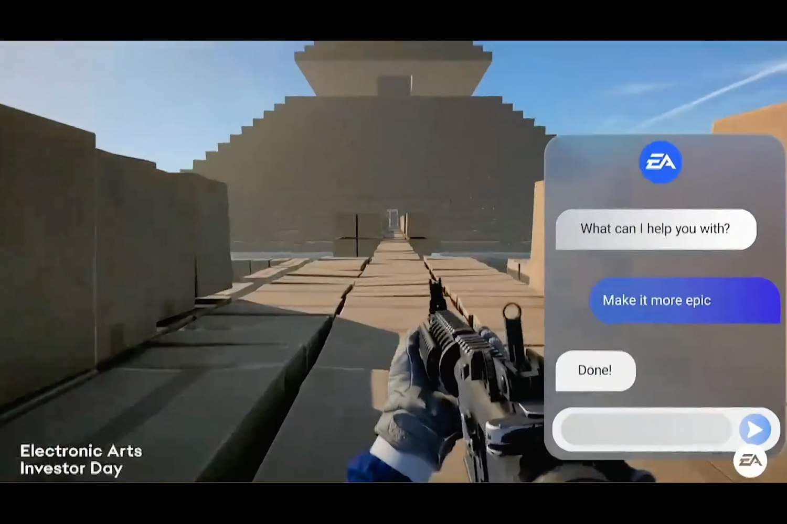

+++
title = "EA à fond dans l'IA générative… et dans le mur ?"
date = 2024-09-19T08:45:32+01:00
draft = false
author = "Mickael"
tags = ["Actu"]
image = "https://nostick.fr/articles/vignettes/septembre/ea-ia.jpg"
+++

Après ces conneries de NFT et de blockchain, l'industrie du jeu vidéo s'est jetée comme une morte de faim sur le buzzword du moment, l'IA générative. On l'a vu en mai dernier dans [le délirant exercice prospectif de Sony](https://nostick.fr/articles/2024/mai/2405-sony-se-touche-la-nouille/), mais aussi dans des déclarations ici et là, cette technologie intéresse les studios au plus haut point. Un sondage Unity [annonçait](https://unity.com/fr/resources/gaming-report) que 62 % d'entre eux l'utilisait déjà.

Et c'est le cas aussi, évidemment, d'Electronic Arts. Lors d'un événement destiné aux investisseurs, Mihir Vaidya, le chef stratégie d'EA, a présenté le nouveau pipeline IA de l'éditeur baptisé « Imagination to Creation ». C'est quelque chose. On peut y voir deux joueurs sans aucune expérience du code créer de toutes pièces un FPS simplement en demandant à un bot de générer les niveaux, les personnages et les armes. 

Le tout avec de simples requêtes texte, dans le plus pur style de ChatGPT, dont certaines feraient mourir des cohortes de level designers et de graphistes par combustion spontanée (« *Make it more epic* », « *make it multi-level* »…).



Le jeu créé par ce bot (qui n'existe pas) n'a rien de franchement original, ce d'autant que le niveau est composé de boîtes en carton — on repassera pour le côté « épique ». Cette « vision » d'EA est d'abord et avant destinée aux investisseurs, tout comme celle de Sony au printemps. Il s'agit d'en mettre plein les yeux, de montrer qu'on est raccord avec les technologies du moment, quitte à prendre des libertés avec la réalité. Le plus important étant de faire signer des chèques à la fin de la démonstration.

Les propos de Mihir Vaidya laissent toutefois penser qu'EA réfléchit très fort à ce type de bot. Il a ainsi expliqué que les utilisateurs qui voudront créer un jeu pourront utiliser des éléments présents dans les jeux de l'éditeur, et il y en a un paquet, pour les remixer. Au bout du compte, l'idée est celle d'une boîte de Lego où les briques sont les héros de tel jeu, dans un univers ressemblant à tel autre jeu, le tout se jouant comme un troisième jeu.

À l'image de la vidéo ci-dessus, on ne peut pas dire que l'imagination soit au pouvoir. Contrairement à la communauté du mod dont le principe est similaire — remixer des jeux — mais avec du cœur et une âme (ou un mauvais esprit). 

Andrew Wilson, le CEO d'EA, a [affirmé](https://www.eurogamer.net/ai-is-the-very-core-of-our-business-says-ea-ceo) durant cette même présentation que l'IA générative était « *au cœur de notre activité* » et que cette « *technologie remarquable n'était pas simplement un buzzword* ». Probablement comme les NFT qui devaient faire partie de « *l'avenir de notre industrie* », comme il le [trompetait](https://www.beyondgames.biz/17114/ea-nft-and-blockchain-games-are-part-of-future-of-our-industry) en 2021… 

EA a « *des centaines de projets IA* » dans ses cartons, et elle est mise en pratique. C'est le cas dans les Sims, [dans le futur hub](https://nostick.fr/articles/2024/septembre/1809-il-ny-aura-pas-de-sims-5/) qui fera office de plateforme centrale pour tous les jeux de la série. L'IA va alimenter le moteur de recherche pour trouver des éléments de jeux à partir de photos. Les joueurs pourront aussi créer des Sims leur ressemblant en uploadant un selfie.

Contrairement au web3 qui n'apportera jamais rien de bon, l'IA promet des retours très tangibles pour améliorer des bouts de jeu ([comme les NPC](https://nostick.fr/articles/2024/avril/0104-comment-la-generative-veut-revolutionner-notre-rapport-aux-pnj/)) et faire des économies. Dans un secteur où les budgets, comme les temps de développement, deviennent franchement délirants, cette technologie a certainement un intérêt pour les studios. Mais les promesses seront-elles réellement tenues ? Et les joueurs seront-ils au rendez-vous ?