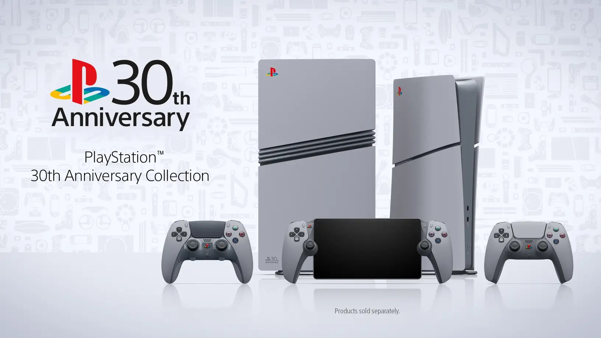
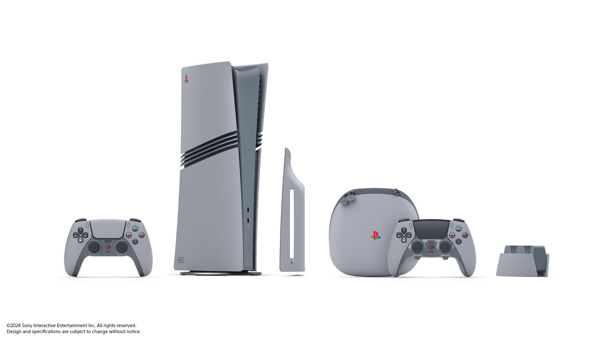
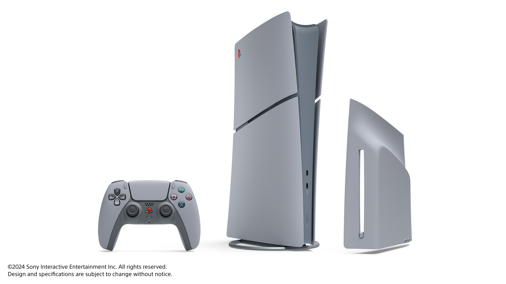
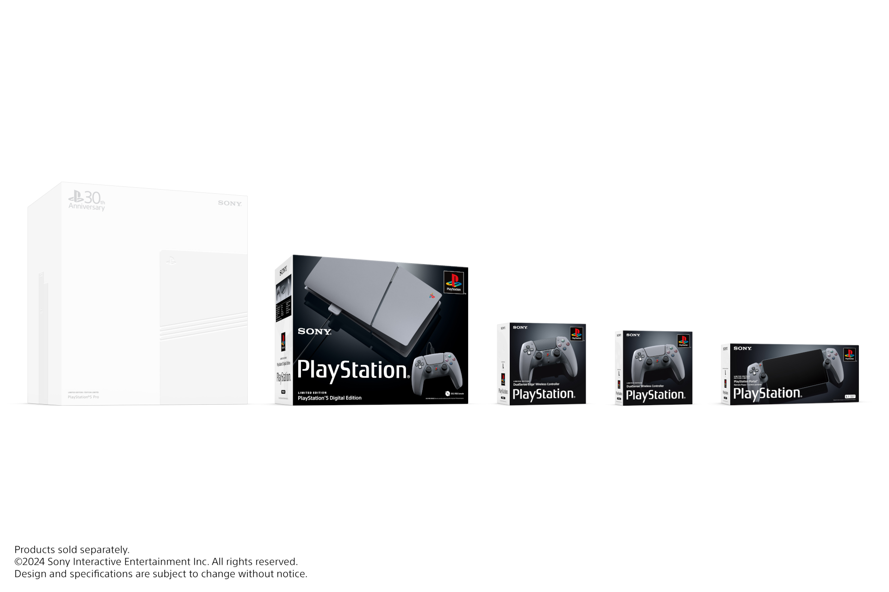
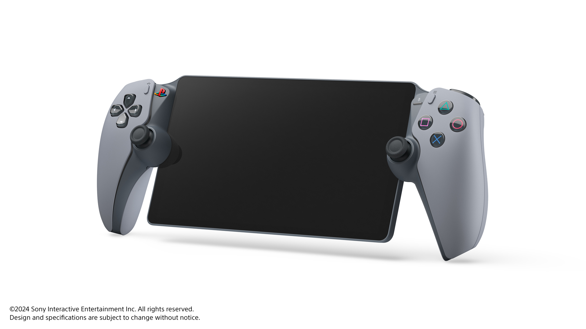

+++
title = "Sony fête les 30 ans de la PlayStation avec des versions rétro de la PS5"
date = 2024-09-19T18:00:32+01:00
draft = false
author = "Félix"
tags = ["Actu"]
type = "une"
image = "https://nostick.fr/articles/vignettes/septembre/psxx.png"
+++

 

Putain, 30 ans ! Sony a [présenté](https://blog.playstation.com/2024/09/19/celebrating-30-years-of-playstation-with-a-nostalgic-look/) une nouvelle collection de PS5 au look délicieusement rétro pour fêter le trentième anniversaire de la marque PlayStation. On y trouve une PS5 et une PS5 Pro à la coque grise rappelant la PS1, en plus d’un PlayStation Portal et de deux DualSense reprenant le look de la première DualShock.

 

Pour l’occasion, Sony a ressorti son premier logo multicolore qui se retrouve sur les manettes et consoles. Un pack PS5 Pro est disponible histoire de donner un coup de pouce à cette nouvelle venue [bien tièdement accueillie](https://nostickreloaded.substack.com/i/148869073/la-grosse-info-de-la-semaine-le-retour-de-lhubris-de-playstation). Il contient la console, une manette Edge et une pas Edge, un socle (!!) ainsi que différents accessoires : poster, stickers, câble à l’ancienne avec une fausse grosse broche, une sacoche… mais pas de lecteur Blu-Ray, faudrait pas déconner non plus. Le pack avec la PS5 « Digitale » ne contient qu’une manette et pas de sacoche ou de station de charge.

La collection sera disponible à partir du 21 novembre. 12 300 unités de la console PlayStation 5 Pro seront en vente, avec des numéros gravés dessus représentant le mois et la date du lancement de la première PlayStation. Les précommandes ouvriront le 26 septembre sur [la boutique de Sony](https://direct.playstation.com) (il faut un compte PSN, mais gare aux scalpels). Vous pouvez obtenir plus de détails sur les différents bundle [dans cet article](https://blog.playstation.com/2024/09/19/celebrating-30-years-of-playstation-with-a-nostalgic-look/). On ne connaît pas les prix, mais vous pouvez commencer à passer un coup de fil à votre banquier : ça promet d’être salé…



