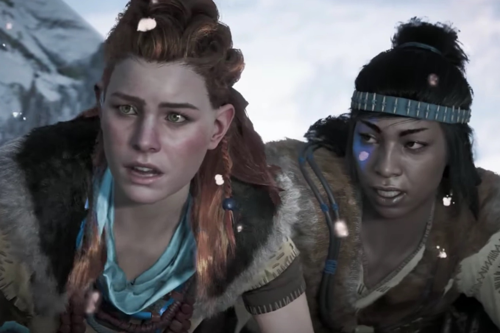

+++
title = "Qui veut d'un remaster de Horizon Zero Dawn ? Non mais sans blague, levez pas tous la main en même temps quoi"
date = 2024-09-19T08:07:32+01:00
draft = false
author = "Mickael"
tags = ["Actu"]
image = "https://nostick.fr/articles/vignettes/septembre/aloy.jpg"
+++

Que faire quand on s'appelle Sony, qu'on n'a aucun nouveau jeu dans les tuyaux pour les prochains mois et qu'il faut malgré tout trouver quelque chose à mettre sous le sapin à Noël ? On lance des remasters, bien sûr ! L'ESRB, l'organisation américaine qui classifie les jeux vidéo, a [révélé](https://www.esrb.org/ratings/40023/horizon-zero-dawn-remastered/) l'existence d'*Horizon Zero Dawn Remastered*.

Le jeu sorti en 2017 sur la PS4, puis sur PC trois ans plus tard, devrait donc connaitre une nouvelle version pour PS5 et PC. Mais une nouvelle version comment ? Plus jolie ? *Horizon Zero Dawn* a déjà reçu un coup de polish sur PS5, en bénéficiant de la patate de la console. Et sur PC, force est de reconnaitre que le titre est vraiment superbe encore aujourd'hui, et parfaitement jouable.

 

Alors quoi ? Le calendrier des prochaines semaines s'annonce chargé pour Sony, qui pourrait bien organiser un State of Play (peut-être la semaine prochaine, d'après des rumeurs). Et puis il y a le Tokyo Game Show à l'horizon… Il va bien falloir présenter une ou deux nouveautés ! Sans oublier la PS5 Pro pour laquelle les gros blockbusters des studios Sony vont intégrer les améliorations graphiques de la nouvelle console. En l'absence de vrai nouveau jeu, il faut bien faire avec ce qu'on a.

Cet *Horizon Zero Dawn Remastered* pourrait donc être un des tout premiers jeux optimisés pour la PS5 Pro, qui sera disponible début novembre. Sony commence à avoir l'habitude de cacher la misère de son catalogue PS5 anémique en multipliant les remasters, comme on l'a vu avec *The Last of Us*. Alors pourquoi pas avec Aloy, qui sera aussi en vedette d'un jeu Lego à sortir cet hiver sur PS5 et Switch. Gare à l'indigestion…