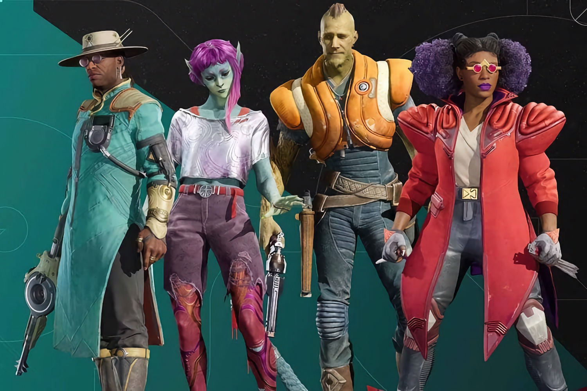

+++
title = "Concord : le directeur du jeu lâche son poste"
date = 2024-09-20T08:49:32+01:00
draft = false
author = "Mickael"
tags = ["Actu"]
type = "telex"
+++

 

Le monstrueux flop de *Concord* provoque des remous au sein du studio Firewalk, comme on pouvait s'y attendre. Ryan Ellis, le directeur du jeu, aurait quitté son poste pour ne plus s'occuper que du support. Il était très attaché à *Concord*, dont le développement a débuté en 2017… et qui s'est lamentablement [crashé au bout de deux petites semaines](https://nostick.fr/articles/2024/septembre/0309-sony-concord-debranche-serveurs-rembourse-joueurs/).

D'après *Kotaku* qui [rapporte](https://kotaku.com/concord-firewalk-studios-relaunch-ps5-sony-playstation-1851652811) la nouvelle, c'est l'attente (et l'angoisse) qui prévaut au sein du studio. Beaucoup sont pessimistes quant au retour du jeu, malgré la volonté affichée de Ryan Ellis d'« *explorer les options* » afin de déterminer « *le meilleur chemin* » à suivre pour *Concord*. Enfin ça, c'est ce qu'il disait lors de l'annonce de la fermeture. Les choses semblent mal engagées.

Certains salariés phosphorent sur des idées à proposer à PlayStation, d'autres s'attendent à des licenciements massifs (150 personnes environ travaillent chez Firewalk). Sony, qui a acheté le studio l'an dernier, pourrait aussi décider de lui donner une de ses franchises à développer. Le stigmate de *Concord* pèserait lourd dans la balance : un certain nombre de salariés attendent surtout de connaitre les conditions du futur plan de départ…