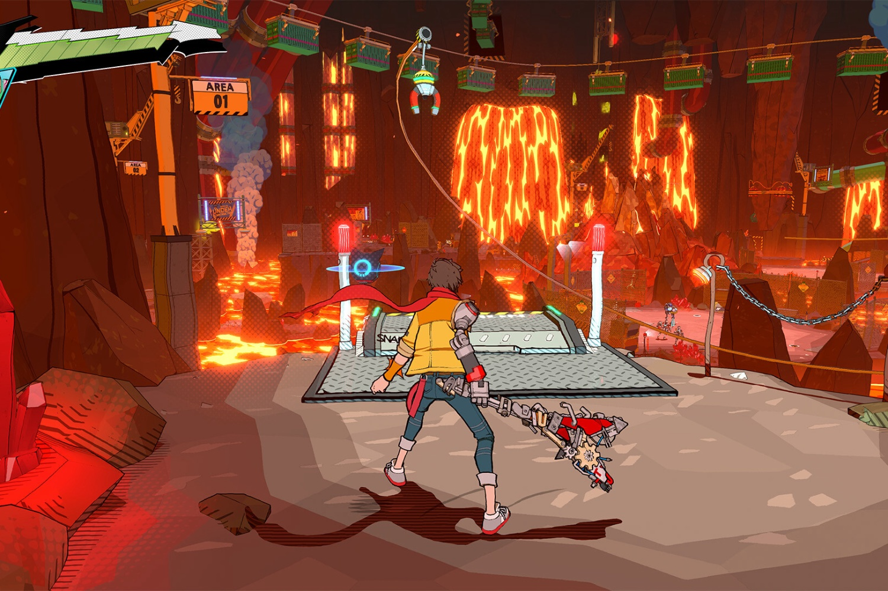

+++
title = "Hi-Fi Rush 2 ne fera pas gagner d'argent à son nouveau proprio"
date = 2024-09-20T09:00:32+01:00
draft = false
author = "Mickael"
tags = ["Actu"]
image = "https://nostick.fr/articles/2024/septembre/2009-hi-fi-rush-2-pas-gagner-argent-proprio/hi-fi-rush.jpg"
+++

Beaucoup de joueurs ont encore du ressentiment envers Microsoft pour [la fermeture en mai dernier de Tango Gameworks](https://nostick.fr/articles/2024/mai/0705-fin-de-partie-pour-arkane-austin-et-tango-gameworks/), le studio japonais créateur de *Hi-Fi Rush*. Après tout, le jeu était un des rares hits Xbox (le seul ?) qui a su faire l'unanimité l'an dernier. Fort heureusement, [Krafton est venu à la rescousse](https://nostick.fr/articles/2024/aout/1208-krafton-a-la-rescousse-de-tango/) en s'offrant non seulement le studio, mais aussi la licence du jeu.

L'éditeur coréen, à l'origine de *PUBG* et du futur *inZOI*, un impressionnant *Sims*-like dopé à l'Unreal Engine 5, veut faire fructifier la franchise *Hi-Fi Rush* et il ne fait aucun doute qu'un deuxième épisode est en développement. Changhan Kim, le CEO de Krafton, ne se fait pourtant pas d'illusion : « *nous ne pensons pas qu'Hi-Fi Rush 2 nous fera gagner de l'argent* », affirme-t-il à *[Game Developer](https://www.gamedeveloper.com/business/-we-don-t-think-hi-fi-rush-2-is-going-to-make-us-money-krafton-ceo-says-tango-gameworks-acquisition-is-about-legacy)*.

Mais alors, quoi ? « *Nous voulions préserver leur héritage* », poursuit-il. Tout au long de son existence, Tango a surtout connu des succès d'estime. *The Evil Within* et *Ghostwire: Tokyo*, qui ne font pas partie du deal, n'ont pas été des cartons financiers, et a priori Hi-Fi Rush non plus. « *Nous avons vu de nombreuses idées créatives qui valaient la peine d'être poursuivies. C'est pourquoi nous voulions travailler avec le studio* », précise le dirigeant.

Acquérir Tango n'était « *ni trop coûteux, ni bon marché non plus* », détaille-t-il sans donner de chiffre. « *Le montant en dollars n'était pas vraiment important pour Microsoft* ». Tango est surtout là pour enrichir le catalogue de Krafton : « *l'équipe est créative. Elle veux essayer quelque chose de nouveau, et nous voulons en faire plus dans ce sens* », dit Changhan Kim. 

« *Créer des jeux vidéo est vraiment un secteur aléatoire, et cela comporte des risques. Mais avoir davantage de projets permet en fait de réduire les risques, car l'un d'entre eux pourrait fonctionner* », conclut-il de manière très rafraîchissante pour si un gros éditeur.