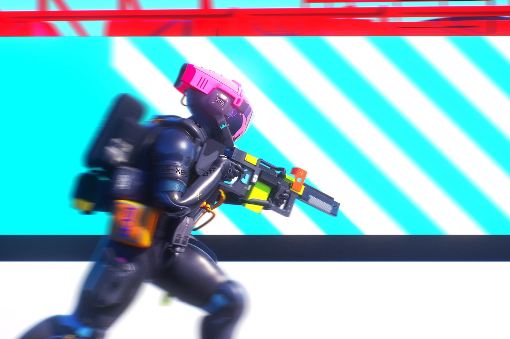

+++
title = "Même prix, même destin ? Comme Concord, Marathon devrait coûter 40 $"
date = 2024-09-20T08:07:32+01:00
draft = false
author = "Mickael"
tags = ["Actu"]
image = "https://nostick.fr/articles/vignettes/septembre/marathon-bungie.jpg"
+++

Pour *Marathon*, Sony va redonner sa chance au modèle économique qui avait si bien marché avec *Concord* : vendre le jeu 40 $… et serrer les fesses en espérant dépasser le record de joueurs Steam ([700](https://nostick.fr/articles/2024/aout/2408-concord-se-crashe-au-decollage/)) qui se sont regardés en chien de faïence dans le défunt shooter du studio Firewalk. 

Le futur jeu de Bungie ne serait donc pas un free-to-play, selon le toujours bien informé Paul Tassi de *[Forbes](https://www.forbes.com/sites/paultassi/2024/09/18/new-marathon-details-on-heroes-price-and-radio-silence/)*. C'est le succès — un vrai, celui-là — de *Helldivers 2* qui aurait convaincu le studio et Sony de mettre une étiquette à 40 $ pour ce reboot du *Marathon* sorti sur Mac en 1994. Et malgré [le crash spectaculaire de *Concord*](https://nostick.fr/articles/2024/septembre/0309-sony-concord-debranche-serveurs-rembourse-joueurs/), PlayStation ne changera pas de modèle.

 

Sony et Bungie seraient de toute manière coincés : le développement du jeu est désormais trop avancé pour le transformer en freemium. Pour 40 $, il faut s'attendre à un jeu « complet », comme pouvait l'être *Concord*, adossé à une boutique de cosmétiques optionnels. A priori, *Marathon* devrait donc donner accès à l'ensemble de ses maps, classes et héros après l'achat. 

Toujours d'après le fuiteur, *Marathon* serait assez proche d'*Apex Legends* dans l'idée, mais avec l'accent mis sur la personnalisation. Les héros auront chacun des capacités uniques (double saut, respawn plus rapide), avec un important volet consacré à l'amélioration des armes et de l'équipement. À l'origine, le titre devait proposer des énigmes à résoudre et des secrets à découvrir, mais Bungie aurait décidé de faire un jeu d'action pur et dur.

Si *Marathon* a eu droit à une bande annonce en mai 2023, la « vraie » présentation avec du gameplay et tout ne serait pas prévue avant le printemps prochain. Enfin, si Sony ne décide pas sur un coup de tête d'arrêter complètement sa stratégie du jeu service, ce qui est toujours possible.