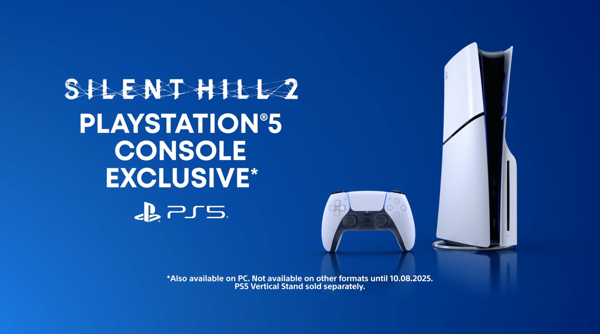

+++
title = "PlayStation s'est offert l'exclusivité Silent Hill 2 pour un an"
date = 2024-09-20T12:44:32+01:00
draft = false
author = "Mickael"
tags = ["Actu"]
type = "telex"
+++

Les studios PlayStation n'ont pas été très prolixes ces derniers mois (années ?), mais fort heureusement Sony a des poches profondes et n'hésite jamais à signer de gros chèques pour s'offrir des exclusivités longue durée. Ce sera le cas une fois de plus pour *Silent Hill 2*, le remake qui sortira sur PC et donc, sur PS5 le 8 octobre.

 

Et pour la Xbox ? Les joueurs de la team green devront prendre leur mal en patience, car cette exclusivité durera un an, jusqu'au 8 octobre 2025, comme l'annonce perfidement le dernier trailer du jeu à la toute fin :

Les joueurs PS5 seront en revanche gâtés, le remake développé par la Bloober Team prend en charge le retour haptique des manettes DualSense, les gâchettes adaptatives et même la barre lumineuse qui donnera le statut de santé du héros.