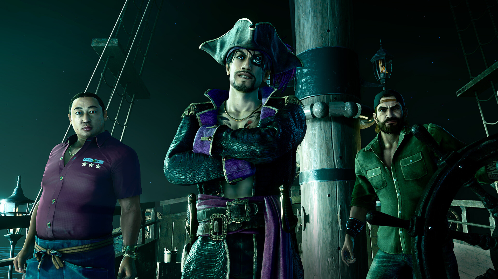

+++
title = "Le prochain Yakuza portera sur le thème… des pirates ?"
date = 2024-09-20T21:00:32+01:00
draft = false
author = "Félix"
tags = ["Trailer"]
image = "https://nostick.fr/articles/2024/septembre/2009-yakuza-theme-pirates/yakuza.jpg"
+++

 

Si Sega ne publie pas un nouveau *Yakuza* chaque année, la boîte implose. C’est comme ça, c’est pas moi qui fait les règles et c’est sans doute ce qui explique l’annonce de *Like a Dragon : Pirate Yakuza in Hawaii* qui sortira le 28 février 2025. Comme son nom l’indique, on y incarnera Majima Goro qui se réveille amnésique sur une plage avant de décider de devenir pirate. Je vous laisse jeter un œil à la bande-annonce, c’est assez foutraque :



Que retenir ? Et bien que Ryu Ga Gotoku Studio compte bien rentabiliser sa map d’Hawaii que l’on a explorée de fond en comble dans *Infinite Wealth*. L’histoire de ce spin-off semble se passer peu de temps après la dernière pérégrination d’Ichiban, le trailer faisant directement référence au précédent opus. Plusieurs nouvelles zones seront de la partie, comme une île plus sauvage baptisée Rich Island et une espèce de cimetière de bateaux repères des gangs et de la mafia.

Exit les combats au tour par tour, ce nouveau jeu faisant la part belle aux bastons en temps réel. *Yakuza* oblige, on peut s’attendre à une flopée de personnages hauts en couleur, à un paquet de mini-jeux et à d’autres activités annexes. On aura sans doute plus de détails au Tokyo Game Show, qui aura lieu la semaine prochaine. Les curieux peuvent se rendre [ici](https://www.youtube.com/watch?v=T6aJQ9hDFxk) pour voir à quoi ressemblera le gameplay ou sur [la page Steam](https://store.steampowered.com/app/3061810/Like_a_Dragon_Pirate_Yakuza_in_Hawaii/) pour poser une précommande. Le jeu sera dispo sur Xbox Series X/S, Xbox One, PlayStation 5, PS4 et PC.