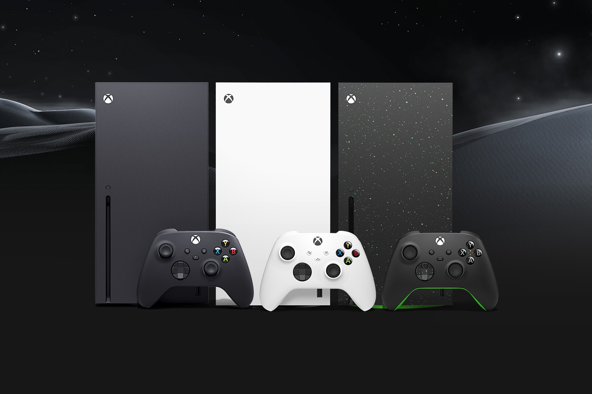
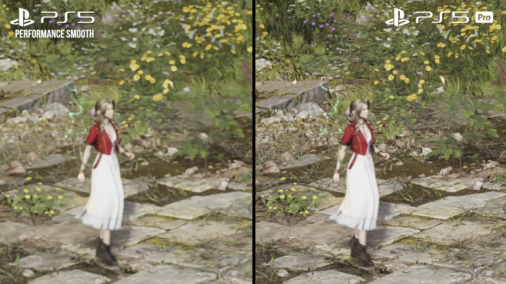
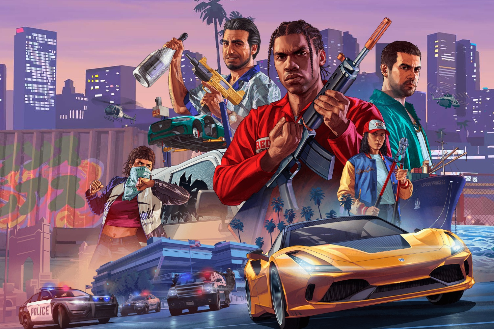

+++
title = "On vide le backlog de la semaine : Xbox, Concord, PS5 Pro, Les Sims 4, GTA Online…"
date = 2024-09-21T07:00:00+01:00
draft = false
author = "Mickael"
tags = ["XXL"]
image = "https://nostick.fr/articles/vignettes/septembre/mortal-kombat-1-ghostface.jpg"
+++

L’actualité du jeu vidéo ne s’arrête pas à la poignée d’articles publiés sur *Nostick* ! Histoire de rattraper le retard accumulé, voici un retour rapide sur quelques unes des infos les plus importantes (ou insignifiantes) de la semaine.

## Le chiffre de la semaine : 28,3 millions…

… Comme le nombre de Xbox Series X/S vendues par Microsoft au 30 juin, selon des chiffres Aldora Intelligence [publiés](https://www.youtube.com/watch?v=yuZtbsSrdwo) par le *Wall Street Journal*. C'est 7 millions de plus qu'il y a un an, ce qui signifie que le constructeur continue de vendre de la console, malgré [un soutien commercial de plus en plus déclinant](https://nostick.fr/articles/2024/juillet/3107-ventes-xbox-coulent-pic/).

Microsoft lancera cet automne [la commercialisation de nouveaux modèles](https://nostick.fr/articles/2024/aout/2108-nouvelles-xbox-preco/), dont une Series X toute blanche et sans lecteur optique, mais aussi sans changement matériel. On est loin de la PS5 Pro qui certes, coûte la peau des fesses mais qui a au moins la bonté d'être plus puissante.

Du côté de la distinguée concurrence, la PS5 vogue loin devant avec 61,7 millions d'unités vendues, deux fois plus que de Xbox. Est-ce si important désormais pour Microsoft ? L'entreprise a acté sa position de bon dernier sur le marché des consoles, et mise maintenant davantage sur les ventes de jeux — d'où la nécessité de sortir du cadre étriqué de la plateforme déclinante. C'est pourquoi *Indy* va sortir sur PS5, et il faut s'attendre à ce que d'autres grosses « exclusivités » ne le restent guère longtemps.

Hasard du calendrier, c'est aussi cette semaine que Microsoft a arrêté son programme d'[ambassadeurs Xbox](https://ambassadors.microsoft.com/xbox), après 13 ans de bons et loyaux services. Cet arrêt est assez significatif du repli de la plateforme, puisque ce programme récompensait des « ambassadeurs » pour aider et soutenir la communauté Xbox. Le constructeur explique que les joueurs ont désormais d'autres moyens pour interagir avec la communauté. En achetant une PS5 pour jouer à des jeux Xbox ?

## L'autre chiffre de la semaine : 400 millions…

… Comme le budget de développement de *Concord*. le shooter multi de PlayStation qui s'est [crashé au bout de deux petites semaines](https://nostick.fr/articles/2024/septembre/0309-sony-concord-debranche-serveurs-rembourse-joueurs/). Sony garde jalousement au secret tous ces chiffres, mais celui-ci a été révélé par le podcast *Sacred Symbols* sur la foi de trois sources internes.



Toujours selon ces fuites, Ryan Ellis, le directeur du jeu qui a [lâché son poste](https://nostick.fr/articles/2024/septembre/2009-concord/) et les responsables du studio Firewalk, étaient aveuglés par la « posivité toxique » qui empêche de prendre en compte les retours négatifs. Ils estimaient que Concord représentait « *le futur de PlayStation* » avec un potentiel digne de *Star Wars*. On a vu à quel point ils se sont plantés.

## La bonne nouvelle de la semaine : finalement c'est pas si pourri la PS5 Pro

Sony a foiré [le lancement de la PS5 Pro](https://nostick.fr/articles/2024/septembre/1009-enfin-une-ps5-pour-les-pro/), en échouant lamentablement à justifier le prix délirant demandé pour acquérir la bête. Les comparaisons montrées durant la vidéo n'ont en effet [convaincu personne](https://nostick.fr/articles/2024/septembre/1409-backlog-ps5-pro-destiny-2-the-crew-2/#la-grosse-info-de-la-semaine--le-retour-de-lhubris-de-playstation), et la compression YouTube n'arrange rien.

Alors qu'il suffisait à Sony de refiler le sale boulot à *Digital Foundry* ! La chaîne YouTube bien connue des amateurs de beaux jeux a obtenu du constructeur une séquence de *Final Fantasy 7 Rebirth* enregistrée sur une PS5 Pro. L'extrait vidéo de 80 Go en haute résolution de 7 minutes se déroule au début du chapitre 2, autrement dit dans la zone en monde ouvert du jeu. 

 

La séquence tourne à 60 FPS, ce qui correspond au mode Performances de la PS5 qui privilégie la fréquence d'affichage à la netteté des graphismes. Sur l'extrait de Sony, les visuels en 4K sont particulièrement nets dans les cinématiques. Bien davantage que sur la console standard, où le 1080p est parfois (souvent) flou.

Ce niveau graphique révèle de nombreux détails, comme les pores de la peau de Barrett ou les cheveux de Tifa. Les problèmes de ghosting du jeu original sont (quasiment) tous du passé. 
Les arbres au loin ne sont plus bizarrement semi-transparents.

Pendant les phases de gameplay, c'est aussi un satisfecit avec un niveau de détail que la PS5 ne parvient pas à atteindre. Comme on peut l'imaginer, le jeu fait appel au PSSR (PlayStation Spectral Super Resolution), la nouvelle technologie d'upscale développée pour la PS5 Pro. Elle permet à Square Enix d'agrandir la résolution interne comprise entre 1 152p et 1 224p vers du 4K  très propre. La PS5 fait aussi de l'upscale 4K, mais sans PSSR… et plus de flou.

La séquence de Sony comparée avec le mode Qualité de la PS5 rapproche les deux consoles sur un plan graphique. Mais évidemment, la PS5 Pro double le nombre d'images par seconde (ce mode limite la fréquence à 30 FPS sur la PS5), tout en améliorant légèrement les graphismes et les détails. 

La PS5 Pro ne fait pas de miracle concernant le suréchantillonnage temporel (temporal supersampling), une technique utilisée pour améliorer la qualité d'une image ou d'une séquence en ajoutant des détails ou des informations visuelles basées sur les images précédentes et suivantes. Le jeu présente toujours des effets de scintillement et de légers flous dans la végétation, les vêtements ou les cheveux des héros. 

L'un dans l'autre, cela reste tout de même le meilleur des deux mondes, soit la promesse de Sony. Il aurait peut-être fallu commencer par ça, même si le feu du prix (800 €, rappelons-le) est toujours bien chaud.

## La mauvaise nouvelle de la semaine : GTA Online est maintenant incompatible Steam Deck

*GTA V* et sa version multijoueur, *GTA Online*, tournent sans trop de souci sur toutes les plateformes, et c'est heureux : après tout, *GTA VI* est prévu pour l'automne prochain ! Malheureusement, les joueurs qui avaient l'habitude de se balader à Los Santos et dans les environs avec leur Steam Deck sont désormais bloqués à l'entrée de la ville.

Rockstar a récemment intégré à *GTA Online* l'outil anti-triche BattlEye. Et puisque BattlEye n'est pas compatible avec le Steam Deck, CQFD : « *Vous pourrez jouer au mode histoire de GTA V, mais vous ne pourrez pas jouer à GTA Online* », confirme le studio. Par conséquent, la [fiche](https://store.steampowered.com/app/271590/Grand_Theft_Auto_V/) Steam du jeu affiche désormais l'infamant statut « Non pris en charge » pour la compatibilité Steam Deck, alors qu'il s'agit d'un best seller chez les utilisateurs de la console.

Et pourtant, il suffirait de pas grand chose pour que *GTA Online* soit de nouveau pleinement opérationnel sur le Steam Deck. Depuis 2021, BattlEye est en effet pris en charge par Proton, la couche de compatibilité basée sur Wine qui permet de jouer à des jeux Windows sur des systèmes Linux — c'est ainsi que fonctionne le Steam Deck.

À l'époque, Valve [expliquait](https://store.steampowered.com/news/group/4145017/view/3104663180636096966) qu'il suffisait à un développeur de contacter BattlEye pour activer le support de sa console. De nombreux jeux ont fait cette procédure, et ça se passe bien. 

La bonne nouvelle dans l'histoire, c'est que les choses pourraient s'arranger relativement rapidement. L'assistance Steam a en effet indiqué que Valve [travaillait](https://www.reddit.com/r/SteamDeck/comments/1fk8hp7/weather_update_gta_v_has_been_updated_to/) avec Rockstar pour trouver un correctif. Il y a de l'espoir… Et pour ceux qui ne peuvent pas attendre, il existe un moyen de contourner BattlEye ([ici](https://github.com/YimMenu/YimMenu/pull/3697)) mais ce n'est pas à la portée du premier venu.

## La grosse info de la semaine : l'univers des Sims 4

*Les Sims 4* était déjà un monde à part, Electronic Arts et Maxis veulent en faire un univers. Le jeu, sorti il y a dix ans (!) et qui s'est transformé en free-to-play en 2022 compte aujourd'hui plus de 80 millions de joueurs. Bon nombre d'entre eux claquent des sous pour acheter des DLC et autres objets.

Dans ces conditions, pourquoi donc s'escrimer à lancer un *Sims 5* ? Combien de ces millions de joueurs seront prêts à investir dans un nouveau jeu et à reprendre de zéro des créations qui les accompagnent depuis de nombreuses années ? À l'orée des 25 ans de la licence, [EA jette donc aux orties la linéarité des *Sims*](https://nostick.fr/articles/2024/septembre/1809-il-ny-aura-pas-de-sims-5/) ! 

À la place, *Les Sims 4* va [devenir](https://www.ea.com/en-gb/games/the-sims/news/the-future-of-the-sims) « *l'expérience fondamentale* », et le jeu s'enrichira de *cozy games*, d'« expériences » plus sociales et collaboratives, et aussi de passerelles avec les jeux mobiles. Le tout en modernisant *Les Sims 4* avec des améliorations de gameplay et graphiques. Autrement dit, le jeu achève sa transformation en plateforme de divertissement, à l'image de c'est devenu *Fortnite*. 

Il n'y aura donc pas de *Sims 5*, le jeu actuel va continuer à s'améliorer sans que les joueurs actuels n'aient à reconstruire quoi que ce soit. En lieu et place, ils pourront poursuivre leur petite vie virtuelle, tout en profitant des fonctions du mystérieux « projet Rene » que beaucoup croyaient être *Les Sims 5*. Il s'agirait plutôt d'une sorte de réseau social et de mode multijoueur ; EA l'avait [comparé](https://www.youtube.com/watch?v=2S2OipqoL-w) l'an dernier à quelque chose comme *Animal Crossing*. On sera bientôt fixé, un bêta-test commencera cet automne sur invitation.

Ce changement de modèle pour *Les Sims 4* a du sens, du point de vue économique pour EA, qui n'a pas à investir des sommes indécentes pour développer un nouvel épisode compliqué à vendre auprès des fans de l'opus actuel. Mais aussi pour les joueurs eux-mêmes finalement, dont les habitudes ne seront pas bousculées outre mesure. 

Electronic Arts reste une des entreprises les plus détestées au monde, mais il faut lui reconnaitre une certaine bonne volonté pour ouvrir en grand les portes et les fenêtres des Sims, entre des labs pour expérimenter de nouvelles fonctions, à ce bêta test de Rene. Pour évoluer dans le bon sens, ce genre de jeux a besoin des retours constants des joueurs, histoire de tester des nouveautés pour les améliorer ou les supprimer, le cas échéant. Un modèle et une transformation qui pourraient bien servir d'exemple à d'autres franchises de longue date.

## osef

Ah oui, *Les Sims* va aussi être adapté au cinéma.

## On n'a pas eu le temps mais on pense à eux

 

Il y a bien sûr *Echos of Wisdom*, le prochain Zelda (avec Zelda en vedette !) qui sort le 26 septembre, mais l'automne de Nintendo sera encore plus chargé puisqu'on attend aussi *Mario & Luigi : L'épopée fraternelle*. Ce nouvel opus de la saga RPG avec les deux frangins sera dispo le 7 novembre, et pour faire patienter, hop, un petit trailer qui montre des batailles certes au tour par tour, mais très agitées tout de même.

 

NetherRealm s'y connait pour faire monter la sauce autour de *Mortal Kombat 1*. Le débilo-rigolo-sanguignolo jeu de tape va avoir droit le 24 septembre à un nouveau DLC, « Khaos Reigns », qui comprend une nouvelle campagne solo et de nouveaux kombattants comme Cyrax, Sektor, mais aussi des invités de marque comme Ghostface, le T-1000 et Conan. Ce sera l'occasion d'apprécier les nouvelles fatalities bien dégueues ainsi que des Animalities tout aussi gouleyantes. Les amateurs de tripaille apprécieront la bande annonce.

 

*Colossatron*, *Age of Zombies*, *Mega Jump*… Si ces jeux mobiles vous rappellent quelque chose, c'est que vous avez usé vos fonds du culotte sur les jeux mobiles de Halfbrick ! Le studio australien vient de [lancer](https://www.halfbrickplus.com) un abonnement à 2,99 € par mois pour accéder à son catalogue, sans pub ni achat intégré (on y ajoutera les increvables *Jetpack Joyride* et *Fruit Ninja*). C'est un peu Apple Arcade, mais en mieux.

## Dans le reste de l'actu déchaînée

- *Palworld* ne se transformera pas en jeu service, même si le studio Pocketpair continue de réfléchir au modèle économique de son jeu ~~pas du tout pompé sur Pokémon~~. [C'est à lire par ici](https://nostick.fr/articles/2024/septembre/1609-palworld-transformera-pas-jeu-service/).
- Mais peut-être que *Palworld* n'aura pas à se poser cette question trop longtemps : Nintendo et la Pokémon Company ont en effet décidé de finalement porter plainte pour infraction de brevet ! [Ça pourrait faire mal](https://nostick.fr/articles/2024/septembre/1909-nintendo-pokemon-company-attaquent-palworld/).
- La manette GameCube qui traine au fond du tiroir va connaître une nouvelle vie grâce au kit retrofit de 8BitDo ! Mais avant de sortir le tournevis, [allez lire l'actu par là](https://nostick.fr/articles/2024/septembre/1609-8bitdo-bluetooth-retrofit-gamecube/).
- Les rumeurs d'un report de *GTA VI* apparaissent régulièrement sur les internets, mais dans la vraie vie Rockstar nous préviendra au dernier moment, [comme on l'explique par ici](https://nostick.fr/articles/2024/septembre/1609-gta-vi-report-quelques-mois/).
- *Final Fantasy XVI* est enfin dispo sur PC, et avec lui… les mods. Au grand dam du producteur du jeu qui demande aux joueurs de résister à la tentation de faire n'importe quoi. [Sera-t-il entendu ?](https://nostick.fr/articles/2024/septembre/1709-final-fantasy-xvi-mods/)
- Intel aurait bien voulu fournir Sony en puces pour la PS6, mais c'est AMD qui a remporté le morceau. On revient sur le sujet [dans cette actu](https://nostick.fr/articles/2024/septembre/1709-moteur-ps5-pro-amd-intel/).
- L'iPad devient beaucoup plus intéressant en Europe grâce à iPadOS 18, qui permet l'installation de boutiques alternatives. À vous les joies de Fortnite et de Delta sur votre tablette. [C'est à découvrir par ici](https://nostick.fr/articles/2024/septembre/1709-ipad-souvre-aux-boutiques-tierces/).
- Les jeux trop durs sont définitivement trop durs. C'est pourquoi Dragon's Dogma 2 inaugure un mode casual pour vivre la vie plus facilement. [On s'en réjouit par là](https://nostick.fr/articles/2024/septembre/1809-dragons-dogma-2-mode-casual/).
- Contrairement à Xbox qui n'a pas l'air de savoir que faire, Sony a de nouveau réaffirmé que la PlayStation était au cœur de son activité jeu vidéo. Bon, le PC n'est pas très loin pour autant… [À lire par ici](https://nostick.fr/articles/2024/septembre/1809-sony-coeur-playstation/).
- À force d'attendre, on finit par voir la Switch 2 partout. [Peut-être dans cette série d'images CAO ?](https://nostick.fr/articles/2024/septembre/1809-switch-2-visuels-cad/)
- Ressortez votre vieille souris SNES, elle va peut-être resservir ! Ou peut-être pas, en tout cas, Nintendo s'est arrangé pour la rendre compatible avec le NSO. On s'en étonne [dans cette actu](https://nostick.fr/articles/2024/septembre/1809-nintendo-switch-online-snes-souris/).
- Electronic Arts a présenté à des investisseurs sa vision du développement de jeu à forte dose d'IA générative. [C'est pas glorieux](https://nostick.fr/articles/2024/septembre/1909-ea-fond-ia-mur/).
- Chouette : Sony prépare visiblement un remaster de *Horizon Zero Dawn* ! Allez quoi, c'est une nouvelle ! [Comment ça, osef ?](https://nostick.fr/articles/2024/septembre/1909-remaster-horizon-zero-dawn-vraiment-sony/)
- Si le pipeline de jeux de Sony est vide de chez vide, du côté du matos le constructeur fait feu de tout bois : les PS5 et PS5 Pro du 30e anniversaire de PlayStation sont de toute beauté ! Et Sony n'a pas fait l'erreur d'annoncer des prix… [C'est à admirer ici](https://nostick.fr/articles/2024/septembre/1909-ps5-30e-anniversaire/).
- PlayStation toujours, mais cette fois avec *Marathon*, le prochain jeu multi de Bungie qui devrait être facturé 40 $, comme un certain *Concord*. [Même prix, même destin ?](https://nostick.fr/articles/2024/septembre/2009-marathon-concord-prix-destin/)
- L'éditeur Krafton a arraché à la mort le studio Tango Gameworks et la licence *Hi-Fi Rush*, mais sans être certain de gagner de l'argent. [Et c'est pas grave !](https://nostick.fr/articles/2024/septembre/2009-hi-fi-rush-2-pas-gagner-argent-proprio/)
- Arrrrr ! La saga Yakuza n'a jamais eu peur d'explorer des univers très éloignés des petites habitudes de la mafia japonaise, se lance cette fois à l'assaut des pirates. C'est foutraque ? Oui, et [la bande annonce vaut le coup d'œil](https://nostick.fr/articles/2024/septembre/2009-yakuza-theme-pirates/).