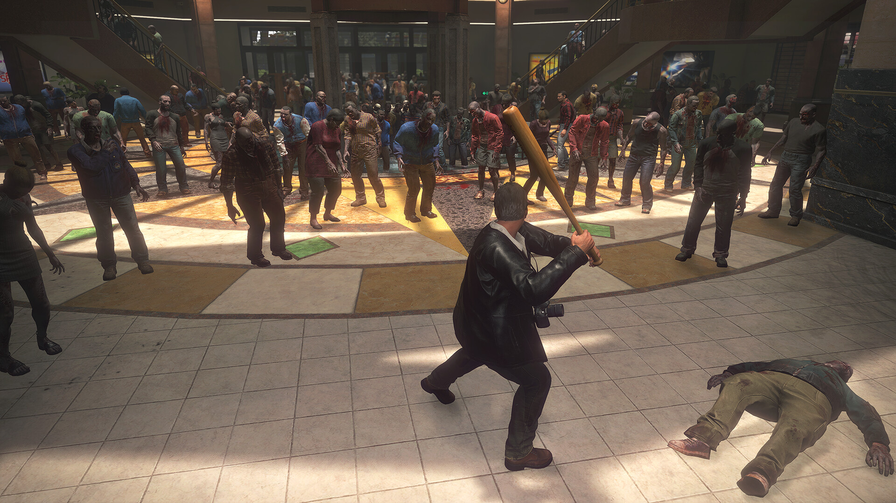

+++
title = "Frostpunk 2, Le Vaillant Petit Page : le récap des sorties de la semaine (22/09)"
date = 2024-09-22T08:00:02+01:00
draft = false
author = "Félix"
tags = ["C’est dispo"]
image = "https://nostick.fr/articles/2024/septembre/2209-les-sorties-de-la-semaine/dead.jpg"
+++

Entre la garderie, les courses et la voisine du dessus qui déplace ses meubles tous les soirs dès 23h30, vous n’avez peut-être pas eu le temps de vous intéresser aux nouveautés du moment. Qu’à cela ne tienne : voici les sorties de ces derniers jours qui ont retenu notre attention.

## Tu nous entends le Blizzard ? Tu nous entends ?

Alors que l’été se termine, pourquoi ne pas se jeter corps et âme dans un jeu où règnent déprime, tristesse et neige éternelle ? ***Frostpunk***, le simulateur de chagrin de 11 bit Studios est de retour dans un deuxième opus qui vient améliorer la formule du premier. Pour rappel, le jeu consiste à faire survivre un groupe de rescapé d’un blizzard apocalyptique bloqué dans un hiver sans fin et réunit autour d’une vieille centrale à charbon. Il va s’agir d’étendre sa ville, de faire survivre un maximum de monde et si possible, de rendre les habitants pas trop mécontents. *Frostpunk 2* se déroule 30 ans après le premier épisode : le petit hameau est devenu une vraie cité avec plusieurs milliers d’habitants. Une fois de plus, il va falloir faire de la politique pour tenir le cap : faut-il faire travailler les enfants ou les envoyer à l’école ? Imposer le mariage pour faire grimper la population ? Céder aux demandes des gangs pour éviter le chaos ? Ce second opus est visiblement réussi, poussant le concept du premier encore plus loin en ajoutant des éléments renouvelant le gameplay. Les tests évoquent une suite solide, à ne pas manquer si le pitch déprimant ne vous a pas refroidi. 45 € sur Mac et [PC](https://store.steampowered.com/app/1601580/Frostpunk_2/), aussi dispo sur Xbox/PS5 et dans le Game Pass (mais pas le Game Pass [des pauvres](https://nostick.fr/articles/2024/juillet/0907-game-pass-xbox-bordel-hausse-prix/)).

## Devolver se met à la page

Après quelques previews moyennes, on s’inquiétait un peu pour ***Le Vaillant Petit Page***, le dernier Zelda-like de Devolver. Le jeu mélange habilement des séances dans un livre d’histoire  en 2D avec des niveaux 3D dans le monde réel pour un rendu vraiment chouette. On parcourt un album rempli de villes colorées et des grottes obscures en se faisant quelques copains sur la route pour aller retrouver un grand méchant. Le gameplay semble assez classique en alternants plateformes, combats et puzzles, mais apporte quelques bonnes idées : le héros peut par exemple sortir du livre dans lequel se passe l’aventure pour tourner les pages, ou modifier certains mots pour changer des éléments de l’univers. Les testeurs décrivent un jeu sympathique arrivant à créer la surprise, un poil répétitif sur la fin mais qui reste un solide 7/10. Peut être pas pour tout de suite au vu du tarif de 30 €, mais à -20 % dans quelques mois, ça sera sans doute une bonne affaire. Dispo sur Switch, [PC](https://store.steampowered.com/app/1627570/Le_Vaillant_Petit_Page/?l=french) et consoles.

 

## Les fonds de tiroir de Capcom épisode n°1978669

Capcom continue de nous servir des remakes à la pelle avec aujourd’hui une édition « Deluxe Remaster » du premier ***Dead Rising***, sorti à l’époque sur 360 et dans lequel on incarne un journaliste véreux bloqué dans un centre commercial blindé de zombies. Le jeu de base est une référence, donc difficile de se planter : les graphismes ont été refaits sous le Resident Evil Engine, tandis que certains éléments ont été modifiés pour améliorer le confort de jeu (sauvegardes automatiques, UI…). Les développeurs se sont donné un peu de mal étant donné que le jeu est désormais intégralement doublé là où certains contenus coupés ont été déterrés. Bref, ça passe même si les esprits chagrins regretteront que certaines mécaniques des opus suivants n’aient pas été intégrées ou l’IA des PNJ toujours aux fraises, ce qui donne un jeu qui reste plutôt vieillot. On garde ça dans un coin de wishlist pour une future promo, mais en l’état et pour 50 balles, ça semble un peu fort de café. Dispo sur [PC](https://store.steampowered.com/app/2527390/Dead_Rising_Deluxe_Remaster/), PS5 et Xbox.

## Bright Souls

Cette semaine est sorti **‌Enotria : The Last Song**, un *Souls* italien qui s’est pris les pieds dans le tapis. Le concept est pourtant plutôt original étant donné qu’on nous promet un univers inspiré du folklore de ~~nos voisins néo-fascistes~~ la patrie de la pizza en parcourant de vieux villages aux petites ruelles sous un soleil de plomb. Malgré son ambiance appréciée des testeurs, le jeu pêche par son gameplay : les combats sont décrits comme pas terribles et certaines mécaniques manquent d’équilibrage. Le jeu aurait bien besoin d’un coup de polish, certains joueurs se plaignant de bugs et de mauvaises performances. Tout n’est pas entièrement à jeter, mais c’est pour l’instant à réserver aux grands fans du genre qui savent dans quoi ils se lancent. Après, ça reste le premier jeu du studio : on espère qu’ils pourront corriger le tir ou qu’ils feront mieux la prochaine fois tant l’idée d’un *Dark Souls* sans caves ni château en ruine est intéressante. 45 balles sur [Steam](https://store.steampowered.com/app/2102450/Enotria_The_Last_Song/), également dispo sur PS5 et Xbox.

 

## Mais aussi

Pas mal de sorties à noter cette semaine, comme celle de l’intriguant ***Judero*** : ce titre mélange exploration et combats est fait en stop-motion fait main. La [page Steam](https://store.steampowered.com/app/1960900/Judero/) mérite le coup d’œil juste pour découvrir ce rendu bizarre, et le jeu a été plutôt bien accueilli. Pour 17,50 € et sachant qu’il y a une démo, ça peut valoir le coup. Relevons aussi la sortie la semaine dernière (oui bon ça va hein) de ***‌Hollowbody***, un survival-horror « tech-noir » rendant hommage aux grands du genre sur PS2. Les critiques sont toutes positives et c’est vendu 16,50 sur [Steam](https://store.steampowered.com/app/2123640/Hollowbody/). Enfin, les versions PC de ***[Final Fantasy XVI](https://store.steampowered.com/app/2515020/FINAL_FANTASY_XVI/)*** et de ***[God of War Ragnarok](https://store.steampowered.com/app/2322010/God_of_War_Ragnarok/)*** sont dispo pour respectivement 50 € et 60 €. Si avec tout ça vous trouvez moyen de vous occuper ce week-end, je ne peux plus rien faire pour vous.