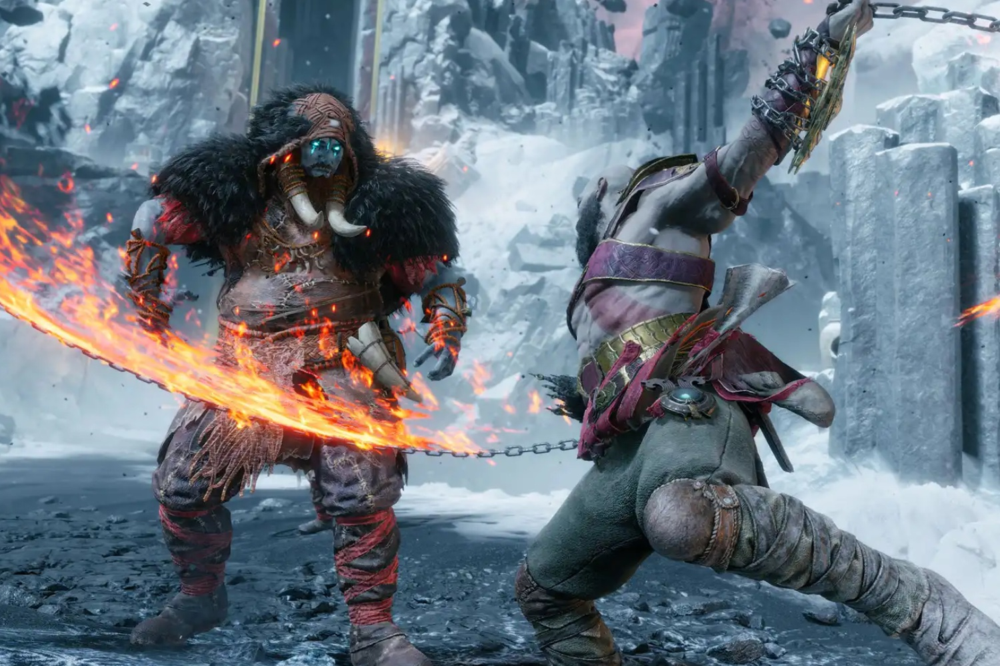

+++
title = "Ça commence moyen bof pour God of War Ragnarök sur PC"
date = 2024-09-23T08:01:32+01:00
draft = false
author = "Mickael"
tags = ["Actu"]
image = "https://nostick.fr/articles/vignettes/septembre/god-of-war.jpg"
+++

Le saviez-vous ? *God of War Ragnarök* est sorti la semaine dernière sur PC ! C'est vrai que la communication de Sony n'a pas été tonitruante, alors qu'il s'agit d'un bon gros blockbuster PlayStation qui avait marqué la fin de l'année 2022 sur la console.

On aurait pu s'attendre à un raz de marée sur Steam, le jeu ayant bonne réputation… Et pourtant ça a été bien calme. Le titre du studio Santa Monica a dépassé les 35 000 joueurs en simultané, selon [SteamDB](https://steamdb.info/app/2322010/charts/). C'est solide, mais c'est tout de même moitié moins que la version PC du premier *God of War* à son lancement, il y a un peu moins de trois ans.

 

Dans ce domaine, c'est le director's cut de *Ghost of Tsushima* qui détient le record avec 77 000 joueurs simultanés. Le cas *Helldivers 2* avec ses 460 000 joueurs (!) est un peu à part, le shooter coop étant sorti en même temps sur PS5 et sur PC. Est-ce que ce *Ragnarök* est une déception ? Difficile à dire pour Sony, mais on peut imaginer que le constructeur en aurait voulu davantage au vu du prestige de la licence et des efforts accomplis pour [optimiser](https://blog.playstation.com/2024/09/18/god-of-war-ragnarok-brings-a-host-of-new-features-to-pc-available-tomorrow/) le jeu au PC.

Pour les joueurs en revanche, on connait leur humeur et elle est maussade. Les évaluations [Steam](https://store.steampowered.com/app/2322010/God_of_War_Ragnark/) sont « moyennes », pour une raison bien particulière : *Ragnarök* exige un compte PSN. Ce qui élimine d'un coup des millions de joueurs, puisque le service n'est pas disponible dans une centaine de pays et de territoires ! Il est toujours possible de tricher en utilisant un VPN, mais gare : PlayStation peut toujours révoquer un compte créé de la sorte.

Sony avait dû rabattre son caquet quand la plateforme avait commencé à demander un compte PSN pour *Helldivers 2* [quelques semaines après le lancement du jeu](https://nostick.fr/articles/2024/mai/0505-sony-fait-plonger-helldivers-2-en-enfer/). Mais désormais, y compris pour les jeux solo comme c'est le cas de *God of War*, un compte PSN est obligatoire. Ce qui est fou quand on y pense : l'entreprise est prête à s'asseoir sur de nombreux joueurs potentiels pour une bêtise.

Quoi qu'il en soit, cette stratégie du portage sur PC est désormais bien partie pour durer. La direction de Sony le rappelle régulièrement : malgré des PC plus compliqués à configurer que les consoles, comme l'expliquait encore récemment Hideaki Nishino, co-CEO de Sony, il s'agit [d'augmenter la part de marché de PlayStation](https://nostick.fr/articles/2024/septembre/1809-sony-coeur-playstation/).