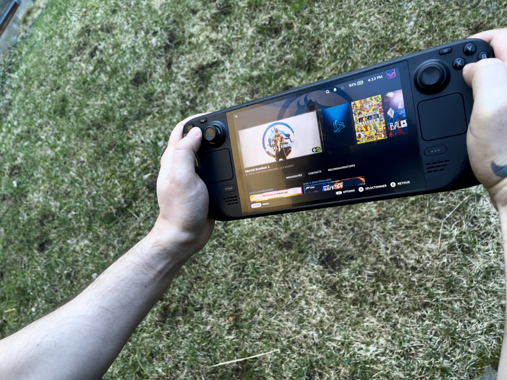

+++
title = "Les jeux Steam bientôt jouables sur les smartphones (et les Mac) ?"
date = 2024-09-23T07:00:32+01:00
draft = false
author = "Mickael"
tags = ["Actu"]
image = "https://nostick.fr/articles/vignettes/septembre/SteamDeck2.jpg"
+++

Si le Steam Deck parvient à accomplir de véritables miracles dans la prise en charge de jeux PC — aussi bien des indés que des AAA —, c'est grâce à la couche de compatibilité Proton, basée sur [Wine](https://www.winehq.org), qui permet aux jeux Windows de fonctionner sur Linux, le système d'exploitation de la console. Elle traduit les API de Windows dans leurs équivalents Linux sans nécessiter de changements dans le jeu, le tout en offrant des performances impressionnantes pour un tel appareil.

Le Steam Deck fonctionne avec un processeur Zen 2 custom conçu avec AMD, une puce qui repose sur l'architecture x86, comme les puces d'Intel. Mais Valve s'intéresse à d'autres architectures, en particulier ARM. SteamDB a [repéré](https://steamdb.info/app/3043620/history/?changeid=25321568) une curieuse mise à jour pour une application *ValveTestApp3043620*. Celle-ci liste plusieurs jeux populaires (*Left 4 Dead 2*, *Garry’s Mod*, *Kerbal Space Program*, *Shadow of Mordor*) contenant des mots clé fort intrigants : « proton-arm64 » et « proton-arm64e ».

Autrement dit, il est plus que probable que Valve teste en ce moment une version de Proton pour les systèmes basés sur l'architecture ARM64. Ce qui est très intéressant, c'est que les puces ARM équipent tous les smartphones, aussi bien iOS qu'Android, la vaste majorité des tablettes, et de plus en plus d'ordinateurs : tous les Mac et les nouveaux PC Copilot.

Cela signifie que les jeux distribués par Steam pourraient rouler sur tous ces appareils grâce à une couche Proton optimisée pour les puces ARM. *ValveTestApp3043620* contient aussi des références à Waydroid, un outil qui permet d'utiliser des apps Android sur Linux, ce qui pourrait encore agrandir le catalogue de logiciels accessibles à la plateforme de Valve.

Comme le prophétise *[Notebookcheck](https://www.notebookcheck.net/Valve-is-testing-ARM64-support-for-popular-games-sparking-speculations-about-new-future-hardware.891851.0.html)*, ce travail de fond pourrait être mis au service du futur casque VR autonome toujours dans les cartons de Valve qui embarquerait donc une puce ARM. Autre hypothèse : le Steam Deck 2, évidemment ! Un des atouts des processeurs ARM est qu'ils sont particulièrement économes, ce qui est évidemment capital pour une console portable…