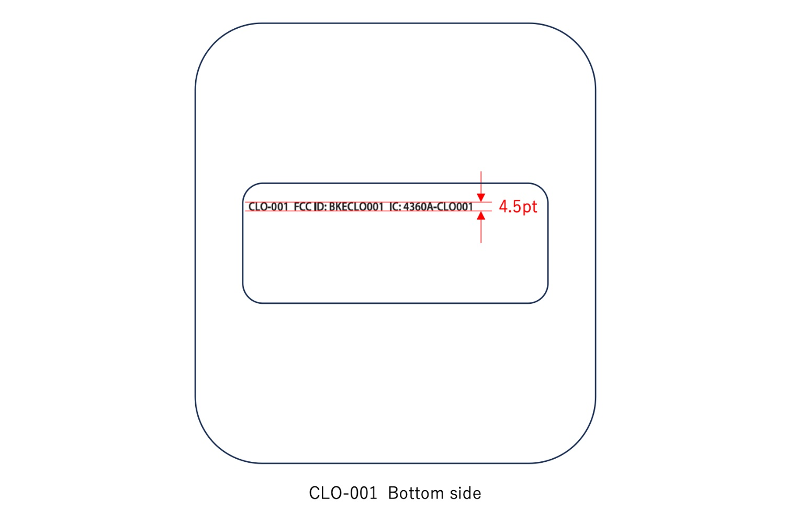

+++
title = "Nintendo dépose aux États-Unis un appareil mystère qui n'est pas la Switch 2"
date = 2024-09-23T12:47:32+01:00
draft = false
author = "Mickael"
tags = ["Actu"]
image = "https://nostick.fr/articles/vignettes/septembre/nintendo-mystere-produit.jpg"
+++

En cette période un peu fofolle où [la moindre rumeur plus ou moins frelatée sur la Switch 2](https://nostick.fr/articles/2024/septembre/1809-switch-2-visuels-cad/) provoque un tsunami sur les internets, voici une confirmation que le constructeur japonais travaille sur… quelque chose. La FCC, le régulateur américain des communications, a [publié](https://apps.fcc.gov/oetcf/eas/reports/ViewExhibitReport.cfm?mode=Exhibits&RequestTimeout=500&calledFromFrame=Y&application_id=m9V0HXBXo8nolsDsEYU3Nw%3D%3D&fcc_id=BKECLO001) des informations sur un mystérieux appareil signé Nintendo. Le numéro de modèle de ce produit, CLO-001, signale qu'il s'agit du premier d'une gamme : la Switch originale est numérotée HAC-001.

La FCC s'occupant de réglementer les appareils sans fil, on sait que cet appareil se connecte à la bande de fréquence des 2,4 GHz, ce qui exclut le support du Wi-Fi 6E (qui peut se brancher aux fréquences des 5 et 6 GHz). De même, l'engin embarque un capteur mmWave (ondes millimétriques) branché sur la bande des 24 GHz, qui offre une vitesse de transmission des données très rapides sur de très courtes distances.

*The Verge* [rappelle](https://www.theverge.com/2024/9/23/24251736/nintendo-mmwave-device-24ghz-fcc-filing) que Cypress Semiconductor fournissait les puces Wi-Fi de la Switch ; l'entreprise a ensuite été avalée par Infineon, qui mise beaucoup sur ses radars 24 GHz dont la portée de détection est de 100 mètres, y compris au travers d'obstacles.

La fiche indique également qu'il s'agit d'un « appareil sans fil » mais pas d'une « console de jeux sans fil » ni d'une manette type Joy-Con. Il n'y a pas non plus de batterie et il faut le brancher au courant pour que le produit fonctionne. En l'occurrence, il peut être chargé via USB-C. 

Vu le peu de détails fournis et le visuel très schématique partagé par la FCC, bien malin celui qui saura dire de quoi il retourne. Si l'on peut écarter la Switch 2, en revanche pourquoi pas un bidule pour les parcs d'attraction de Nintendo… ?