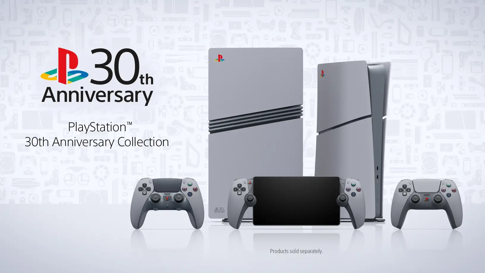

+++
title = "PS5, DualSense : les produits du 30e anniversaire PlayStation ne coûteraient pas (trop) cher"
date = 2024-09-23T08:00:00+01:00
draft = false
author = "Félix"
tags = ["Actu"]
image = "https://nostick.fr/articles/vignettes/septembre/psxx.png"
+++

 

Sony a dévoilé [la semaine dernière](https://nostick.fr/articles/2024/septembre/1909-ps5-30e-anniversaire/) une très chouette gamme de produits en hommage à l’anniversaire de la marque PlayStation : du matos paré d’une robe grise évoquant la toute première console du fabricant. Si cela donne envie, le Japonais s’est bien gardé de communiquer les tarifs, et les esprits chagrins s’attendaient à des prix stratosphériques. Ça a l’air plutôt correct, le généralement bien renseigné billbil-kun de [Dealabs](https://www.dealabs.com/magazine/on-vous-devoile-les-prix-de-quelques-references-des-editions-limitees-du-30eme-anniversaire-playstation-59567) voyant venir une DualSense à 79,99 €. C’est à ce prix que sont vendues les autres manettes en édition limitée, comme celle sortie il y a peu et [inspirée d’Astro Bot](https://direct.playstation.com/fr-fr/buy-accessories/dualsense-wireless-controller-astro-bot-limited-edition).

Billbil-kun annonce un prix de 450 $ pour le pack console PS5 Slim, soit 50 $ de plus que le modèle classique. Ça devrait fait environ 519,99 € chez nous quand on peut trouver la même console au look standard pour [449,99 €](https://www.fnac.com/Console-Sony-PS5-Slim-Edition-Digital-Blanc-et-Noir/a18919799/w-4). Ce n’est pas donné, mais rappelons que cette édition comporte quelques goodies (stickers, poster, attache-câbles) ainsi qu’un capot pour lecteur Blu-Ray. C’est pas le Pérou, mais on va dire que ça compense un peu.

Aucune information n’est donnée sur le reste des accessoires, comme la DualSense Edge, le PlayStation Portal ou le pack PlayStation 5 Pro. Celui-ci ne sera produit qu’à 12 300 unités, on peut donc s’attendre à ce que la facture soit salée. Pour rappel, il comportera une PS5 Pro, une manette DualSense et DualSense Edge, une station de recharge ainsi qu’un paquet de goodies. La PS5 Pro coûtant 800 €, on devrait donc largement dépasser la barrière des 1 000 balles.