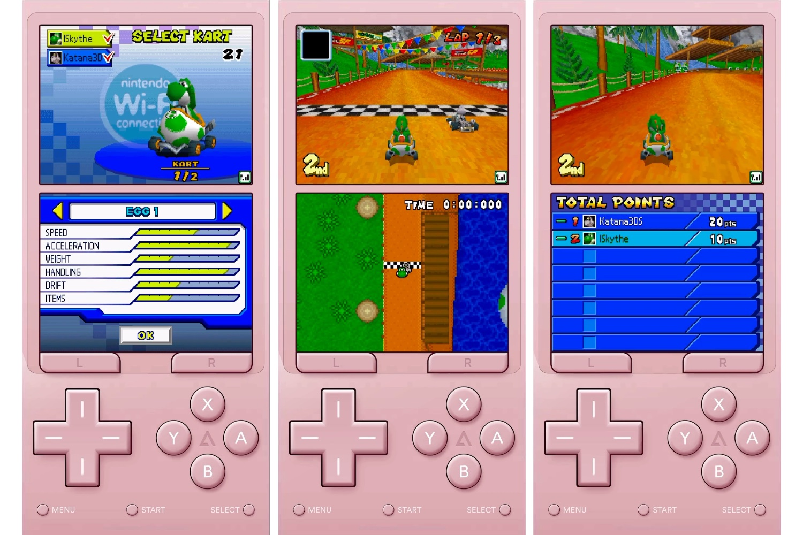

+++
title = "L'émulateur Delta va assurer le multijoueur en joueur pour les jeux DS"
date = 2024-09-24T08:07:32+01:00
draft = false
author = "Mickael"
tags = ["Actu"]
image = "https://nostick.fr/articles/vignettes/septembre/mario-kart-ds-multi.jpg"
+++

Delta, probablement le meilleur émulateur Nintendo toutes plateformes confondues (même s'il n'est dispo que sur iPhone et iPad), s'améliore encore et pas qu'un peu. Riley Testut, le développeur émérite de l'application, a [annoncé](https://mastodon.social/@rileytestut/113188173713251235) le support à venir du multijoueur en ligne pour les jeux DS !

Cela signifie que l'on va pouvoir retrouver le goût du sang dans la bouche en jouant à *Mario Kart DS* contre la planète entière.  Ce petit miracle est rendu possible par l'intégration dans Delta* du support en ligne de l'émulateur (excellent, lui aussi) [melonDS](https://melonds.kuribo64.net), qui se connecte aux serveurs WFC — Wi-Fi Connection — multijoueur tiers comme AltWFC, Wimmfi ou encore Kaeru. Nintendo a fermé ses propres serveurs en 2014, mais la communauté ne l'a pas entendu de cette oreille.

« *Cela signifie que les 10 millions d'utilisateurs de Delta pourront se connecter à d'autres utilisateurs de Delta ainsi qu'aux utilisateurs d'autres appareils qui utilisent ces serveurs Nintendo WFC tiers* », [explique](https://www.theverge.com/2024/9/23/24252493/delta-ios-emulator-online-multiplayer-nintendo-ds) Testut à *The Verge*. Et gratuitement. Le hic, c'est que cela ne concerne que les jeux DS, mais il y a de quoi faire dans le catalogue.

Il faudra prendre son mal en patience pour en profiter cependant, puisque dans un premier temps ce sont les membres [Patreon](https://www.patreon.com/rileyshane) de Delta qui y auront droit, aussi pour essuyer les plâtres. Rappelons qu'en Europe, l'émulateur peut être installé depuis AltStore PAL, la boutique alternative ([et c'est maintenant très simple de l'installer](https://nostick.fr/articles/2024/avril/1904-comment-installer-et-utiliser-delta/)). Dans le reste du monde, Delta est dispo sur l'App Store.