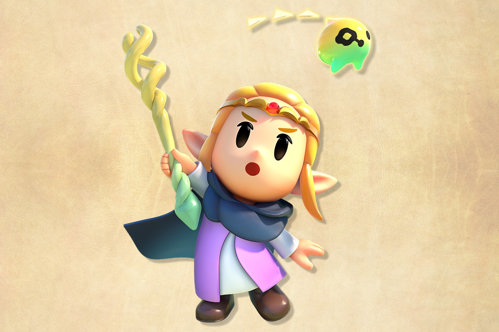
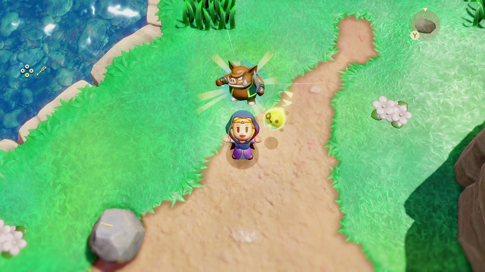
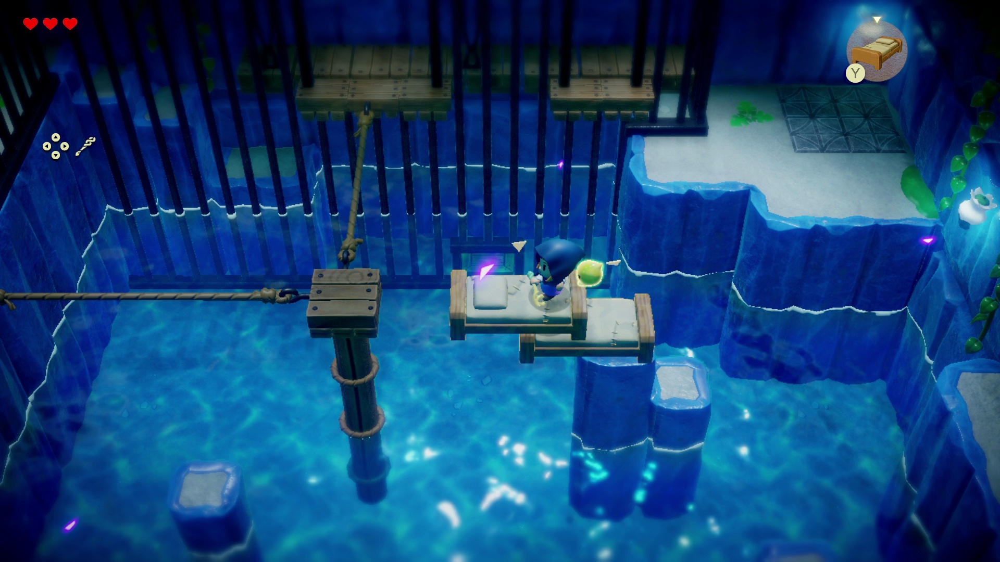

+++
title = "Echoes of Wisdom avait commencé comme un « Zelda Maker »"
date = 2024-09-24T08:40:32+01:00
draft = false
author = "Mickael"
tags = ["Actu"]
image = "https://nostick.fr/articles/vignettes/septembre/zelda-echos-of-wisdom.jpg"
+++

*The Legend of Zelda: Echos of Wisdom* aurait pu être très différent. Dans le [volume 13](https://www.nintendo.com/us/whatsnew/ask-the-developer-vol-13-the-legend-of-zelda-echoes-of-wisdom-part-1/) de la série *Ask the Developer* de Nintendo consacré au jeu, Tomomi Sana, coréalisatrice (une première pour un jeu Zelda) révèle qu'à l'origine, l'équipe avait commencé à plancher sur un prototype de création de donjons. Ça a duré pendant un an, avant qu'*Echoes of Wisdom* commence à réellement prendre forme.

Eijo Aonuma, le producteur de la franchise Zelda, explique que « *tout le monde développait le jeu en pensant à la création de donjons* »… mais de son côté, il était « *en train de réfléchir à autre chose* » ! En patron, c'est donc lui qui a fini par décider d'aller de l'avant avec quelque chose d'encore plus évolué qu'un « Zelda Maker ».

 

« *J’ai senti que la fonction "créer un donjon" qu’ils m’ont montrée avait un potentiel significatif pour être développée en une nouvelle façon de jouer à The Legend of Zelda, si le gameplay était modifié pour utiliser des "échos" à la place* », explique-t-il. Des échos qui faisaient parti des recherches initiales. Satochi Terada, directeur du jeu pour le studio Grezzo (qui coréalise), indique qu'une approche impliquait Link qui pouvait coller et coller toutes sortes d'objets, « *comme des portes et des chandeliers* », pour créer des donjons originaux.

C'est donc Grezzo qui est aux manettes, et peut-être même un peu plus que ça. « *J'ai toujours voulu établir une série de jeux Zelda en 2D avec une vue du dessus, distincte des titres en 3D comme Breath of the Wild* », indique Eijo Aonuma. « *Grezzo avait trouvé une excellente façon de faire revivre l'expérience Zelda en vue de dessus pour une époque moderne, et j'ai pensé que nous pourrions développer quelque chose de totalement nouveau qui n'avait jamais été fait auparavant* ».

Le studio a proposé ce concept de « Zelda Maker » juste après leur remake de *Link's Awakening* sorti en 2019. « *Ce fut un grand événement pour Grezzo. Après tous les remakes sur lesquels nous avions travaillé [Majora's Mask 3D en 2015, Luigi's Mansion en 2018…], c'était la première fois que nous étions confrontés à un nouveau projet de jeu dès la phase conceptuelle* », se rappelle Satochi Terada. « *Nous avons proposé tellement d’idées qu’il nous a fallu trois jours rien que pour les examiner et les passer en revue* ».

Au bout du compte, deux idées ont fini par émerger : un gameplay « copier/coller » et un autre qui combine une vue du dessus et une vue de côté. *Echos of Wisdom* reprend ces deux concepts, même si ça n'a pas été facile. « *même si nous parvenions à trouver le bon équilibre entre ennemis et alliés, ainsi qu'entre la vue de dessus et la vue de côté, il fallait aussi prendre en compte tous les différents endroits où les joueurs pourraient utiliser ces échos* », raconte Satochi Terada.

« *Que se passe-t-il si vous rencontrez un monstre dans les montagnes enneigées et que vous en créez un écho dans un volcan ?* », rebondit Eijo Aonuma. « *Il a fallu beaucoup de travail pour s'assurer que tout fonctionne de manière cohérente et que le jeu ne se désagrège pas si les joueurs utilisent un écho dans une zone différente de celle où ils l'ont trouvé* ».

On verra comment tout cela s'articule dans *Echos of Wisdom*, qui sera dispo le 26 septembre sur Switch.