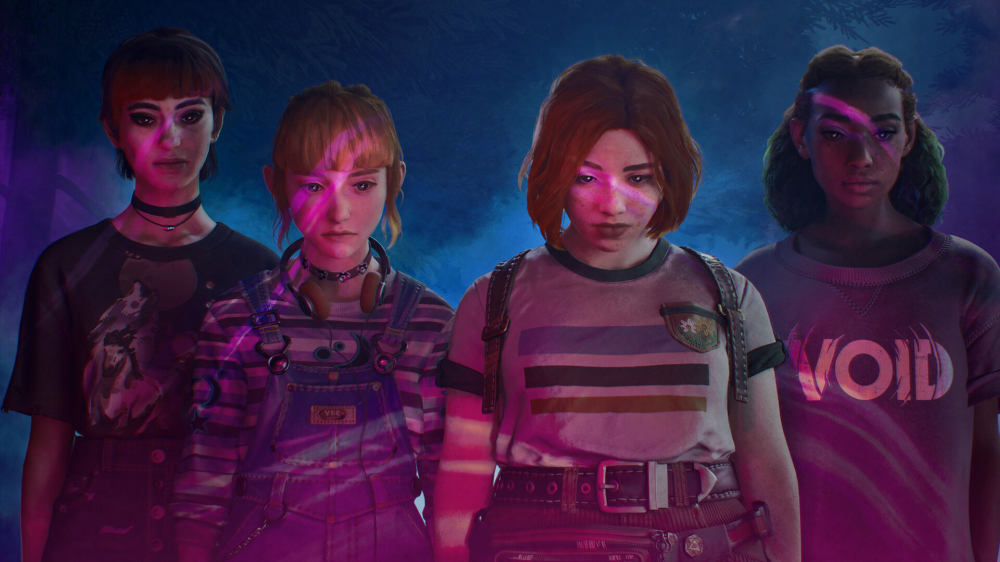

+++
title = "Après les ventes décevantes de ses derniers jeux, Don’t Nod mise tout sur Lost Records: Bloom & Rage"
date = 2024-09-24T18:30:32+01:00
draft = false
author = "Félix"
tags = ["Actu"]
image = "https://nostick.fr/articles/vignettes/septembre/psxx.png"
+++

 

L’ambiance n’est pas à la fête chez Don’t Nod, les créateurs de *Life is Strange* qui galèrent un peu à trouver un second souffle après le carton du premier opus. Plusieurs jeux ont été publiés depuis 2015 dont plusieurs suites bonnes mais sans plus et quelques titres vites oubliés (vous vous souvenez de *‌Tell Me Why* ou de *‌Twin Mirror* ?). Dans un nouveau rapport financier, le groupe a révélé que les récents *Jusant* et *Banishers : Ghosts of New Eden* n’avaient pas particulièrement aidé à relancer la machine.

Le CEO de Don't Nod s’est dit « *évidemment déçu* » par ces récentes performances avant de confier que les deux titres n’avaient « *pas atteint les résultats commerciaux espérés* ». Il a donc [déclaré](https://www.eurogamer.net/dont-nod-bets-on-lost-records-bloom-rage-as-multiple-projects-fail-to-meet-expectations) que le groupe allait procéder à une dépréciation partielle des actifs des deux jeux pour un montant de 24 millions d'euros. *Jusant* a pourtant été favorablement accueilli par la presse, et si les notes ont tapé un peu moins haut pour *Banishers*, le titre affiche des évaluations « très positives » sur Steam.

Don't Nod a temporairement mis en pause deux projets actuellement « *en phase de conception* » dans le but de « *prioriser les ressources et de maximiser les chances de succès des titres ayant le plus grand potentiel* ». L’accent va être mis sur le futur *[Lost Records : Bloom & Rage](https://store.steampowered.com/app/1902960/Lost_Records_Bloom__Rage/)*, qui a été [repoussé](https://nostick.fr/articles/2024/juin/2806-dont-nod-repousse-lost-records/) au début 2025 et sortira en deux parties avec un mois d’intervalle sur PC, PS5 et Xbox. Cette énième tentative de recréer la magie du premier *Life is Strange* sera-t-elle un succès ? Don’t Nod y croit, affirmant que le jeu a reçu un accueil « *particulièrement positif* » à la Gamescom. 

Don’t Nod garde deux autres projets en cuisine qui devraient sortir avant 2027. La boîte a aussi dans l’idée d’éditer deux jeux dont le curieux *[Koira](https://store.steampowered.com/app/1626620/Koira/?curator_clanid=33977966)*, que l’on attend dans 6 mois. Les fans de *Life is Strange* pourront bientôt retrouver Max Caulfield dans un nouvel opus appelé *[Double Exposure](https://store.steampowered.com/app/1874000/Life_is_Strange_Double_Exposure/)*, développé par Deck Nine et édité par… Square Enix. Il sortira le 29 octobre prochain.

